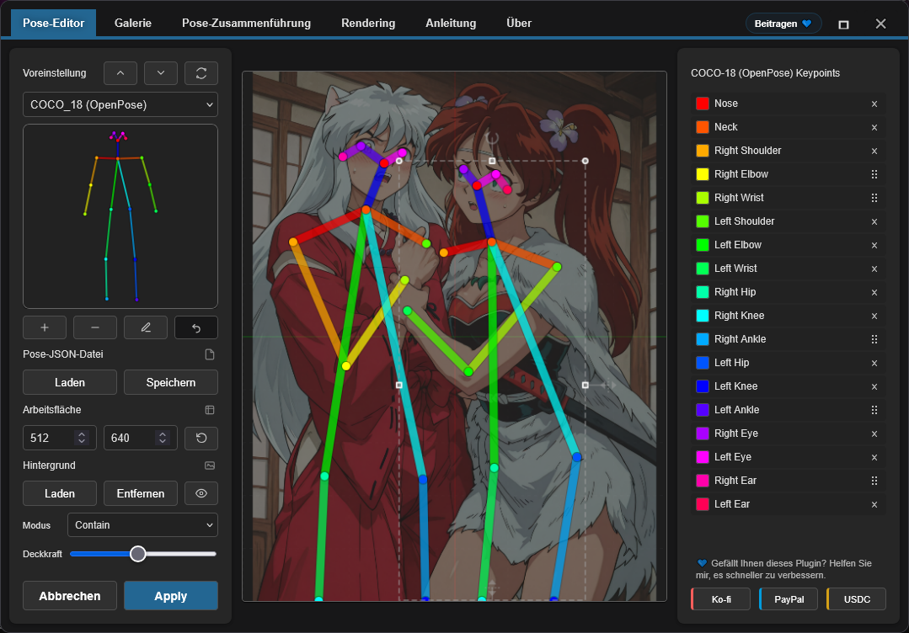
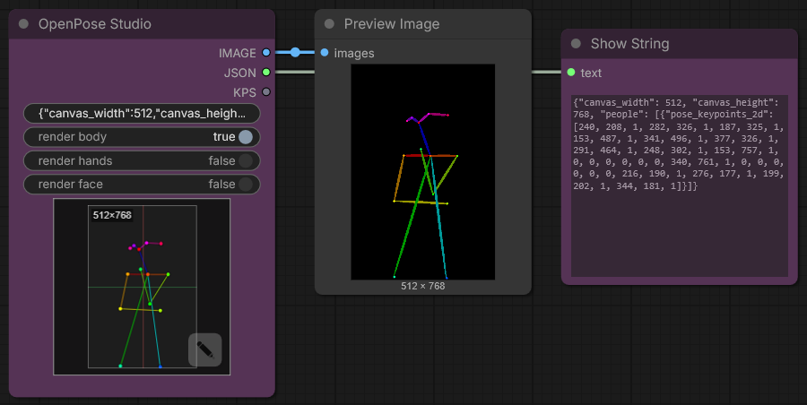
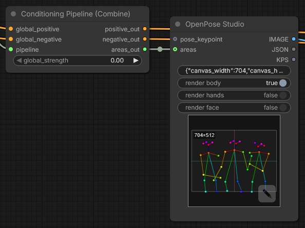
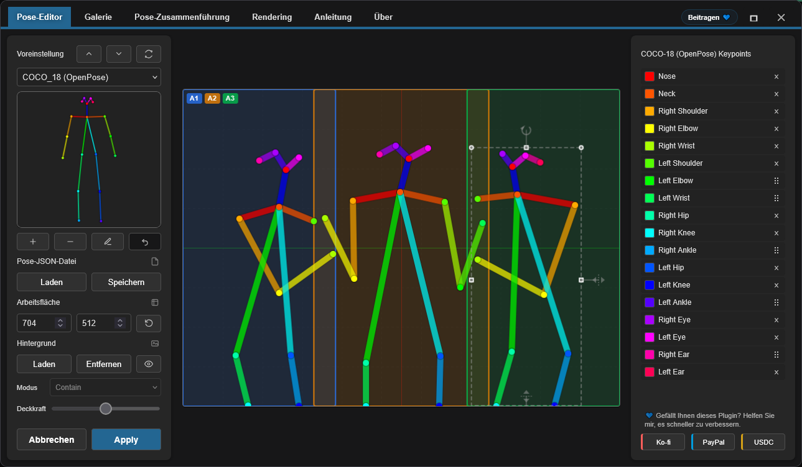

<h4 align="center">
  <a href="./README.md">English</a> | Deutsch | <a href="./README.es.md">Español</a> | <a href="./README.fr.md">Français</a> | <a href="./README.pt.md">Português</a> | <a href="./README.ru.md">Русский</a> | <a href="./README.ja.md">日本語</a> | <a href="./README.ko.md">한국어</a> | <a href="./README.zh.md">中文</a> | <a href="./README.zh-TW.md">繁體中文</a>
</h4>

<p align="center">
  
  
  
</p>
<br />

# OpenPose Studio for ComfyUI 🤸

OpenPose Studio ist eine fortschrittliche ComfyUI-Erweiterung zum Erstellen, Bearbeiten, Anzeigen und Organisieren von OpenPose-Posen mit einer schlanken, benutzerfreundlichen Oberfläche. Sie erleichtert das visuelle Anpassen von Keypoints, das Speichern und Laden von Pose-Dateien, das Durchsuchen von Pose-Presets und Galerien, das Verwalten von Pose-Sammlungen, das Zusammenführen mehrerer Posen sowie den Export sauberer JSON-Daten zur Verwendung in ControlNet und anderen posegesteuerten Workflows.

---

## Inhaltsverzeichnis

- ✨ [Funktionen](#funktionen)
- 📦 [Installation](#installation)
- 🎯 [Verwendung](#verwendung)
- 🔧 [Nodes](#nodes)
- ⌨️ [Editor-Steuerung und Tastenkürzel](#editor-steuerung-und-tastenkürzel)
- 📋 [Formatspezifikationen](#formatspezifikationen)
- 🖼️ [Galerie und Pose-Verwaltung](#galerie-und-pose-verwaltung)
- 🔀 [Pose Merger](#pose-merger)
- 🖼️ [Hintergrundreeferenz](#background-reference)
- 🗺️ [Areas Input](#areas-input)
- ⚠️ [Bekannte Einschränkungen](#bekannte-einschränkungen)
- 🔍 [Fehlerbehebung](#fehlerbehebung)
- 🤝 [Mitwirken](#mitwirken)
- 💙 [Finanzierung und Support](#finanzierung-und-support)
- 📄 [Lizenz](#lizenz)

---

## Funktionen

✨ **Kernfunktionen**
- Echtzeit-Bearbeitung von OpenPose-Keypoints mit visuellem Feedback
- Modernes natives Canvas-Rendering-Engine (schneller, flüssiger, weniger bewegliche Teile)
- Interaktive Bearbeitungs-UX: klare aktive Auswahl + Pose-Hover-Vorauswahl
- Eingeschränkte Transformationen, damit Keypoints nicht aus den Canvas-Grenzen driften
- JSON-Import/Export für einzelne Poses und Pose-Sammlungen
- Standard-OpenPose-JSON-Export (portierbar zu anderen Tools)
- Legacy-JSON-Kompatibilität (kann ältere nicht-standardmäßige JSON laden und korrekt bearbeiten)

✨ **Erweiterte Funktionen**
- **Render Toggles**: Body / Hands / Face optional rendern
- **Pose Gallery**: Poses aus `poses/` durchsuchen und voransehen
- **Pose Collections**: Multi-Pose-JSON-Dateien als einzeln auswählbare Poses angezeigt
- **Pose Merger**: Mehrere JSON-Dateien zu organisierten Sammlungen zusammenführen
- **Quick Cleanup Actions**: Face-Keypoints und/oder linke/rechte Hand-Keypoints entfernen, wenn vorhanden
- **Optional Cleanup on Export**: Face- und/oder Hands-Keypoints beim Export von Pose-Packs entfernen
- **Background Overlay System**: Auswählbare Contain/Cover-Modi mit Opazitätskontrolle
- **Undo**: Vollständiger Bearbeitungsverlauf während der Sitzung

✨ **Datenverarbeitung**
- Automatische Pose-Dateierkennung aus `poses/` (einschließlich Unterverzeichnisse)
- Validierung und Fehlerwiederherstellung für fehlerhafte JSON-Dateien
- Unterstützung für Teilposen (Teilmenge von Body-Keypoints)
- Pixelraum-Koordinaten, die mit Pose-Dateien für nahtlose Kompatibilität übereinstimmen

✨ **UI und Integration**
- Vollständig responsives Layout: passt sich in Echtzeit an jede Fenstergröße an und bleibt zentriert
- Automatische Anpassungsskalierung, wenn das Canvas sonst nicht auf den Bildschirm passt
- Verbesserte Canvas-Optik: Hintergrundgitter + Mittelachsen im Stil von Blender
- Persistenz nach Neustart: Galerie-Ansichtsmodus + Hintergrundüberlagerungs-Einstellungen beim Start wiederhergestellt
- Native ComfyUI-Integrationen: Toasts + Dialoge (mit sicherem Fallback)

---

✨ **Geplante Funktionen und Roadmap**

> [!IMPORTANT]
> Viele geplante Funktionen hängen von der Finanzierung für KI-Token ab. Den vollständigen Fahrplan und bevorstehende Arbeiten finden Sie unter [TODO.md](../TODO.md)..

Wenn Sie eine Idee für eine neue Funktion haben, würde ich sie gerne hören — vielleicht können wir sie schnell umsetzen. Bitte senden Sie Feedback, Ideen oder Vorschläge über die Issues-Seite des Repositorys: https://github.com/andreszs/comfyui-openpose-studio/issues


## Installation

### Anforderungen
- ComfyUI (aktueller Build)
- Python 3.10+

### Schritte

1. Klone dieses Repository in `ComfyUI/custom_nodes/`.
2. Starte ComfyUI neu.
3. Bestätige, dass Nodes unter `image > OpenPose Studio` erscheinen.

---

## Verwendung

### Grundlegender Workflow

1. Den **OpenPose Studio**-Node zum Workflow hinzufügen
2. Auf die Vorschau-Canvas des Nodes klicken, um die Editor-UI zu öffnen
3. Eine Pose aus den Voreinstellungen oder der Galerie auswählen, um sie in die Canvas einzufügen
4. Keypoints durch Ziehen auf der Canvas anpassen
5. Auf **Apply** klicken, um die Pose zu rendern. Dadurch wird das serialisierte JSON im Node erstellt.
6. Den `image`-Ausgang mit nachfolgenden Bild-Nodes verbinden
7. Den `kps`-Ausgang mit ControlNet/OpenPose-kompatiblen Nodes verbinden

### Editor-Vorschau



---

## Nodes

### OpenPose Studio

**Kategorie:** `image`

- **Eingang:** `Pose JSON` (STRING) — Standard-OpenPose-JSON.
- **Optionale Eingänge:**
  - `areas` (`CONDITIONING_AREAS`) — Bereichs-Overlay-Daten; den `areas_out`-Ausgang eines [Conditioning Pipeline (Combine)](https://github.com/andreszs/comfyui-lora-pipeline)-Nodes verbinden, um Konditionierungsbereiche auf der Canvas zu visualisieren
- **Optionen:**
  - `render body` — Body in das gerenderte Vorschau-/Ausgabebild einbeziehen
  - `render hands` — Hands in das gerenderte Vorschau-/Ausgabebild einbeziehen (falls im JSON vorhanden)
  - `render face` — Face in das gerenderte Vorschau-/Ausgabebild einbeziehen (falls im JSON vorhanden)
- **Ausgänge:**
  - `IMAGE` — Gerenderte Pose-Visualisierung als RGB-Bild (float32, Bereich 0-1)
  - `JSON` — OpenPose-JSON mit Canvas-Abmessungen und People-Array mit Keypoint-Daten
  - `KPS` — Keypoint-Daten im POSE_KEYPOINT-Format, kompatibel mit ControlNet
- **UI:** Auf die Node-Vorschau klicken, um den interaktiven Editor zu öffnen. Den **open editor**-Button (Bleistift-Symbol) verwenden, um die Pose direkt zu bearbeiten.

#### Node-Screenshot



---

## Editor-Steuerung und Tastenkürzel

### Tastaturkürzel

| Steuerung | Aktion |
|---------|--------|
| **Enter** | Pose anwenden und Editor schließen |
| **Escape** | Abbrechen und Änderungen verwerfen |
| **Ctrl+Z** | Letzte Aktion rückgängig machen |
| **Ctrl+Y** | Zuletzt rückgängig gemachte Aktion wiederherstellen |
| **Delete** | Ausgewählten Keypoint entfernen |

### Canvas-Interaktionen

- **Klick**: Keypoint auswählen
- **Ziehen**: Keypoint an neue Position verschieben
- **Scrollen**: Auf der Canvas herein-/herauszoomen (TO-DO)

### Background Reference

Referenzbilder (z. B. Anatomieführer, Fotovorlagen) als nicht-destruktive Überlagerungen während der Pose-Bearbeitung laden. Den **Contain**-Modus verwenden, um Bilder in der Canvas einzupassen, oder den **Cover**-Modus, um die Canvas zu füllen. Opazität nach Bedarf anpassen.

- **Load Image**: Referenzbild von Datenträger importieren
- **Contain/Cover**: Skalierungsmodus wählen
- **Opacity**: Transparenz anpassen (0-100%)

> [!NOTE]
> Hintergrundbilder bleiben während der ComfyUI-Sitzung erhalten, werden aber **nicht** in Workflows gespeichert.

### Areas Input

Der **areas**-Eingang ist eine **optionale** Verbindung, die während der Pose-Bearbeitung Konditionierungsbereichsgrenzen auf der Canvas überlagert.

Den `areas_out`-Ausgang des [**Conditioning Pipeline (Combine)**](https://github.com/andreszs/comfyui-lora-pipeline)-Nodes aus dem [ComfyUI-LoRA-Pipeline](https://github.com/andreszs/comfyui-lora-pipeline)-Repository verbinden, um die Zielbereiche jedes Bereichs beim Positionieren der Posen zu visualisieren.



Jeder Bereich wird als beschriftetes Badge auf der Canvas angezeigt. Auf ein Badge klicken, um den jeweiligen Bereich einzeln **zu aktivieren oder zu deaktivieren**, sodass die für die aktuelle Pose relevanten Regionen im Fokus bleiben.



Diese Kombination ist besonders nützlich beim Aufbau von Multi-Charakter-Workflows: [ComfyUI-LoRA-Pipeline](https://github.com/andreszs/comfyui-lora-pipeline) übernimmt die bereichsbezogene Konditionierung und LoRA-Zuweisung, während OpenPose Studio die präzise Positionierung der Posen innerhalb jedes Bereichs gewährleistet. Das Ergebnis ist ein unkompliziertes, nicht-destruktives Setup, in dem sowohl bereichsbezogene als auch posenbezogene LoRAs gleichzeitig ohne gegenseitige Beeinflussung angewendet werden können. Wer noch nicht mit bereichsbasierter Konditionierung vertraut ist: Die [ComfyUI-LoRA-Pipeline](https://github.com/andreszs/comfyui-lora-pipeline)-Erweiterung ist genau für diese Art von Workflow konzipiert und lässt sich hervorragend mit diesem Node kombinieren.

Ein reales Beispiel, das alle drei Repos gemeinsam nutzt — Bereichskonditionierung, OpenPose-Steuerung und Style-Layering — ist in diesem [Schritt-für-Schritt-Workflow-Guide](https://www.andreszsogon.com/building-a-multi-character-comfyui-workflow-with-area-conditioning-openpose-control-and-style-layering/) zu finden.

---

## Formatspezifikationen

Dieser Editor unterstützt vollständig die **OpenPose COCO-18 (body)**-Bearbeitung.

Er unterstützt auch **OpenPose Face- und Hands-Daten** auf *Pass-Through*-Weise: Wenn Ihr JSON Face- und/oder Hand-Keypoints enthält, werden diese beibehalten (nicht entfernt) und der Python-Node kann sie korrekt rendern. **Die Bearbeitung von Face- und Hand-Keypoints ist jedoch noch nicht verfügbar** (für zukünftige Updates geplant).

### OpenPose COCO-18-Keypoints (body)

COCO-18 verwendet **18 Body-Keypoints**. Die Pose wird als flaches Array namens `pose_keypoints_2d` mit dem Muster gespeichert:

`[x0, y0, c0, x1, y1, c1, ...]`

Dabei hat jeder Keypoint:
- `x`, `y`: Pixelkoordinaten auf der Canvas
- `c`: Konfidenz (üblicherweise `0..1`; `0` kann für „fehlende" Punkte verwendet werden)

Keypoint-Reihenfolge (Index → Name):

| Index | Name |
|------:|------|
| 0 | Nase |
| 1 | Hals |
| 2 | Rechte Schulter |
| 3 | Rechter Ellbogen |
| 4 | Rechtes Handgelenk |
| 5 | Linke Schulter |
| 6 | Linker Ellbogen |
| 7 | Linkes Handgelenk |
| 8 | Rechte Hüfte |
| 9 | Rechtes Knie |
| 10 | Rechter Knöchel |
| 11 | Linke Hüfte |
| 12 | Linkes Knie |
| 13 | Linker Knöchel |
| 14 | Rechtes Auge |
| 15 | Linkes Auge |
| 16 | Rechtes Ohr |
| 17 | Linkes Ohr |

> [!NOTE]
> **COCO** bezieht sich auf die *Common Objects in Context*-Keypoint-Konvention/Dataset-Bezeichnung, die in der Pose-Schätzung weit verbreitet ist. „COCO-18" bezeichnet hier das OpenPose-Body-Layout mit 18 Keypoints.

### Minimale JSON-Struktur

Ein typisches OpenPose-JSON für eine einzelne Pose enthält Canvas-Abmessungen und einen `people`-Eintrag mit `pose_keypoints_2d`:

```json
{
  "canvas_width": 512,
  "canvas_height": 512,
  "people": [
    {
      "pose_keypoints_2d": [0, 0, 0, 0, 0, 0 /* ... 18 * 3 values total ... */]
    }
  ]
}
```

> [!NOTE]
> Der Editor kann Teilposen verarbeiten (einige Keypoints fehlen). Fehlende Punkte werden typischerweise als 0,0,0 dargestellt. Mit dem Pose Editor können auch distale Keypoints gelöscht werden.

### Weiterführende Literatur

- Geschichte und Kontext: „What is OpenPose — Exploring a milestone in pose estimation" — ein verständlicher Artikel, der erklärt, wie OpenPose eingeführt wurde und seine Auswirkungen auf die Pose-Schätzung: https://www.ultralytics.com/blog/what-is-openpose-exploring-a-milestone-in-pose-estimation

### JSON-Format: Standard vs. Legacy

- **OpenPose Studio:** liest/schreibt **Standard-OpenPose-JSON** und akzeptiert auch älteres nicht-standardmäßiges (Legacy-)JSON.

Praktische Hinweise:
- Das Einfügen von Standard-JSON in den OpenPose Studio-Node rendert die Vorschau sofort.

---

## Galerie und Pose-Verwaltung

### Überblick

Die **Gallery**-Registerkarte bietet visuelles Durchsuchen aller verfügbaren Poses mit Live-Vorschau-Thumbnails. Sie erkennt und organisiert Poses automatisch ohne manuelle Konfiguration.


### Ansichtsmodi

Die Gallery unterstützt drei Anzeigemodi:
- **Large** — größere Vorschauen für schnelle visuelle Auswahl
- **Medium** — ausgewogene Vorschaugröße und -dichte
- **Tiles** — kompaktes Raster mit zusätzlichen Metadaten (z. B. **Canvas-Größe**, **Keypoint-Anzahl** und weitere Pose-Details)

### Funktionen

- **Auto-discovery**: Scannt das `poses/`-Verzeichnis beim Start
- **Nested organization**: Unterverzeichnisnamen werden zu Gruppenbezeichnungen
- **Live preview**: Thumbnail-Rendering für jede Pose in Echtzeit
- **Search/filter**: Poses nach Name oder Gruppe finden
- **One-click load**: Pose auswählen, um sie in den Editor zu laden

### Unterstützte Dateitypen

- **Single-pose JSON**: Einzelne OpenPose-JSON-Dateien
- **Pose Collections**: Multi-Pose-JSON-Dateien (jede Pose wird separat angezeigt)
- **Nested directories**: Poses in Unterverzeichnissen werden automatisch gruppiert

### Deterministisches Verhalten

Galeriereihenfolge und -erkennung sind vollständig deterministisch:
- Kein zufälliges Mischen
- Konsistente alphabetische Sortierung
- Root-Poses zuerst aufgelistet, dann gruppierte Poses
- Sofortiges Neuladen aller JSON-Poses beim Öffnen des Editor-Fensters.

---

## Pose Merger

### Zweck

Die **Pose Merger**-Registerkarte fasst mehrere einzelne Pose-JSON-Dateien in organisierten Pose-Sammlungsdateien zusammen. Dies ist nützlich für:

- Konvertierung großer Pose-Bibliotheken in einzelne Dateien
- Bereinigung von Pose-Daten (Entfernung von Face/Hand-Keypoints)
- Reorganisation und Umbenennung von Poses
- Effiziente Verteilung von Pose-Paketen

### Workflow

1. **Add Files**: Einzelne oder Sammlungs-JSON-Dateien laden
2. **Preview**: Jede Pose wird mit Thumbnail angezeigt
3. **Configure**: Face/Hand-Komponenten optional ausschließen
4. **Export**: Als kombinierte Sammlung oder einzelne Dateien speichern

### Hauptfunktionen

| Funktion | Anwendungsfall |
|---------|----------|
| **Load Multiple Files** | Massenimport aus dem Dateisystem |
| **Component Filtering** | Unnötige Face/Hand-Daten entfernen |
| **Collection Expansion** | Poses aus bestehenden Sammlungen extrahieren |
| **Batch Renaming** | Beim Export sinnvolle Namen vergeben |
| **Selective Export** | Auswählen, welche Poses einbezogen werden |

### Ausgabeoptionen

- **Combined Collection**: Einzelnes JSON mit allen Poses
- **Individual Files**: Eine Datei pro Pose (für Kompatibilität)

Beide Ausgabeformate werden automatisch von Gallery und Pose Selector erkannt.

---

## Bekannte Einschränkungen

> [!WARNING]
> Nodes 2.0 wird derzeit nicht unterstützt. Bitte Nodes 2.0 vorerst deaktivieren.

### Aktuelle Einschränkungen und Workarounds

1. **Hand- und Face-Bearbeitung**
  - Problem: Editor derzeit auf Body-Keypoints (0-17) beschränkt
  - Status: Für zukünftige Version geplant
  - Workaround: Pose Merger verwenden, um Hand/Face-JSON vor dem Import manuell zu bearbeiten

2. **Auflösungskonsistenz**
  - Problem: Pose Merger vereinheitlicht die Auflösung bei Sammlungsexporten nicht automatisch
  - Status: Erfordert sorgfältige Implementierung, um Beschneidung zu vermeiden
  - Workaround: Poses vor dem Import auf Zielauflösung vorkalibieren

3. **Nodes 2.0-Kompatibilität**
  - Problem: Der Node verhält sich nicht korrekt, wenn ComfyUI „Nodes 2.0" aktiviert ist.
  - Status: Fix geplant, aber es ist ein großes und zeitaufwändiges Refactoring.
  - Hinweis: Dieses Projekt wird mit bezahlten KI-Agenten entwickelt. Sobald Mittel für zusätzliche KI-Token verfügbar sind, beabsichtige ich, die Nodes 2.0-Unterstützung zu priorisieren.
  - Workaround: Nodes 2.0 vorerst deaktivieren.

### Fehlerwiederherstellung

Das Plugin enthält defensives Fehlerhandling:
- Ungültige JSON-Dateien werden in der Gallery lautlos übersprungen
- Render-Fehler geben leere Bilder zurück, anstatt abzustürzen
- Fehlende Metadaten fallen auf sichere Standardwerte zurück
- Fehlerhafte Keypoints werden beim Rendern gefiltert

---

## Fehlerbehebung

### Häufige Probleme und Lösungen

**Poses erscheinen nicht in der Gallery**
```
✓ Bestätigen, dass Dateien im poses/-Verzeichnis vorhanden sind
✓ JSON auf Gültigkeit prüfen (Online-JSON-Validator verwenden)
✓ Prüfen, ob Dateiendung .json ist (Groß-/Kleinschreibung auf Linux relevant)
✓ ComfyUI neu starten, um die Erkennung auszulösen
✓ Browserkonsole (F12) auf Fehlermeldungen prüfen
```

**JSON-Import schlägt fehl**
```
✓ JSON-Struktur validieren (muss "pose_keypoints_2d" oder Äquivalent haben)
✓ Sicherstellen, dass Koordinaten gültige Zahlen sind, keine Strings
✓ Mindestens 18 Keypoints für Body-Poses bestätigen
✓ Auf fehlerhafte Escape-Sequenzen im JSON prüfen
```

**Leeres Ausgabebild**
```
✓ Sicherstellen, dass Pose ausgewählt ist und gültige Keypoints enthält
✓ Canvas-Abmessungen (Breite/Höhe) prüfen, vernünftig (100-2048px)
✓ Auf Apply klicken, um nach Änderungen zu rendern
✓ Auf NaN oder unendliche Werte in Koordinaten prüfen
```

**Background reference bleibt nicht erhalten**
```
✓ Drittanbieter-Cookies/-Speicher im Browser aktivieren
✓ Browser-localStorage-Einstellungen prüfen
✓ Inkognito-Modus ausprobieren, um Problem zu isolieren
✓ Browser-Cache leeren und erneut versuchen
```

**Node erscheint nicht in ComfyUI**
```
✓ Clone-Speicherort prüfen: ComfyUI/custom_nodes/comfyui-openpose-studio
✓ Prüfen, ob __init__.py vorhanden ist und korrekt importiert
✓ ComfyUI vollständig neu starten (nicht nur Seite neu laden)
✓ ComfyUI-Konsole auf Importfehler prüfen
```
---

## Mitwirken

Richtlinien für Beiträge, Pull-Request-Richtlinien, Architekturdetails und Entwicklungsinformationen finden Sie unter [CONTRIBUTING.md](../CONTRIBUTING.md). Wenn Sie einen KI-Agenten zur Unterstützung bei der Entwicklung einsetzen, stellen Sie sicher, dass er [AGENTS.md](../AGENTS.md) liest, bevor er Codeänderungen vornimmt.

---

## Finanzierung und Support

### Warum Ihre Unterstützung wichtig ist

Dieses Plugin wird unabhängig entwickelt und gepflegt, mit regelmäßigem Einsatz von **bezahlten KI-Agenten**, um Debugging, Tests und Verbesserungen der Lebensqualität zu beschleunigen. Wenn Sie es nützlich finden, hilft finanzielle Unterstützung dabei, die Entwicklung stetig voranzubringen.

Ihr Beitrag hilft:

* KI-Tools für schnellere Korrekturen und neue Funktionen zu finanzieren
* Laufende Wartungs- und Kompatibilitätsarbeiten bei ComfyUI-Updates zu decken
* Entwicklungsverlangsamungen zu verhindern, wenn Nutzungsgrenzen erreicht werden

> [!TIP]
> Keine Spende möglich? Ein GitHub-Stern ⭐ hilft dennoch sehr, indem er die Sichtbarkeit verbessert und mehr Nutzern zugute kommt.

### 💙 Dieses Projekt unterstützen

<table style="width: 100%; table-layout: fixed;">
  <tr>
    <td align="center" style="width: 33.33%; padding: 20px;">
      <div>
        <h4 style="margin: 8px 0;">Ko-fi</h4>
        <a href="https://ko-fi.com/D1D716OLPM" target="_blank" rel="noopener noreferrer">
          
        </a>
        <p style="margin: 8px 0; font-size: 12px;"><a href="https://ko-fi.com/D1D716OLPM" target="_blank" rel="noopener noreferrer">Einen Kaffee spendieren</a></p>
      </div>
    </td>
    <td align="center" style="width: 33.33%; padding: 20px;">
      <div>
        <h4 style="margin: 8px 0;">PayPal</h4>
        <a href="https://www.paypal.com/ncp/payment/GEEM324PDD9NC" target="_blank" rel="noopener noreferrer">
          
        </a>
        <p style="margin: 8px 0; font-size: 12px;"><a href="https://www.paypal.com/ncp/payment/GEEM324PDD9NC" target="_blank" rel="noopener noreferrer">PayPal öffnen</a></p>
      </div>
    </td>
    <td align="center" style="width: 33.33%; padding: 20px;">
      <div>
        <h4 style="margin: 8px 0;">USDC (nur Arbitrum ⚠️)</h4>
        <a href="https://arbiscan.io/address/0xe36a336fC6cc9Daae657b4A380dA492AB9601e73" target="_blank" rel="noopener noreferrer">
          
        </a>
        <p style="margin: 8px 0; font-size: 12px;"><a href="#usdc-address">Adresse anzeigen</a></p>
      </div>
    </td>
  </tr>
</table>

<details>
  <summary>Lieber scannen? QR-Codes anzeigen</summary>
  <br />
  <table style="width: 100%; table-layout: fixed;">
    <tr>
      <td align="center" style="width: 33.33%; padding: 12px;">
        <strong>Ko-fi</strong><br />
        <a href="https://ko-fi.com/D1D716OLPM" target="_blank" rel="noopener noreferrer">
          
        </a>
      </td>
      <td align="center" style="width: 33.33%; padding: 12px;">
        <strong>PayPal</strong><br />
        <a href="https://www.paypal.com/ncp/payment/GEEM324PDD9NC" target="_blank" rel="noopener noreferrer">
          
        </a>
      </td>
      <td align="center" style="width: 33.33%; padding: 12px;">
        <strong>USDC (Arbitrum) ⚠️</strong><br />
        <a href="https://arbiscan.io/address/0xe36a336fC6cc9Daae657b4A380dA492AB9601e73" target="_blank" rel="noopener noreferrer">
          
        </a>
      </td>
    </tr>
  </table>
</details>

<a id="usdc-address"></a>
<details>
  <summary>USDC-Adresse anzeigen</summary>

```text
0xe36a336fC6cc9Daae657b4A380dA492AB9601e73
```

> [!WARNING]
> USDC nur auf Arbitrum One senden. Transfers auf anderen Netzwerken kommen nicht an und können dauerhaft verloren gehen.
</details>

---

## Lizenz

MIT-Lizenz – vollständiger Text in der Datei [LICENSE](../LICENSE).

**Zusammenfassung:**
- ✓ Kostenlos für kommerzielle Nutzung
- ✓ Kostenlos für private Nutzung
- ✓ Ändern und verteilen
- ✓ Lizenz und Copyright-Hinweis beilegen

---

## Zusätzliche Ressourcen

### Verwandte Projekte

- [ComfyUI](https://github.com/comfyanonymous/ComfyUI) - Kernframework
- [comfyui_controlnet_aux](https://github.com/Kosinkadink/ComfyUI-Advanced-ControlNet) - ControlNet-Unterstützung
- [OpenPose](https://github.com/CMU-Perceptual-Computing-Lab/openpose) - Ursprüngliche Pose-Erkennung

### Dokumentation

- [ComfyUI Custom Nodes Guide](https://github.com/comfyanonymous/ComfyUI/blob/main/docs/)
- [OpenPose Models & Keypoints](https://github.com/CMU-Perceptual-Computing-Lab/openpose/blob/master/doc/02_Output.md)
- [Canvas 2D API](https://developer.mozilla.org/en-US/docs/Web/API/Canvas_API) - Rendering-Engine

### Fehlerbehebungsanleitungen

- [ComfyUI Installation Issues](https://github.com/comfyanonymous/ComfyUI/wiki/Installation)
- [Node Registration & Loading](https://github.com/comfyanonymous/ComfyUI/blob/main/docs/CONTRIBUTING.md)
- [Browser Developer Tools](https://developer.chrome.com/docs/devtools/)

---

**Gepflegt von:** andreszs  
**Status:** Aktive Entwicklung
