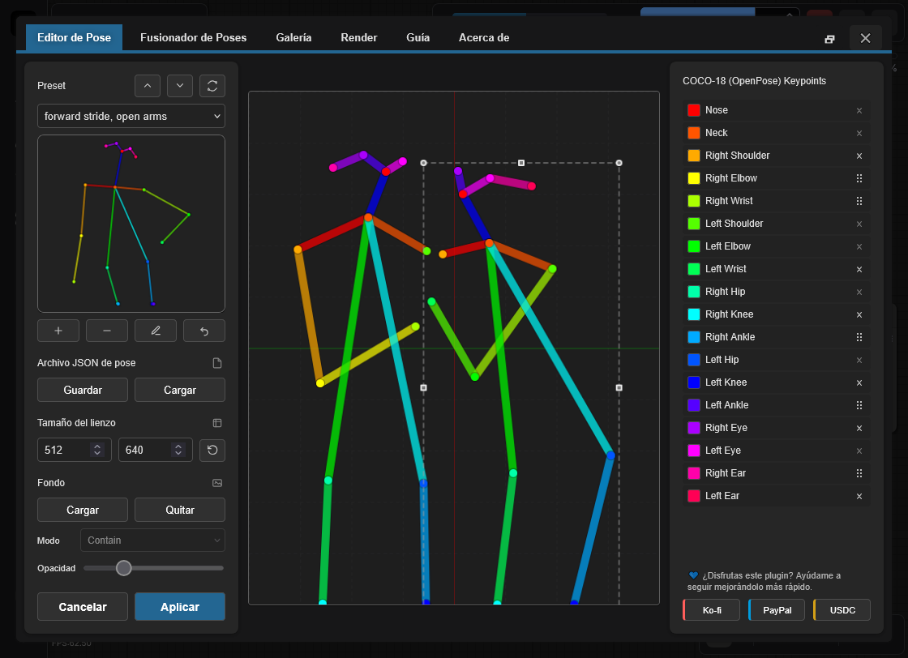
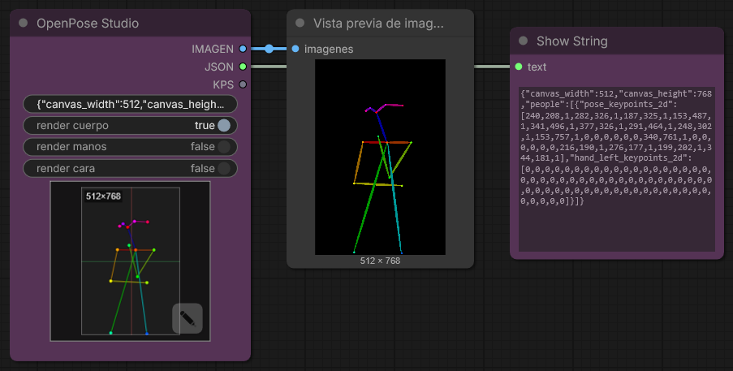
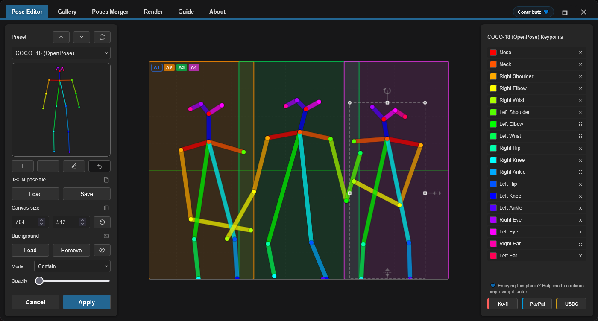
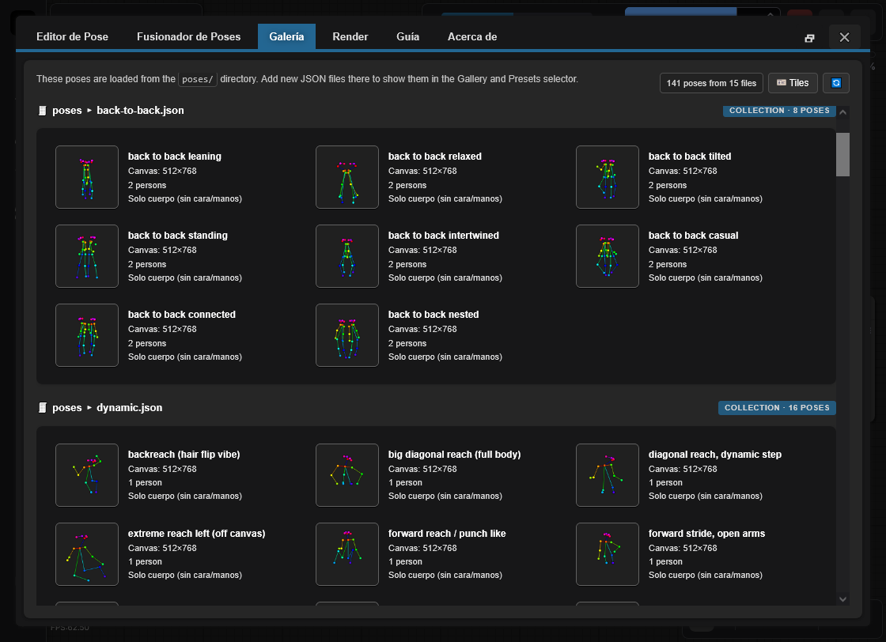

<h4 align="center">
  <a href="./README.md">English</a> | <a href="./README.de.md">Deutsch</a> | Español | <a href="./README.fr.md">Français</a> | <a href="./README.pt.md">Português</a> | <a href="./README.ru.md">Русский</a> | <a href="./README.ja.md">日本語</a> | <a href="./README.ko.md">한국어</a> | <a href="./README.zh.md">中文</a> | <a href="./README.zh-TW.md">繁體中文</a>
</h4>

<p align="center">
  
  
  
</p>
<br />

# OpenPose Studio for ComfyUI 🤸

OpenPose Studio es una extensión avanzada para ComfyUI que permite crear, editar, previsualizar y organizar poses de OpenPose mediante una interfaz ágil y cómoda. Facilita ajustar keypoints de forma visual, guardar y cargar archivos de poses, explorar presets y galerías de poses, administrar colecciones, fusionar múltiples poses y exportar datos JSON limpios para usar en ControlNet y otros workflows guiados por poses.

---

## Tabla de contenidos

- ✨ [Características](#características)
- 📦 [Instalación](#instalación)
- 🎯 [Uso](#uso)
- 🔧 [Nodos](#nodos)
- ⌨️ [Controles y atajos del editor](#controles-y-atajos-del-editor)
- 📋 [Especificaciones de formato](#especificaciones-de-formato)
- 🖼️ [Galería y gestión de poses](#galería-y-gestión-de-poses)
- 🔀 [Fusionador de poses](#pose-merger)
- 🖼️ [Referencia de fondo](#background-reference)
- 🗺️ [Areas Input](#areas-input)
- ⚠️ [Limitaciones conocidas](#limitaciones-conocidas)
- 🔍 [Solución de problemas](#solución-de-problemas)
- 🤝 [Contribuir](#contribuir)
- 💙 [Financiamiento y soporte](#financiamiento-y-soporte)
- 📄 [Licencia](#licencia)

---

## Características

✨ **Capacidades principales**
- Edición de Keypoints de OpenPose en tiempo real con retroalimentación visual
- Motor moderno de Render de Canvas nativo (más rápido, más fluido, con menos partes móviles)
- UX de edición interactiva: selección activa clara + preselección al pasar el mouse por una pose
- Transformaciones restringidas para que los Keypoints no se desplacen fuera de los límites del Canvas
- Importación/exportación de JSON para poses individuales y colecciones de poses
- Exportación estándar de JSON de OpenPose (portable a otras herramientas)
- Compatibilidad con JSON legacy (puede cargar y editar correctamente JSON no estándar más antiguos)

✨ **Funciones avanzadas**
- **Render Toggles**: Renderizar opcionalmente Body / Hands / Face
- **Pose Gallery**: Explorar y previsualizar poses desde `poses/`
- **Pose Collections**: Archivos JSON multi-pose mostrados como poses individuales seleccionables
- **Pose Merger**: Combinar múltiples archivos JSON en colecciones organizadas
- **Quick Cleanup Actions**: Eliminar Keypoints de Face y/o Keypoints de Hand izquierda/derecha cuando estén presentes
- **Optional Cleanup on Export**: Eliminar Keypoints de Face y/o Hands al exportar packs de poses
- **Background Overlay System**: Modos Contain/Cover seleccionables con control de opacidad
- **Undo**: Historial completo de edición durante la sesión

✨ **Manejo de datos**
- Descubrimiento automático de archivos de pose desde `poses/` (incluye subdirectorios)
- Validación y recuperación de errores para archivos JSON malformados
- Soporte para poses parciales (subconjunto de Keypoints del cuerpo)
- Coordenadas en espacio de píxeles que coinciden con los archivos de pose para compatibilidad sin fricción

✨ **UI e integración**
- Layout totalmente responsivo: se adapta a cualquier tamaño de ventana en tiempo real y se mantiene centrado
- Escalado automático para encajar cuando el Canvas no entraría en pantalla
- Visuales mejorados del Canvas: grilla de fondo + ejes centrales con estilo similar a Blender
- Persistencia entre reinicios: modo de vista de la galería + ajustes de superposición de fondo restaurados al iniciar
- Integraciones nativas de ComfyUI: toasts + diálogos (con fallback seguro)

---

✨ **Funciones planificadas y roadmap**

> [!IMPORTANT]
> Muchas funciones planificadas dependen de financiamiento para tokens de IA. Para el roadmap completo y el trabajo próximo, revisa [TODO.md](../TODO.md)..

Si tienes una idea para una nueva función, me encantaría escucharla — quizá podamos implementarla rápidamente. Envía feedback, ideas o sugerencias mediante la página de Issues del repositorio: https://github.com/andreszs/comfyui-openpose-studio/issues


## Instalación

### Requisitos
- ComfyUI (build reciente)
- Python 3.10+

### Pasos

1. Clona este repositorio en `ComfyUI/custom_nodes/`.
2. Reinicia ComfyUI.
3. Confirma que los nodos aparecen bajo `image > OpenPose Studio`.

---

## Uso

### Flujo de trabajo básico

1. Agrega el nodo **OpenPose Studio** a tu workflow
2. Haz clic en el Canvas de vista previa del nodo para abrir la UI del editor
3. Selecciona una pose desde los Preset o la galería para insertarla en el Canvas
4. Ajusta los Keypoints arrastrándolos en el Canvas
5. Haz clic en **Apply** para Renderizar la pose. Esto creará el JSON serializado en el nodo.
6. Conecta la salida `image` a los nodos de imagen posteriores
7. Conecta la salida `kps` a nodos compatibles con ControlNet/OpenPose

### Vista previa del editor



---

## Nodos

### OpenPose Studio

**Categoría:** `image`

- **Entrada:** `Pose JSON` (STRING) — JSON estándar estilo OpenPose.
- **Entradas opcionales:**
  - `areas` (`CONDITIONING_AREAS`) — datos de overlay de áreas; conecta la salida `areas_out` de un nodo [Conditioning Pipeline (Combine)](https://github.com/andreszs/comfyui-lora-pipeline) para visualizar las regiones de condicionamiento en el Canvas
- **Opciones:**
  - `render body` — incluir body en la vista previa/salida Renderizada
  - `render hands` — incluir hands en la vista previa/salida Renderizada (si están presentes en el JSON)
  - `render face` — incluir face en la vista previa/salida Renderizada (si está presente en el JSON)
- **Salidas:**
  - `IMAGE` — Visualización Renderizada de la pose como imagen RGB (float32, rango 0-1)
  - `JSON` — JSON estilo OpenPose con dimensiones del Canvas y un array `people` que contiene datos de Keypoints
  - `KPS` — Datos de Keypoints en formato POSE_KEYPOINT, compatible con ControlNet
- **UI:** Haz clic en la vista previa del nodo para abrir el editor interactivo. Usa el botón **open editor** (ícono de lápiz) para editar la pose directamente.

#### Captura del nodo



---

## Controles y atajos del editor

### Atajos de teclado

| Control | Acción |
|---------|--------|
| **Enter** | Aplicar la pose y cerrar el editor |
| **Escape** | Cancelar y descartar cambios |
| **Ctrl+Z** | Deshacer la última acción |
| **Ctrl+Y** | Rehacer la última acción deshecha |
| **Delete** | Eliminar el Keypoint seleccionado |

### Interacciones del Canvas

- **Click**: Seleccionar Keypoint
- **Drag**: Mover Keypoint a una nueva posición
- **Scroll**: Zoom in/out en el Canvas (TO-DO)

### Background Reference

Carga imágenes de referencia (p. ej., guías de anatomía, referencias fotográficas) como superposiciones no destructivas durante la edición de poses. Usa el modo **Contain** para ajustar imágenes dentro del Canvas o el modo **Cover** para llenar el Canvas. Ajusta la opacidad según sea necesario.

- **Load Image**: Importar imagen de referencia desde el disco
- **Contain/Cover**: Elegir modo de escalado
- **Opacity**: Ajustar transparencia (0-100%)

> [!NOTE]
> Las imágenes de fondo persisten durante la sesión de ComfyUI pero **no** se guardan en los workflows.

### Areas Input

La entrada **areas** es una conexión **opcional** que superpone los límites de las áreas de condicionamiento en el Canvas durante la edición de poses.

Conecta la salida `areas_out` del nodo [**Conditioning Pipeline (Combine)**](https://github.com/andreszs/comfyui-lora-pipeline) del repositorio [ComfyUI-LoRA-Pipeline](https://github.com/andreszs/comfyui-lora-pipeline) para visualizar qué regiones apunta cada área mientras posicionas tus poses.

Cada área se muestra como un badge etiquetado en el Canvas. Haz clic en cualquier badge para **habilitar o deshabilitar** esa área individualmente, permitiéndote centrarte en las regiones relevantes para tu pose actual.



Esta combinación es especialmente útil cuando se construyen workflows de múltiples personajes: [ComfyUI-LoRA-Pipeline](https://github.com/andreszs/comfyui-lora-pipeline) gestiona el condicionamiento por área y la asignación de LoRA, mientras que OpenPose Studio mantiene el posicionamiento preciso de las poses dentro de cada región. El resultado es una configuración directa y no destructiva donde tanto los LoRAs por área como los por pose pueden aplicarse simultáneamente sin interferencia. Si aún no estás familiarizado con el condicionamiento basado en áreas, la extensión [ComfyUI-LoRA-Pipeline](https://github.com/andreszs/comfyui-lora-pipeline) está diseñada exactamente para este tipo de workflow y se combina perfectamente con este nodo.

Para un ejemplo real de los tres repositorios trabajando juntos — condicionamiento por áreas, control de OpenPose y aplicación de estilos en capas — consulta esta [guía paso a paso del workflow](https://www.andreszsogon.com/building-a-multi-character-comfyui-workflow-with-area-conditioning-openpose-control-and-style-layering/).

---

## Especificaciones de formato

Este editor soporta completamente la edición de **OpenPose COCO-18 (body)**.

También soporta datos de **OpenPose face y hands** de manera *pass-through*: si tu JSON incluye Keypoints de face y/o hand, se preservan (no se eliminan) y el nodo de Python puede Renderizarlos correctamente. Sin embargo, **la edición de Keypoints de face y hand aún no está disponible** (planificada para próximas actualizaciones).

### OpenPose COCO-18 keypoints (body)

COCO-18 usa **18 Keypoints del cuerpo**. La pose se almacena como un array plano llamado `pose_keypoints_2d` con el patrón:

`[x0, y0, c0, x1, y1, c1, ...]`

Donde cada Keypoint tiene:
- `x`, `y`: coordenadas en píxeles en el Canvas
- `c`: confianza (comúnmente `0..1`; `0` puede usarse para puntos “faltantes”)

Orden de Keypoints (índice → nombre):

| Índice | Nombre |
|------:|------|
| 0 | Nariz |
| 1 | Cuello |
| 2 | Hombro derecho |
| 3 | Codo derecho |
| 4 | Muñeca derecha |
| 5 | Hombro izquierdo |
| 6 | Codo izquierdo |
| 7 | Muñeca izquierda |
| 8 | Cadera derecha |
| 9 | Rodilla derecha |
| 10 | Tobillo derecho |
| 11 | Cadera izquierda |
| 12 | Rodilla izquierda |
| 13 | Tobillo izquierdo |
| 14 | Ojo derecho |
| 15 | Ojo izquierdo |
| 16 | Oreja derecha |
| 17 | Oreja izquierda |

> [!NOTE]
> **COCO** se refiere a la convención/nombre de dataset *Common Objects in Context* ampliamente usada en estimación de pose. “COCO-18” aquí significa el layout de body de OpenPose con 18 Keypoints.

### Forma mínima de JSON

Un JSON típico estilo OpenPose para una pose individual incluye dimensiones del Canvas y una entrada en `people` con `pose_keypoints_2d`:

```json
{
  "canvas_width": 512,
  "canvas_height": 512,
  "people": [
    {
      "pose_keypoints_2d": [0, 0, 0, 0, 0, 0 /* ... 18 * 3 values total ... */]
    }
  ]
}
```

> [!NOTE]
> El editor puede manejar poses parciales (faltan algunos Keypoints). Los puntos faltantes típicamente se representan como 0,0,0. También puedes borrar Keypoints distales usando el OpenPose Studio.

### Lecturas adicionales

- Historia y contexto: "What is OpenPose — Exploring a milestone in pose estimation" — un artículo accesible que explica cómo se introdujo OpenPose y su impacto en la estimación de pose: https://www.ultralytics.com/blog/what-is-openpose-exploring-a-milestone-in-pose-estimation

### Formato JSON: estándar vs legacy

- **OpenPose Studio:** lee/escribe **JSON estándar estilo OpenPose** y también acepta JSON legacy no estándar antiguo.

Notas prácticas:
- Pegar JSON estándar en el nodo OpenPose Studio Renderiza la vista previa de inmediato.

---

## Galería y gestión de poses

### Descripción general

La pestaña **Gallery** permite explorar visualmente todas las poses disponibles con miniaturas de vista previa en vivo. Descubre y organiza poses automáticamente, sin configuración manual.



### Modos de vista

La Gallery soporta tres modos de visualización:
- **Large** — vistas previas más grandes para selección visual rápida
- **Medium** — tamaño y densidad de vista previa balanceados
- **Tiles** — grilla compacta con metadatos extra (p. ej., **tamaño del Canvas**, **cantidad de Keypoints** y otros detalles de la pose)

### Funciones

- **Auto-discovery**: Escanea el directorio `poses/` al iniciar
- **Nested organization**: Los nombres de subdirectorios se convierten en etiquetas de grupo
- **Live preview**: Render de miniaturas en vivo para cada pose
- **Search/filter**: Encontrar poses por nombre o grupo
- **One-click load**: Seleccionar una pose para cargarla en el editor

### Tipos de archivo soportados

- **Single-pose JSON**: Archivos JSON individuales de OpenPose
- **Pose Collections**: Archivos JSON multi-pose (cada pose se muestra por separado)
- **Nested directories**: Poses en subdirectorios agrupadas automáticamente

### Comportamiento determinístico

El orden y el descubrimiento en la Gallery es completamente determinístico:
- Sin mezcla aleatoria
- Orden alfabético consistente
- Las poses raíz aparecen primero, luego las poses agrupadas
- Recarga inmediata de todas las poses JSON al abrir la ventana del editor.

---

## Pose Merger

### Propósito

La pestaña **Pose Merger** consolida múltiples archivos JSON de pose individuales en archivos de colección de poses organizados. Esto es útil para:

- Convertir bibliotecas grandes de poses en archivos únicos
- Limpiar datos de poses (eliminar Keypoints de face/hand)
- Reorganizar y renombrar poses
- Distribuir packs de poses de manera eficiente

### Flujo de trabajo

1. **Add Files**: Cargar archivos JSON individuales o de colección
2. **Preview**: Cada pose se muestra con miniatura
3. **Configure**: Excluir opcionalmente componentes de face/hand
4. **Export**: Guardar como colección combinada o archivos individuales

### Capacidades clave

| Función | Caso de uso |
|---------|----------|
| **Load Multiple Files** | Importación masiva desde el sistema de archivos |
| **Component Filtering** | Eliminar datos innecesarios de face/hand |
| **Collection Expansion** | Extraer poses desde colecciones existentes |
| **Batch Renaming** | Asignar nombres significativos durante la exportación |
| **Selective Export** | Elegir qué poses incluir |

### Opciones de salida

- **Combined Collection**: Un único JSON con todas las poses
- **Individual Files**: Un archivo por pose (para compatibilidad)

Ambos formatos de salida se detectan automáticamente por la Gallery y el Pose Selector.

---

## Limitaciones conocidas

> [!WARNING]
> Nodes 2.0 actualmente no está soportado. Por favor desactiva Nodes 2.0 por ahora.

### Limitaciones actuales y workarounds

1. **Edición de Hand y Face**
  - Problema: El editor actualmente está limitado a Keypoints del body (0-17)
  - Estado: Planificado para una versión futura
  - Workaround: Usa Pose Merger para editar manualmente el JSON de hand/face antes de importar

2. **Consistencia de resolución**
  - Problema: Pose Merger no unifica automáticamente la resolución en exportaciones de colecciones
  - Estado: Requiere una implementación cuidadosa para evitar recortes
  - Workaround: Pre-escala las poses a la resolución objetivo antes de importar

3. **Compatibilidad con Nodes 2.0**
  - Problema: El nodo no se comporta correctamente cuando ComfyUI "Nodes 2.0" está habilitado.
  - Estado: Fix planificado, pero es un refactor grande y que consume mucho tiempo.
  - Nota: Este proyecto se desarrolla usando agentes de IA pagos. Una vez que haya financiamiento para comprar tokens de IA adicionales, tengo la intención de priorizar el soporte de Nodes 2.0.
  - Workaround: Desactiva Nodes 2.0 por ahora.

### Recuperación de errores

El plugin incluye manejo defensivo de errores:
- Archivos JSON inválidos se omiten silenciosamente en la Gallery
- Errores de Render devuelven imágenes en blanco en lugar de crashear
- Metadatos faltantes usan defaults seguros
- Keypoints malformados se filtran durante el Render

---

## Solución de problemas

### Problemas comunes y soluciones

**Las poses no aparecen en la Gallery**
```
✓ Confirmar que los archivos existan en el directorio poses/
✓ Verificar que el JSON sea válido (usar un validador de JSON online)
✓ Comprobar que la extensión del archivo sea .json (case-sensitive en Linux)
✓ Reiniciar ComfyUI para disparar el discovery
✓ Revisar la consola del navegador (F12) por mensajes de error
```

**Falla la importación de JSON**
```
✓ Validar la estructura del JSON (debe tener "pose_keypoints_2d" o equivalente)
✓ Asegurar que las coordenadas sean números válidos, no strings
✓ Confirmar un mínimo de 18 Keypoints para poses de body
✓ Revisar secuencias de escape malformadas en el JSON
```

**Imagen de salida en blanco**
```
✓ Verificar que la pose esté seleccionada y contenga Keypoints válidos
✓ Revisar dimensiones del Canvas (ancho/alto) razonables (100-2048px)
✓ Hacer clic en Apply para Renderizar después de hacer cambios
✓ Revisar NaN o valores infinitos en coordenadas
```

**Background reference no persiste**
```
✓ Habilitar cookies/almacenamiento de terceros en el navegador
✓ Revisar la configuración de localStorage del navegador
✓ Probar modo incógnito para aislar el problema
✓ Limpiar caché del navegador y probar nuevamente
```

**El nodo no aparece en ComfyUI**
```
✓ Verificar la ubicación del clone: ComfyUI/custom_nodes/comfyui-openpose-studio
✓ Comprobar que exista __init__.py y que importe correctamente
✓ Reiniciar ComfyUI completamente (no solo recargar la página)
✓ Revisar la consola de ComfyUI por errores de importación
```
---

## Contribuir

Para lineamientos de contribución, lineamientos de pull requests, detalles de arquitectura e información de desarrollo, ver [CONTRIBUTING.md](../CONTRIBUTING.md). Si usas un agente de IA para asistir en desarrollo, asegúrate de que lea [AGENTS.md](../AGENTS.md) antes de hacer cualquier cambio de código.

---

## Financiamiento y soporte

### Por qué importa tu apoyo

Este plugin se desarrolla y mantiene de forma independiente, con uso regular de **agentes de IA pagados** para acelerar la depuración, las pruebas y las mejoras de calidad de vida. Si te resulta útil, el apoyo financiero ayuda a mantener el desarrollo avanzando de forma constante.

Tu contribución ayuda a:

* Financiar herramientas de IA para correcciones más rápidas y nuevas funciones
* Cubrir mantenimiento continuo y trabajo de compatibilidad en las actualizaciones de ComfyUI
* Evitar ralentizaciones del desarrollo cuando se alcanzan los límites de uso

> [!TIP]
> ¿No puedes donar? Una estrella de GitHub ⭐ también ayuda mucho al mejorar la visibilidad y llegar a más usuarios.

### 💙 Apoya este proyecto

Elige tu método preferido para contribuir:

<table style="width: 100%; table-layout: fixed;">
  <tr>
    <td align="center" style="width: 33.33%; padding: 20px;">
      <div>
        <h4 style="margin: 8px 0;">Ko-fi</h4>
        <a href="https://ko-fi.com/D1D716OLPM" target="_blank" rel="noopener noreferrer">
          
        </a>
        <p style="margin: 8px 0; font-size: 12px;"><a href="https://ko-fi.com/D1D716OLPM" target="_blank" rel="noopener noreferrer">Invítame un café</a></p>
      </div>
    </td>
    <td align="center" style="width: 33.33%; padding: 20px;">
      <div>
        <h4 style="margin: 8px 0;">PayPal</h4>
        <a href="https://www.paypal.com/ncp/payment/GEEM324PDD9NC" target="_blank" rel="noopener noreferrer">
          
        </a>
        <p style="margin: 8px 0; font-size: 12px;"><a href="https://www.paypal.com/ncp/payment/GEEM324PDD9NC" target="_blank" rel="noopener noreferrer">Abrir PayPal</a></p>
      </div>
    </td>
    <td align="center" style="width: 33.33%; padding: 20px;">
      <div>
        <h4 style="margin: 8px 0;">USDC (solo Arbitrum ⚠️)</h4>
        <a href="https://arbiscan.io/address/0xe36a336fC6cc9Daae657b4A380dA492AB9601e73" target="_blank" rel="noopener noreferrer">
          
        </a>
        <p style="margin: 8px 0; font-size: 12px;"><a href="#usdc-address">Mostrar dirección</a></p>
      </div>
    </td>
  </tr>
</table>

<details>
  <summary>¿Prefieres escanear? Mostrar códigos QR</summary>
  <br />
  <table style="width: 100%; table-layout: fixed;">
    <tr>
      <td align="center" style="width: 33.33%; padding: 12px;">
        <strong>Ko-fi</strong><br />
        <a href="https://ko-fi.com/D1D716OLPM" target="_blank" rel="noopener noreferrer">
          
        </a>
      </td>
      <td align="center" style="width: 33.33%; padding: 12px;">
        <strong>PayPal</strong><br />
        <a href="https://www.paypal.com/ncp/payment/GEEM324PDD9NC" target="_blank" rel="noopener noreferrer">
          
        </a>
      </td>
      <td align="center" style="width: 33.33%; padding: 12px;">
        <strong>USDC (Arbitrum) ⚠️</strong><br />
        <a href="https://arbiscan.io/address/0xe36a336fC6cc9Daae657b4A380dA492AB9601e73" target="_blank" rel="noopener noreferrer">
          
        </a>
      </td>
    </tr>
  </table>
</details>

<a id="usdc-address"></a>
<details>
  <summary>Mostrar dirección USDC</summary>

```text
0xe36a336fC6cc9Daae657b4A380dA492AB9601e73
```

> [!WARNING]
> Envía USDC solo en Arbitrum One. Las transferencias en cualquier otra red no llegarán y podrían perderse permanentemente.
</details>

---

## Licencia

Licencia MIT - ver el archivo [LICENSE](../LICENSE) para el texto completo.

**Resumen:**
- ✓ Gratis para uso comercial
- ✓ Gratis para uso privado
- ✓ Modificar y distribuir
- ✓ Incluir licencia y aviso de copyright

---

## Recursos adicionales

### Proyectos relacionados

- [ComfyUI](https://github.com/comfyanonymous/ComfyUI) - Framework principal
- [comfyui_controlnet_aux](https://github.com/Kosinkadink/ComfyUI-Advanced-ControlNet) - Soporte ControlNet
- [OpenPose](https://github.com/CMU-Perceptual-Computing-Lab/openpose) - Detección de pose original

### Documentación

- [ComfyUI Custom Nodes Guide](https://github.com/comfyanonymous/ComfyUI/blob/main/docs/)
- [OpenPose Models & Keypoints](https://github.com/CMU-Perceptual-Computing-Lab/openpose/blob/master/doc/02_Output.md)
- [Canvas 2D API](https://developer.mozilla.org/en-US/docs/Web/API/Canvas_API) - Motor de Render

### Guías de solución de problemas

- [ComfyUI Installation Issues](https://github.com/comfyanonymous/ComfyUI/wiki/Installation)
- [Node Registration & Loading](https://github.com/comfyanonymous/ComfyUI/blob/main/docs/CONTRIBUTING.md)
- [Browser Developer Tools](https://developer.chrome.com/docs/devtools/)

---

**Mantenido por:** andreszs  
**Estado:** Desarrollo activo
