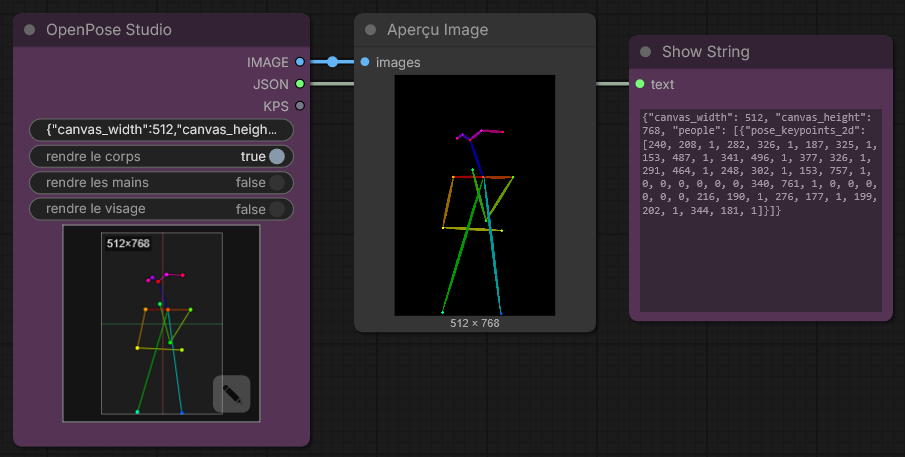

<h4 align="center">
  <a href="./README.md">English</a> | <a href="./README.de.md">Deutsch</a> | <a href="./README.es.md">Español</a> | Français | <a href="./README.pt.md">Português</a> | <a href="./README.ru.md">Русский</a> | <a href="./README.ja.md">日本語</a> | <a href="./README.ko.md">한국어</a> | <a href="./README.zh.md">中文</a> | <a href="./README.zh-TW.md">繁體中文</a>
</h4>

<p align="center">
  
  
  
</p>
<br />

# OpenPose Studio for ComfyUI 🤸

OpenPose Studio est une extension avancée pour ComfyUI permettant de créer, modifier, prévisualiser et organiser des poses OpenPose à l’aide d’une interface fluide et pratique. Elle facilite l’ajustement visuel des keypoints, l’enregistrement et le chargement de fichiers de poses, la navigation dans des presets et galeries de poses, la gestion de collections, la fusion de plusieurs poses et l’export de données JSON propres pour une utilisation avec ControlNet et d’autres workflows pilotés par des poses.

---

## Table des matières

- ✨ [Fonctionnalités](#fonctionnalités)
- 📦 [Installation](#installation)
- 🎯 [Utilisation](#utilisation)
- 🔧 [Nodes](#nodes)
- ⌨️ [Contrôles et raccourcis de l'éditeur](#contrôles-et-raccourcis-de-léditeur)
- 📋 [Spécifications de format](#spécifications-de-format)
- 🖼️ [Galerie et gestion des poses](#galerie-et-gestion-des-poses)
- 🔀 [Pose Merger](#pose-merger)
- 🖼️ [Référence d'arrière-plan](#background-reference)
- ⚠️ [Limitations connues](#limitations-connues)
- 🔍 [Dépannage](#dépannage)
- 🤝 [Contribuer](#contribuer)
- 💙 [Financement et support](#financement-et-support)
- 📄 [Licence](#licence)

---

## Fonctionnalités

✨ **Capacités principales**
- Édition des keypoints OpenPose en temps réel avec retour visuel
- Moteur de rendu Canvas natif moderne (plus rapide, plus fluide, moins de pièces mobiles)
- UX d'édition interactive : sélection active claire + présélection au survol de pose
- Transformations contraintes pour que les keypoints ne dérivent pas hors des limites du canvas
- Import/export JSON pour les poses individuelles et les collections de poses
- Export JSON OpenPose standard (portable vers d'autres outils)
- Compatibilité JSON legacy (peut charger et modifier correctement les JSON non-standard plus anciens)

✨ **Fonctionnalités avancées**
- **Render Toggles** : Rendu optionnel de Body / Hands / Face
- **Pose Gallery** : Parcourir et prévisualiser les poses depuis `poses/`
- **Pose Collections** : Fichiers JSON multi-poses affichés comme des poses individuellement sélectionnables
- **Pose Merger** : Combiner plusieurs fichiers JSON en collections organisées
- **Quick Cleanup Actions** : Supprimer les keypoints Face et/ou les keypoints Main gauche/droite lorsqu'ils sont présents
- **Optional Cleanup on Export** : Supprimer les keypoints Face et/ou Hands lors de l'export de packs de poses
- **Background Overlay System** : Modes Contain/Cover sélectionnables avec contrôle d'opacité
- **Undo** : Historique d'édition complet pendant la session

✨ **Gestion des données**
- Découverte automatique des fichiers de pose depuis `poses/` (y compris les sous-répertoires)
- Validation et récupération d'erreurs pour les fichiers JSON malformés
- Prise en charge des poses partielles (sous-ensemble de keypoints body)
- Coordonnées en espace pixel correspondant aux fichiers de pose pour une compatibilité parfaite

✨ **UI et intégration**
- Disposition entièrement responsive : s'adapte en temps réel à toute taille de fenêtre et reste centré
- Mise à l'échelle automatique quand le canvas ne tiendrait pas autrement à l'écran
- Visuels canvas améliorés : grille d'arrière-plan + axes centraux stylisés comme dans Blender
- Persistance entre les redémarrages : mode de vue galerie + paramètres d'overlay d'arrière-plan restaurés au lancement
- Intégrations ComfyUI natives : toasts + dialogues (avec fallback sécurisé)

---

✨ **Fonctionnalités prévues et feuille de route**

> [!IMPORTANT]
> De nombreuses fonctionnalités prévues dépendent du financement des tokens IA. Pour la feuille de route complète et les travaux à venir, consultez [TODO.md](../TODO.md)..

Si vous avez une idée pour une nouvelle fonctionnalité, je serais ravi de l'entendre — nous pourrions peut-être la mettre en œuvre rapidement. Soumettez vos retours, idées ou suggestions via la page Issues du dépôt : https://github.com/andreszs/comfyui-openpose-studio/issues


## Installation

### Prérequis
- ComfyUI (build récent)
- Python 3.10+

### Étapes

1. Cloner ce dépôt dans `ComfyUI/custom_nodes/`.
2. Redémarrer ComfyUI.
3. Confirmer que les nodes apparaissent sous `image > OpenPose Studio`.

---

## Utilisation

### Workflow de base

1. Ajouter le node **OpenPose Studio** à votre workflow
2. Cliquer sur le canvas de prévisualisation du node pour ouvrir l'UI de l'éditeur
3. Sélectionner une pose depuis les préréglages ou la galerie pour l'insérer dans le canvas
4. Ajuster les keypoints en les faisant glisser sur le canvas
5. Cliquer sur **Apply** pour rendre la pose. Cela créera le JSON sérialisé dans le node.
6. Connecter la sortie `image` aux nodes d'image suivants
7. Connecter la sortie `kps` aux nodes compatibles ControlNet/OpenPose

### Aperçu de l'éditeur


---

## Nodes

### OpenPose Studio

**Catégorie :** `image`

- **Entrée :** `Pose JSON` (STRING) — JSON standard de style OpenPose.
- **Options :**
  - `render body` — inclure le body dans l'image de prévisualisation/sortie rendue
  - `render hands` — inclure les hands dans l'image de prévisualisation/sortie rendue (si présentes dans le JSON)
  - `render face` — inclure le face dans l'image de prévisualisation/sortie rendue (si présent dans le JSON)
- **Sorties :**
  - `IMAGE` — Visualisation rendue de la pose en tant qu'image RGB (float32, plage 0-1)
  - `JSON` — JSON de style OpenPose avec les dimensions du canvas et un tableau people contenant les données de keypoints
  - `KPS` — Données de keypoints au format POSE_KEYPOINT, compatible avec ControlNet
- **UI :** Cliquer sur la prévisualisation du node pour ouvrir l'éditeur interactif. Utiliser le bouton **open editor** (icône crayon) pour modifier la pose directement.

#### Capture du node



---

## Contrôles et raccourcis de l'éditeur

### Raccourcis clavier

| Contrôle | Action |
|---------|--------|
| **Enter** | Appliquer la pose et fermer l'éditeur |
| **Escape** | Annuler et abandonner les modifications |
| **Ctrl+Z** | Annuler la dernière action |
| **Ctrl+Y** | Rétablir la dernière action annulée |
| **Delete** | Supprimer le keypoint sélectionné |

### Interactions avec le canvas

- **Clic** : Sélectionner un keypoint
- **Glisser** : Déplacer le keypoint vers une nouvelle position
- **Défilement** : Zoom avant/arrière sur le canvas (TO-DO)

### Background Reference

Charger des images de référence (ex. guides anatomiques, références photo) comme superpositions non-destructives pendant l'édition des poses. Utiliser le mode **Contain** pour adapter les images dans le canvas ou le mode **Cover** pour remplir le canvas. Ajuster l'opacité selon les besoins.

- **Load Image** : Importer une image de référence depuis le disque
- **Contain/Cover** : Choisir le mode de mise à l'échelle
- **Opacity** : Ajuster la transparence (0-100%)

> [!NOTE]
> Les images d'arrière-plan persistent pendant la session ComfyUI mais ne sont **pas** sauvegardées dans les workflows.

---

## Spécifications de format

Cet éditeur prend en charge complètement l'édition **OpenPose COCO-18 (body)**.

Il prend également en charge les **données OpenPose face et hands** de manière *pass-through* : si votre JSON inclut des keypoints face et/ou hand, ils sont préservés (non supprimés) et le node Python peut les rendre correctement. Cependant, **l'édition des keypoints face et hand n'est pas encore disponible** (prévue pour les prochaines mises à jour).

### Keypoints OpenPose COCO-18 (body)

COCO-18 utilise **18 keypoints body**. La pose est stockée comme un tableau plat nommé `pose_keypoints_2d` avec le modèle :

`[x0, y0, c0, x1, y1, c1, ...]`

Où chaque keypoint a :
- `x`, `y` : coordonnées en pixels sur le canvas
- `c` : confiance (généralement `0..1` ; `0` peut être utilisé pour les points « manquants »)

Ordre des keypoints (index → nom) :

| Index | Nom |
|------:|------|
| 0 | Nez |
| 1 | Cou |
| 2 | Épaule droite |
| 3 | Coude droit |
| 4 | Poignet droit |
| 5 | Épaule gauche |
| 6 | Coude gauche |
| 7 | Poignet gauche |
| 8 | Hanche droite |
| 9 | Genou droit |
| 10 | Cheville droite |
| 11 | Hanche gauche |
| 12 | Genou gauche |
| 13 | Cheville gauche |
| 14 | Œil droit |
| 15 | Œil gauche |
| 16 | Oreille droite |
| 17 | Oreille gauche |

> [!NOTE]
> **COCO** fait référence à la convention/dénomination de dataset *Common Objects in Context* largement utilisée dans l'estimation de pose. « COCO-18 » désigne ici la disposition body OpenPose avec 18 keypoints.

### Structure JSON minimale

Un JSON OpenPose typique pour une pose unique inclut les dimensions du canvas et une entrée `people` avec `pose_keypoints_2d` :

```json
{
  "canvas_width": 512,
  "canvas_height": 512,
  "people": [
    {
      "pose_keypoints_2d": [0, 0, 0, 0, 0, 0 /* ... 18 * 3 values total ... */]
    }
  ]
}
```

> [!NOTE]
> L'éditeur peut gérer les poses partielles (certains keypoints manquants). Les points manquants sont typiquement représentés par 0,0,0. Vous pouvez également supprimer les keypoints distaux à l'aide du Pose Editor.

### Lectures complémentaires

- Histoire et contexte : « What is OpenPose — Exploring a milestone in pose estimation » — un article accessible expliquant comment OpenPose a été introduit et son impact sur l'estimation de pose : https://www.ultralytics.com/blog/what-is-openpose-exploring-a-milestone-in-pose-estimation

### Format JSON : Standard vs Legacy

- **OpenPose Studio :** lit/écrit du **JSON standard de style OpenPose** et accepte également les anciens JSON legacy non-standard.

Notes pratiques :
- Coller du JSON standard dans le node OpenPose Studio affiche immédiatement la prévisualisation.

---

## Galerie et gestion des poses

### Aperçu

L'onglet **Gallery** offre une navigation visuelle de toutes les poses disponibles avec des vignettes de prévisualisation en direct. Il découvre et organise automatiquement les poses sans configuration manuelle.


### Modes d'affichage

La Gallery prend en charge trois modes d'affichage :
- **Large** — prévisualisations plus grandes pour une sélection visuelle rapide
- **Medium** — taille et densité de prévisualisation équilibrées
- **Tiles** — grille compacte avec métadonnées supplémentaires (ex. **taille du canvas**, **nombre de keypoints** et autres détails de pose)

### Fonctionnalités

- **Auto-discovery** : Scanne le répertoire `poses/` au démarrage
- **Nested organization** : Les noms de sous-répertoires deviennent des étiquettes de groupe
- **Live preview** : Rendu de vignettes en direct pour chaque pose
- **Search/filter** : Trouver des poses par nom ou groupe
- **One-click load** : Sélectionner une pose pour la charger dans l'éditeur

### Types de fichiers pris en charge

- **Single-pose JSON** : Fichiers JSON OpenPose individuels
- **Pose Collections** : Fichiers JSON multi-poses (chaque pose affichée séparément)
- **Nested directories** : Poses dans des sous-répertoires automatiquement regroupées

### Comportement déterministe

L'ordre et la découverte de la galerie sont entièrement déterministes :
- Pas de mélange aléatoire
- Tri alphabétique cohérent
- Poses racines listées en premier, puis poses groupées
- Rechargement immédiat de toutes les poses JSON à l'ouverture de la fenêtre de l'éditeur.

---

## Pose Merger

### Objectif

L'onglet **Pose Merger** consolide plusieurs fichiers JSON de poses individuelles en fichiers de collection de poses organisés. Ceci est utile pour :

- Convertir de grandes bibliothèques de poses en fichiers uniques
- Nettoyer les données de poses (suppression des keypoints face/hand)
- Réorganiser et renommer des poses
- Distribuer des packs de poses efficacement

### Workflow

1. **Add Files** : Charger des fichiers JSON individuels ou de collection
2. **Preview** : Chaque pose affichée avec sa vignette
3. **Configure** : Exclure optionnellement les composants face/hand
4. **Export** : Sauvegarder comme collection combinée ou fichiers individuels

### Capacités clés

| Fonctionnalité | Cas d'utilisation |
|---------|----------|
| **Load Multiple Files** | Import en masse depuis le système de fichiers |
| **Component Filtering** | Supprimer les données face/hand inutiles |
| **Collection Expansion** | Extraire des poses de collections existantes |
| **Batch Renaming** | Attribuer des noms significatifs lors de l'export |
| **Selective Export** | Choisir quelles poses inclure |

### Options de sortie

- **Combined Collection** : JSON unique avec toutes les poses
- **Individual Files** : Un fichier par pose (pour la compatibilité)

Les deux formats de sortie sont automatiquement détectés par Gallery et Pose Selector.

---

## Limitations connues

> [!WARNING]
> Nodes 2.0 n'est actuellement pas pris en charge. Veuillez désactiver Nodes 2.0 pour l'instant.

### Limitations actuelles et solutions de contournement

1. **Édition Hand et Face**
  - Problème : L'éditeur est actuellement limité aux keypoints body (0-17)
  - Statut : Prévu pour une prochaine version
  - Solution : Utiliser Pose Merger pour modifier manuellement le JSON hand/face avant l'import

2. **Cohérence de résolution**
  - Problème : Pose Merger n'unifie pas automatiquement la résolution lors des exports de collections
  - Statut : Nécessite une implémentation prudente pour éviter le rognage
  - Solution : Pré-mettre à l'échelle les poses à la résolution cible avant l'import

3. **Compatibilité Nodes 2.0**
  - Problème : Le node ne se comporte pas correctement quand ComfyUI « Nodes 2.0 » est activé.
  - Statut : Correction prévue, mais c'est un refactoring important et chronophage.
  - Note : Ce projet est développé avec des agents IA payants. Une fois le financement disponible pour acheter des tokens IA supplémentaires, j'ai l'intention de prioriser le support Nodes 2.0.
  - Solution : Désactiver Nodes 2.0 pour l'instant.

### Récupération d'erreurs

Le plugin inclut une gestion défensive des erreurs :
- Les fichiers JSON invalides sont ignorés silencieusement dans Gallery
- Les erreurs de rendu renvoient des images blanches au lieu de planter
- Les métadonnées manquantes se replient sur des valeurs par défaut sûres
- Les keypoints malformés sont filtrés pendant le rendu

---

## Dépannage

### Problèmes courants et solutions

**Les poses n'apparaissent pas dans Gallery**
```
✓ Confirmer que les fichiers existent dans le répertoire poses/
✓ Vérifier que le JSON est valide (utiliser un validateur JSON en ligne)
✓ Vérifier que l'extension de fichier est .json (sensible à la casse sur Linux)
✓ Redémarrer ComfyUI pour déclencher la découverte
✓ Vérifier la console du navigateur (F12) pour les messages d'erreur
```

**L'import JSON échoue**
```
✓ Valider la structure JSON (doit avoir "pose_keypoints_2d" ou équivalent)
✓ S'assurer que les coordonnées sont des nombres valides, pas des chaînes
✓ Confirmer un minimum de 18 keypoints pour les poses body
✓ Vérifier les séquences d'échappement malformées dans le JSON
```

**Image de sortie vide**
```
✓ Vérifier que la pose est sélectionnée et contient des keypoints valides
✓ Vérifier les dimensions du canvas (largeur/hauteur) raisonnables (100-2048px)
✓ Cliquer sur Apply pour rendre après avoir effectué des modifications
✓ Vérifier la présence de valeurs NaN ou infinies dans les coordonnées
```

**La référence d'arrière-plan ne persiste pas**
```
✓ Activer les cookies/stockage tiers dans le navigateur
✓ Vérifier les paramètres localStorage du navigateur
✓ Essayer le mode incognito pour isoler le problème
✓ Vider le cache du navigateur et réessayer
```

**Le node n'apparaît pas dans ComfyUI**
```
✓ Vérifier l'emplacement du clone : ComfyUI/custom_nodes/comfyui-openpose-studio
✓ Vérifier que __init__.py existe et importe correctement
✓ Redémarrer ComfyUI complètement (pas seulement recharger la page)
✓ Vérifier la console ComfyUI pour les erreurs d'import
```
---

## Contribuer

Pour les directives de contribution, les directives de pull request, les détails d'architecture et les informations de développement, voir [CONTRIBUTING.md](../CONTRIBUTING.md). Si vous utilisez un agent IA pour aider au développement, assurez-vous qu'il lit [AGENTS.md](../AGENTS.md) avant d'effectuer des modifications de code.

---

## Financement et support

### Pourquoi votre soutien est important

Ce plugin est développé et maintenu de façon indépendante, avec une utilisation régulière d'**agents IA payants** pour accélérer le débogage, les tests et les améliorations de la qualité de vie. Si vous le trouvez utile, le soutien financier aide à maintenir le développement en marche.

Votre contribution aide à :

* Financer les outils IA pour des corrections plus rapides et de nouvelles fonctionnalités
* Couvrir la maintenance continue et le travail de compatibilité lors des mises à jour de ComfyUI
* Prévenir les ralentissements de développement quand les limites d'utilisation sont atteintes

> [!TIP]
> Pas de don ? Une étoile GitHub ⭐ aide beaucoup en améliorant la visibilité et en atteignant plus d'utilisateurs.

### 💙 Soutenir ce projet

<table style="width: 100%; table-layout: fixed;">
  <tr>
    <td align="center" style="width: 33.33%; padding: 20px;">
      <div>
        <h4 style="margin: 8px 0;">Ko-fi</h4>
        <a href="https://ko-fi.com/D1D716OLPM" target="_blank" rel="noopener noreferrer">
          
        </a>
        <p style="margin: 8px 0; font-size: 12px;"><a href="https://ko-fi.com/D1D716OLPM" target="_blank" rel="noopener noreferrer">Offrir un café</a></p>
      </div>
    </td>
    <td align="center" style="width: 33.33%; padding: 20px;">
      <div>
        <h4 style="margin: 8px 0;">PayPal</h4>
        <a href="https://www.paypal.com/ncp/payment/GEEM324PDD9NC" target="_blank" rel="noopener noreferrer">
          
        </a>
        <p style="margin: 8px 0; font-size: 12px;"><a href="https://www.paypal.com/ncp/payment/GEEM324PDD9NC" target="_blank" rel="noopener noreferrer">Ouvrir PayPal</a></p>
      </div>
    </td>
    <td align="center" style="width: 33.33%; padding: 20px;">
      <div>
        <h4 style="margin: 8px 0;">USDC (Arbitrum uniquement ⚠️)</h4>
        <a href="https://arbiscan.io/address/0xe36a336fC6cc9Daae657b4A380dA492AB9601e73" target="_blank" rel="noopener noreferrer">
          
        </a>
        <p style="margin: 8px 0; font-size: 12px;"><a href="#usdc-address">Afficher l'adresse</a></p>
      </div>
    </td>
  </tr>
</table>

<details>
  <summary>Vous préférez scanner ? Afficher les QR codes</summary>
  <br />
  <table style="width: 100%; table-layout: fixed;">
    <tr>
      <td align="center" style="width: 33.33%; padding: 12px;">
        <strong>Ko-fi</strong><br />
        <a href="https://ko-fi.com/D1D716OLPM" target="_blank" rel="noopener noreferrer">
          
        </a>
      </td>
      <td align="center" style="width: 33.33%; padding: 12px;">
        <strong>PayPal</strong><br />
        <a href="https://www.paypal.com/ncp/payment/GEEM324PDD9NC" target="_blank" rel="noopener noreferrer">
          
        </a>
      </td>
      <td align="center" style="width: 33.33%; padding: 12px;">
        <strong>USDC (Arbitrum) ⚠️</strong><br />
        <a href="https://arbiscan.io/address/0xe36a336fC6cc9Daae657b4A380dA492AB9601e73" target="_blank" rel="noopener noreferrer">
          
        </a>
      </td>
    </tr>
  </table>
</details>

<a id="usdc-address"></a>
<details>
  <summary>Afficher l'adresse USDC</summary>

```text
0xe36a336fC6cc9Daae657b4A380dA492AB9601e73
```

> [!WARNING]
> Envoyer USDC uniquement sur Arbitrum One. Les transferts envoyés sur tout autre réseau n'arriveront pas et pourraient être définitivement perdus.
</details>

---

## Licence

Licence MIT — voir le fichier [LICENSE](../LICENSE) pour le texte complet.

**Résumé :**
- ✓ Gratuit pour usage commercial
- ✓ Gratuit pour usage privé
- ✓ Modifier et distribuer
- ✓ Inclure la licence et la notice de copyright

---

## Ressources supplémentaires

### Projets liés

- [ComfyUI](https://github.com/comfyanonymous/ComfyUI) - Framework principal
- [comfyui_controlnet_aux](https://github.com/Kosinkadink/ComfyUI-Advanced-ControlNet) - Support ControlNet
- [OpenPose](https://github.com/CMU-Perceptual-Computing-Lab/openpose) - Détection de pose originale

### Documentation

- [ComfyUI Custom Nodes Guide](https://github.com/comfyanonymous/ComfyUI/blob/main/docs/)
- [OpenPose Models & Keypoints](https://github.com/CMU-Perceptual-Computing-Lab/openpose/blob/master/doc/02_Output.md)
- [Canvas 2D API](https://developer.mozilla.org/en-US/docs/Web/API/Canvas_API) - Moteur de rendu

### Guides de dépannage

- [ComfyUI Installation Issues](https://github.com/comfyanonymous/ComfyUI/wiki/Installation)
- [Node Registration & Loading](https://github.com/comfyanonymous/ComfyUI/blob/main/docs/CONTRIBUTING.md)
- [Browser Developer Tools](https://developer.chrome.com/docs/devtools/)

---

**Maintenu par :** andreszs  
**Statut :** Développement actif
