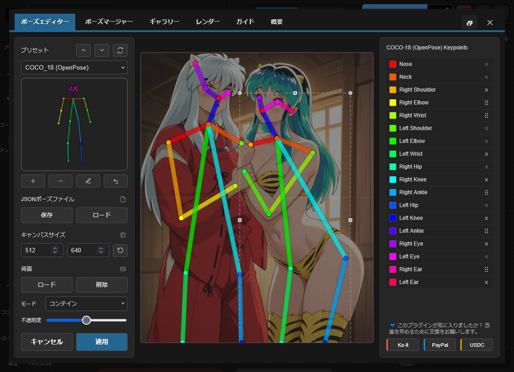
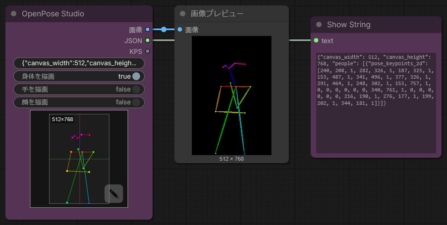
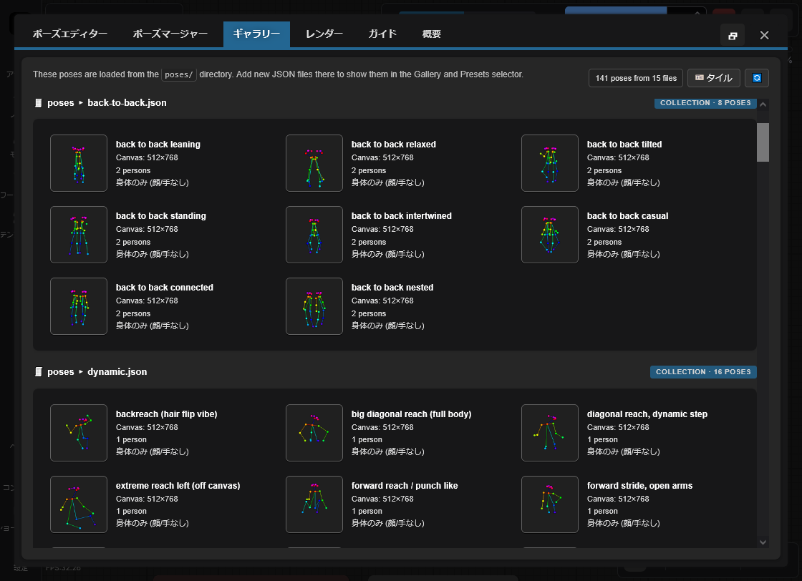

<h4 align="center">
  <a href="./README.md">English</a> | <a href="./README.de.md">Deutsch</a> | <a href="./README.es.md">Español</a> | <a href="./README.fr.md">Français</a> | <a href="./README.pt.md">Português</a> | <a href="./README.ru.md">Русский</a> | 日本語 | <a href="./README.ko.md">한국어</a> | <a href="./README.zh.md">中文</a> | <a href="./README.zh-TW.md">繁體中文</a>
</h4>

<p align="center">
  
  
  
</p>
<br />

# OpenPose Studio for ComfyUI 🤸

OpenPose Studio は、洗練された使いやすいインターフェースで OpenPose のポーズを作成、編集、プレビュー、整理できる高度な ComfyUI 拡張機能です。keypoints の視覚的な調整、ポーズファイルの保存と読み込み、ポーズのプリセットやギャラリーの閲覧、ポーズコレクションの管理、複数ポーズの結合、そして ControlNet やその他のポーズ駆動型 workflow で使うためのクリーンな JSON データのエクスポートを簡単に行えます。

---

## 目次

- ✨ [機能](#機能)
- 📦 [インストール](#インストール)
- 🎯 [使い方](#使い方)
- 🔧 [ノード](#ノード)
- ⌨️ [エディター操作とショートカット](#エディター操作とショートカット)
- 📋 [フォーマット仕様](#フォーマット仕様)
- 🖼️ [ギャラリーとポーズ管理](#ギャラリーとポーズ管理)
- 🔀 [ポーズマージャー](#pose-merger)
- 🖼️ [背景リファレンス](#背景リファレンス)
- ⚠️ [既知の制限事項](#既知の制限事項)
- 🔍 [トラブルシューティング](#トラブルシューティング)
- 🤝 [貢献](#貢献)
- 💙 [資金提供とサポート](#資金提供とサポート)
- 📄 [ライセンス](#ライセンス)

---

## 機能

✨ **主な機能**
- OpenPose のキーポイントをリアルタイムに編集（視覚フィードバック付き）
- ネイティブ Canvas 描画のモダンな Render エンジン（高速・滑らか・構成要素が少ない）
- 直感的な編集 UX：明確なアクティブ選択 + ポーズ上のホバーによるプレビュー選択
- キーポイントが Canvas 境界外へずれないよう制限付き変形
- 単体ポーズ/ポーズコレクションの JSON インポート/エクスポート
- 標準 OpenPose JSON のエクスポート（他ツールへの持ち運びが容易）
- legacy JSON 互換（非標準の古い JSON も正しく読み込み・編集可能）

✨ **高度な機能**
- **描画トグル**：Body / Hands / Face を必要に応じて描画
- **Pose Gallery**：`poses/` からポーズを閲覧・プレビュー
- **Pose Collections**：複数ポーズを含む JSON を、選択可能な個別ポーズとして表示
- **Pose Merger**：複数の JSON を整理されたポーズコレクションへ結合
- **クイッククリーンアップ**：Face キーポイントおよび左/右 Hand キーポイントを（存在する場合）削除
- **エクスポート時の任意クリーンアップ**：ポーズパックのエクスポート時に Face/Hands キーポイントを削除
- **背景オーバーレイ**：コンテイン / カバー切替と不透明度制御
- **Undo**：セッション中の完全な編集履歴

✨ **データ取り扱い**
- `poses/` からポーズファイルを自動発見（サブディレクトリ含む）
- 破損・不正 JSON に対する検証と復旧
- 部分ポーズ（Body のキーポイントの一部のみ）の対応
- ポーズファイルと一致するピクセル座標系で、摩擦のない互換性を実現

✨ **UI と統合**
- 完全レスポンシブのレイアウト：あらゆるウィンドウサイズにリアルタイム適応し、常に中央寄せ
- Canvas が画面に収まらない場合の自動フィットスケーリング
- Canvas の視覚改善：背景グリッド + Blender 風の中心軸
- 再起動後も設定を復元：ギャラリー表示モード + 背景オーバーレイ設定を起動時に復元
- ComfyUI ネイティブ統合：トースト + ダイアログ（安全なフォールバック付き）

---

✨ **計画中の機能 / ロードマップ**

> [!IMPORTANT]
> 計画中の多くの機能は、AI Token の資金が必要です。完全なロードマップと直近の作業については [TODO.md](../TODO.md) を参照してください。

新機能のアイデアがあれば、ぜひ聞かせてください。素早く実装できるかもしれません。フィードバック・アイデア・提案は、リポジトリの Issues から送ってください： https://github.com/andreszs/comfyui-openpose-studio/issues

## インストール

### 要件
- ComfyUI（最新ビルド）
- Python 3.10+

### 手順

1. このリポジトリを `ComfyUI/custom_nodes/` にクローンします。
2. ComfyUI を再起動します。
3. `image > OpenPose Studio` にノードが表示されることを確認します。

---

## 使い方

### 基本ワークフロー

1. ワークフローに **OpenPose Studio** ノードを追加します。  
2. ノードのプレビュー Canvas をクリックしてエディター UI を開きます。  
3. プリセットまたはギャラリーからポーズを選び、Canvas に挿入します。  
4. Canvas 上でキーポイントをドラッグして調整します。  
5. **Apply** をクリックしてポーズをレンダリングします。これにより、ノード内にシリアライズされた JSON が作成されます。  
6. `image` 出力を後段の画像ノードに接続します。  
7. `kps` 出力を ControlNet/OpenPose 対応ノードに接続します。

### エディターのプレビュー



---

## ノード

### OpenPose Studio

**カテゴリ:** `image`

- **入力:** `Pose JSON` (STRING) — OpenPose 標準形式の JSON。  
- **オプション:**
  - `render body` — プレビュー/レンダリング出力に Body を含める  
  - `render hands` — プレビュー/レンダリング出力に Hands を含める（JSON に存在する場合）  
  - `render face` — プレビュー/レンダリング出力に Face を含める（JSON に存在する場合）  
- **出力:**
  - `IMAGE` — ポーズを RGB 画像としてレンダリングした可視化（float32、0-1 範囲）  
  - `JSON` — Canvas 寸法と、キーポイントデータを含む `people` 配列を持つ OpenPose 形式の JSON  
  - `KPS` — ControlNet と互換の POSE_KEYPOINT 形式キーポイントデータ  
- **UI:** ノードのプレビューをクリックして対話型エディターを開きます。**open editor** ボタン（鉛筆アイコン）で直接編集できます。

#### ノードのスクリーンショット




---

## エディター操作とショートカット

### キーボードショートカット

| 操作 | アクション |
|---------|--------|
| **Enter** | ポーズを適用してエディターを閉じる |
| **Escape** | キャンセルして変更を破棄 |
| **Ctrl+Z** | 直前の操作を Undo |
| **Ctrl+Y** | Undo した操作を Redo |
| **Delete** | 選択中のキーポイントを削除 |

### Canvas 操作

- **クリック**: キーポイント選択  
- **ドラッグ**: キーポイントを新しい位置へ移動  
- **スクロール**: Canvas のズーム（TO-DO）

---

## フォーマット仕様

本エディターは **OpenPose COCO-18（body）** の編集を完全にサポートします。

また、**OpenPose face と hands** のデータは *pass-through* として扱います。つまり、JSON に face/hands のキーポイントが含まれている場合、それらは保持され（削除されず）、Python ノードは正しくレンダリングできます。ただし、**face と hands のキーポイント編集はまだ利用できません**（今後の更新で予定）。

### OpenPose COCO-18 keypoints（body）

COCO-18 は **18 個の body キーポイント** を使用します。ポーズは `pose_keypoints_2d` というフラット配列に次のパターンで格納されます：

`[x0, y0, c0, x1, y1, c1, ...]`

各キーポイントは以下を持ちます：
- `x`, `y`: Canvas 上のピクセル座標  
- `c`: 信頼度（一般的に `0..1`、欠損点には `0` を使うことがあります）

キーポイント順（index → name）：

| Index | 名前 |
|------:|------|
| 0 | 鼻 |
| 1 | 首 |
| 2 | 右肩 |
| 3 | 右肘 |
| 4 | 右手首 |
| 5 | 左肩 |
| 6 | 左肘 |
| 7 | 左手首 |
| 8 | 右腰 |
| 9 | 右膝 |
| 10 | 右足首 |
| 11 | 左腰 |
| 12 | 左膝 |
| 13 | 左足首 |
| 14 | 右目 |
| 15 | 左目 |
| 16 | 右耳 |
| 17 | 左耳 |

> [!NOTE]
> **COCO** は *Common Objects in Context* データセット名/規約を指し、姿勢推定で広く使われています。ここでの “COCO-18” は OpenPose の 18 キーポイント body レイアウトを意味します。

### JSON の最小形

単体ポーズ用の典型的な OpenPose 形式 JSON は、Canvas 寸法と `people` 内の `pose_keypoints_2d` を含みます：

```json
{
  "canvas_width": 512,
  "canvas_height": 512,
  "people": [
    {
      "pose_keypoints_2d": [0, 0, 0, 0, 0, 0 /* ... 18 * 3 values total ... */]
    }
  ]
}
```

> [!NOTE]
> エディターは部分ポーズ（キーポイントの欠損）を扱えます。欠損点は通常 0,0,0 で表現します。また、OpenPose Studio で末端キーポイントを削除することも可能です。

### 追加の読み物

- 背景と文脈："What is OpenPose — Exploring a milestone in pose estimation" — OpenPose がどのように導入され、姿勢推定へどのような影響を与えたかを解説する読みやすい記事： https://www.ultralytics.com/blog/what-is-openpose-exploring-a-milestone-in-pose-estimation

### JSON フォーマット：標準 vs legacy

- **OpenPose Studio:** **OpenPose 標準形式 JSON** を読み書きし、古い非標準 (legacy) JSON も受け付けます。

実用上のメモ：
- 標準 JSON を OpenPose Studio ノードへ貼り付けると、即座にプレビューがレンダリングされます。  

---

## ギャラリーとポーズ管理

### 概要

**Gallery** タブでは、利用可能なすべてのポーズをライブプレビューのサムネイルで視覚的に閲覧できます。手動設定なしで自動的に発見・整理します。



### 機能

- **Auto-discovery**: 起動時に `poses/` ディレクトリをスキャン  
- **Nested organization**: サブディレクトリ名をグループラベルとして使用  
- **Live preview**: 各ポーズのサムネイルをライブレンダリング  
- **Search/filter**: 名前またはグループでポーズを検索/フィルタ  
- **One-click load**: クリック 1 回でエディターに読み込み  

### 対応ファイル形式

- **Single-pose JSON**: 単体の OpenPose JSON  
- **Pose Collections**: 複数ポーズを含む JSON（各ポーズを個別に表示）  
- **Nested directories**: サブディレクトリ内のポーズを自動グルーピング  

### 決定的な挙動

ギャラリーの順序と発見は完全に決定的です：
- ランダム要素なし  
- 一貫したアルファベット順  
- ルートのポーズが先、次にグループ化されたポーズ  
- エディターウィンドウを開くたびに、すべてのポーズ JSON を即時リロード  

---

## Pose Merger

### 目的

**Pose Merger** タブは、複数の単体ポーズ JSON を、整理されたポーズコレクション JSON に統合します。以下の用途に便利です：

- 大規模なポーズライブラリを単一ファイルへまとめる  
- ポーズデータをクリーンアップする（face/hand キーポイントの削除）  
- ポーズの再整理とリネーム  
- ポーズパックを効率よく配布する  

### ワークフロー

1. **Add Files**: 単体/コレクション JSON を追加  
2. **Preview**: 各ポーズをサムネイルで表示  
3. **Configure**: face/hand 要素を任意で除外  
4. **Export**: 結合コレクション、または個別ファイルとして保存  

### 主な機能

| 機能 | ユースケース |
|---------|----------|
| **Load Multiple Files** | ファイルシステムからの一括インポート |
| **Component Filtering** | 不要な face/hand データの削除 |
| **Collection Expansion** | 既存コレクションからポーズを展開 |
| **Batch Renaming** | エクスポート時に意味のある名前を付与 |
| **Selective Export** | 含めるポーズを選択 |

### 出力オプション

- **Combined Collection**: すべてのポーズを 1 つの JSON に格納  
- **Individual Files**: ポーズごとに 1 ファイル（互換性のため）  

どちらの出力形式も Gallery と Pose Selector が自動検出します。

---

## 背景リファレンス

ポーズ編集時に、参照画像（例：解剖学ガイド、写真参照）を非破壊のオーバーレイとして読み込めます。Canvas に収めたい場合は **コンテイン**、Canvas を埋めたい場合は **カバー** を使用します。不透明度は必要に応じて調整してください。

- **Load Image**: ディスクから参照画像を読み込み  
- **Contain/Cover**: スケーリングモードを選択（コンテイン / カバー）  
- **Opacity**: 透明度を調整（0-100%）  

> [!NOTE]
> 背景画像は ComfyUI セッション中は保持されますが、ワークフローには保存されません。

---

## 既知の制限事項

> [!WARNING]
> Nodes 2.0 は現在サポートしていません。現時点では Nodes 2.0 を無効にしてください。

### 現在の制限と回避策

1. **Hand と Face の編集**
  - 問題: 現在のエディターは body キーポイント（0-17）のみに限定されています  
  - 状態: 将来のリリースで予定  
  - 回避策: インポート前に Pose Merger で hand/face の JSON を手動で調整してください  

2. **解像度の一貫性**
  - 問題: Pose Merger はコレクション出力時に解像度を自動で統一しません  
  - 状態: トリミングを避けるため慎重な実装が必要です  
  - 回避策: インポート前に目的の解像度へ事前スケールしてください  

3. **Nodes 2.0 互換性**
  - 問題: ComfyUI の "Nodes 2.0" が有効な場合、ノードが正しく動作しません  
  - 状態: 修正は予定していますが、大規模で時間のかかるリファクタが必要です  
  - 注記: 本プロジェクトは有料 AI エージェントを用いて開発しています。追加の AI Token 資金が確保でき次第、Nodes 2.0 対応を優先する予定です  
  - 回避策: 現時点では Nodes 2.0 を無効にしてください  

### エラー復旧

本プラグインは防御的なエラーハンドリングを備えています：
- 不正な JSON ファイルは Gallery で静かにスキップ  
- レンダリングエラー時はクラッシュではなく空画像を返す  
- 欠落メタデータには安全なデフォルトを使用  
- 破損したキーポイントはレンダリング時にフィルタ  

---

## トラブルシューティング

### よくある問題と解決策

**Gallery にポーズが表示されない**
```
✓ poses/ ディレクトリにファイルが存在するか確認
✓ JSON が有効か確認（オンライン JSON バリデータを使用）
✓ 拡張子が .json か確認（Linux では大文字小文字を区別）
✓ ComfyUI を再起動して discovery を実行
✓ ブラウザコンソール（F12）でエラーメッセージを確認
```

**JSON のインポートに失敗する**
```
✓ JSON 構造を検証（"pose_keypoints_2d" または同等が必要）
✓ 座標が文字列ではなく有効な数値であることを確認
✓ body ポーズに最低 18 キーポイントがあることを確認
✓ JSON 内のエスケープが壊れていないか確認
```

**出力画像が真っ白**
```
✓ ポーズが選択され、キーポイントが有効であることを確認
✓ Canvas の寸法（幅/高さ）が妥当（100-2048px）か確認
✓ 変更後に Apply をクリックしてレンダリングしたか確認
✓ 座標に NaN や無限大が含まれていないか確認
```

**背景リファレンスが保持されない**
```
✓ ブラウザでクッキー/サードパーティストレージを許可
✓ ブラウザの localStorage 設定を確認
✓ 問題切り分けのためシークレットモードで試す
✓ ブラウザキャッシュをクリアして再試行
```

**ComfyUI にノードが表示されない**
```
✓ clone 先が正しいか確認: ComfyUI/custom_nodes/comfyui-openpose-studio
✓ __init__.py が存在し、正しく import されているか確認
✓ ComfyUI を完全に再起動（ページリロードだけでは不十分）
✓ ComfyUI コンソールで import エラーを確認
```

---

## 貢献

貢献ガイドライン、pull request の方針、アーキテクチャ詳細、開発情報については [CONTRIBUTING.md](../CONTRIBUTING.md) を参照してください。開発補助に AI エージェントを使用する場合は、コード変更前に必ず [AGENTS.md](../AGENTS.md) を読ませてください。

---

## 資金提供とサポート

### あなたのサポートが重要な理由

このプラグインは独立して開発・保守されており、デバッグ、テスト、品質向上を加速するために **有料 AI エージェント** を定期的に利用しています。役に立っていると感じた場合、資金面でのサポートは開発を安定して継続する助けになります。

ご支援は次の点に役立ちます：

* より速い修正と新機能のための AI ツールへの資金提供
* ComfyUI 更新に伴う継続的な保守と互換性対応の作業をカバー
* 利用上限に達した際の開発停滞を防止

> [!TIP]
> 寄付が難しい場合でも、GitHub スター ⭐ を付けていただくことで可視性が高まり、より多くのユーザーに届く助けになります。

### 💙 このプロジェクトを支援する

お好みの方法でご支援ください：

<table style="width: 100%; table-layout: fixed;">
  <tr>
    <td align="center" style="width: 33.33%; padding: 20px;">
      <div>
        <h4 style="margin: 8px 0;">Ko-fi</h4>
        <a href="https://ko-fi.com/D1D716OLPM" target="_blank" rel="noopener noreferrer">
          
        </a>
        <p style="margin: 8px 0; font-size: 12px;"><a href="https://ko-fi.com/D1D716OLPM" target="_blank" rel="noopener noreferrer">コーヒーをおごる</a></p>
      </div>
    </td>
    <td align="center" style="width: 33.33%; padding: 20px;">
      <div>
        <h4 style="margin: 8px 0;">PayPal</h4>
        <a href="https://www.paypal.com/ncp/payment/GEEM324PDD9NC" target="_blank" rel="noopener noreferrer">
          
        </a>
        <p style="margin: 8px 0; font-size: 12px;"><a href="https://www.paypal.com/ncp/payment/GEEM324PDD9NC" target="_blank" rel="noopener noreferrer">PayPal を開く</a></p>
      </div>
    </td>
    <td align="center" style="width: 33.33%; padding: 20px;">
      <div>
        <h4 style="margin: 8px 0;">USDC（Arbitrum のみ ⚠️）</h4>
        <a href="https://arbiscan.io/address/0xe36a336fC6cc9Daae657b4A380dA492AB9601e73" target="_blank" rel="noopener noreferrer">
          
        </a>
        <p style="margin: 8px 0; font-size: 12px;"><a href="#usdc-address">アドレスを表示</a></p>
      </div>
    </td>
  </tr>
</table>

<details>
  <summary>スキャンしますか？ QR コードを表示</summary>
  <br />
  <table style="width: 100%; table-layout: fixed;">
    <tr>
      <td align="center" style="width: 33.33%; padding: 12px;">
        <strong>Ko-fi</strong><br />
        <a href="https://ko-fi.com/D1D716OLPM" target="_blank" rel="noopener noreferrer">
          
        </a>
      </td>
      <td align="center" style="width: 33.33%; padding: 12px;">
        <strong>PayPal</strong><br />
        <a href="https://www.paypal.com/ncp/payment/GEEM324PDD9NC" target="_blank" rel="noopener noreferrer">
          
        </a>
      </td>
      <td align="center" style="width: 33.33%; padding: 12px;">
        <strong>USDC（Arbitrum）⚠️</strong><br />
        <a href="https://arbiscan.io/address/0xe36a336fC6cc9Daae657b4A380dA492AB9601e73" target="_blank" rel="noopener noreferrer">
          
        </a>
      </td>
    </tr>
  </table>
</details>

<a id="usdc-address"></a>
<details>
  <summary>USDC アドレスを表示</summary>

```text
0xe36a336fC6cc9Daae657b4A380dA492AB9601e73
```

> [!WARNING]
> USDC は Arbitrum One のみで送金してください。他ネットワークで送金した場合、到着せず永久に失われる可能性があります。
</details>

---

## ライセンス

MIT License — 全文は [LICENSE](../LICENSE) を参照してください。

**要約:**
- ✓ 商用利用無料
- ✓ 私的利用無料
- ✓ 改変・配布可
- ✓ ライセンスと著作権表示の同梱が必要

---

## Additional Resources

### Related Projects

- [ComfyUI](https://github.com/comfyanonymous/ComfyUI) - Main framework
- [comfyui_controlnet_aux](https://github.com/Kosinkadink/ComfyUI-Advanced-ControlNet) - ControlNet support
- [OpenPose](https://github.com/CMU-Perceptual-Computing-Lab/openpose) - Original pose detection

### Documentation

- [ComfyUI Custom Nodes Guide](https://github.com/comfyanonymous/ComfyUI/blob/main/docs/)
- [OpenPose Models & Keypoints](https://github.com/CMU-Perceptual-Computing-Lab/openpose/blob/master/doc/02_Output.md)
- [Canvas 2D API](https://developer.mozilla.org/en-US/docs/Web/API/Canvas_API) - Rendering engine

### Troubleshooting Guides

- [ComfyUI Installation Issues](https://github.com/comfyanonymous/ComfyUI/wiki/Installation)
- [Node Registration & Loading](https://github.com/comfyanonymous/ComfyUI/blob/main/docs/CONTRIBUTING.md)
- [Browser Developer Tools](https://developer.chrome.com/docs/devtools/)

---

**Maintained by:** andreszs  
**Status:** Active development
