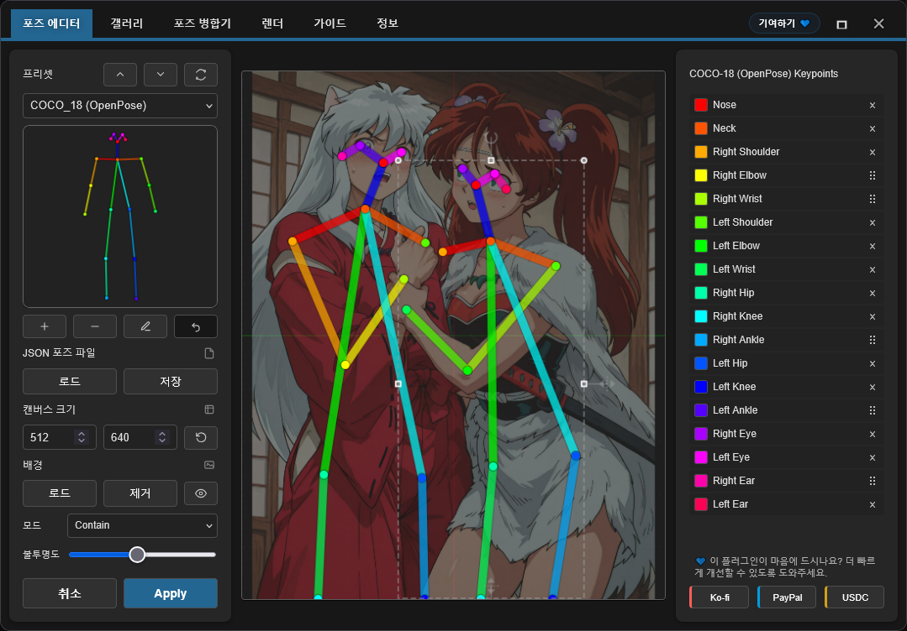
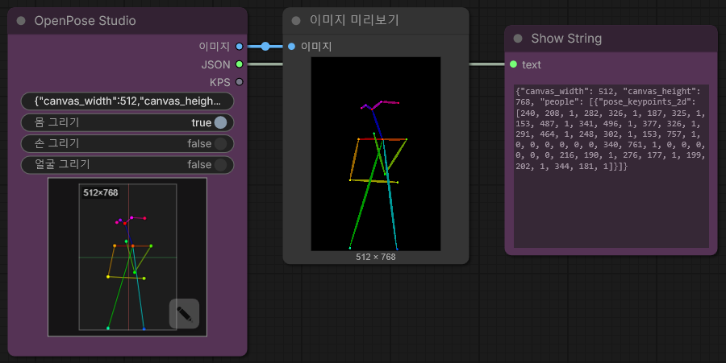
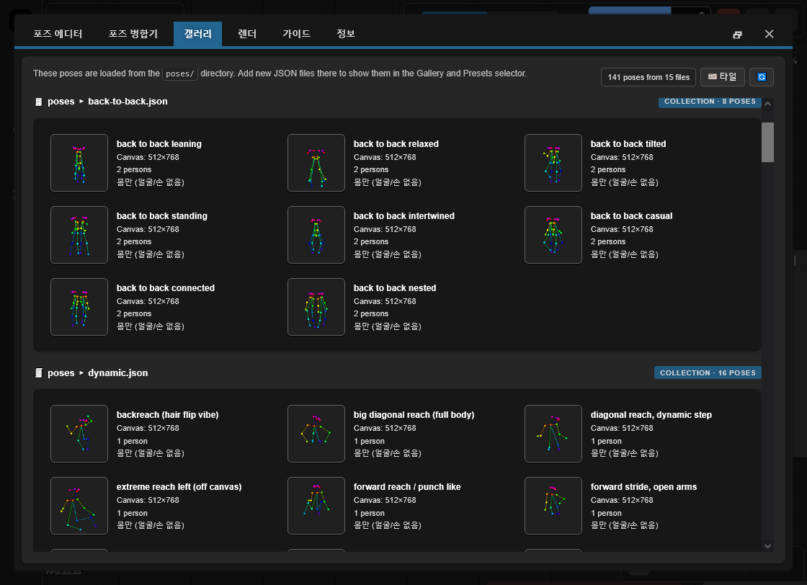

<h4 align="center">
  <a href="./README.md">English</a> | <a href="./README.de.md">Deutsch</a> | <a href="./README.es.md">Español</a> | <a href="./README.fr.md">Français</a> | <a href="./README.pt.md">Português</a> | <a href="./README.ru.md">Русский</a> | <a href="./README.ja.md">日本語</a> | 한국어 | <a href="./README.zh.md">中文</a> | <a href="./README.zh-TW.md">繁體中文</a>
</h4>

<p align="center">
  
  
  
</p>
<br />

# ComfyUI용 OpenPose Studio 🤸

OpenPose Studio는 간결하고 편리한 인터페이스로 OpenPose 포즈를 생성, 편집, 미리보기, 정리할 수 있는 고급 ComfyUI 확장입니다. keypoints를 시각적으로 손쉽게 조정하고, 포즈 파일을 저장 및 불러오며, 포즈 프리셋과 갤러리를 탐색하고, 포즈 컬렉션을 관리하고, 여러 포즈를 병합하고, ControlNet 및 기타 포즈 기반 workflow에 사용할 깔끔한 JSON 데이터를 내보내는 작업을 쉽게 해줍니다.

---

## 목차

- ✨ [기능](#기능)
- 📦 [설치](#설치)
- 🎯 [사용법](#사용법)
- 🔧 [노드](#노드)
- ⌨️ [에디터 조작 및 단축키](#에디터-조작-및-단축키)
- 📋 [포맷 사양](#포맷-사양)
- 🖼️ [갤러리 및 포즈 관리](#갤러리-및-포즈-관리)
- 🔀 [포즈 병합기](#포즈-병합기)
- 🖼️ [배경 레퍼런스](#배경-레퍼런스)
- 🗺️ [에리어 입력](#에리어-입력)
- ⚠️ [알려진 제한 사항](#알려진-제한-사항)
- 🔍 [문제 해결](#문제-해결)
- 🤝 [기여](#기여)
- 💙 [후원 및 지원](#후원-및-지원)
- 📄 [라이선스](#라이선스)

---

## 기능

✨ **핵심 기능**
- 시각적 피드백과 함께 실시간 OpenPose 키포인트 편집
- 최신 네이티브 Canvas 렌더링 엔진(더 빠르고, 더 부드럽고, 구성 요소가 더 단순함)
- 상호작용 편집 UX: 명확한 활성 선택 + 포즈 호버 사전 선택
- 키포인트가 캔버스 경계 밖으로 벗어나지 않도록 제한된 변형
- 단일 포즈 및 포즈 컬렉션용 JSON 가져오기/내보내기
- 표준 OpenPose JSON 내보내기(다른 도구로 이식 가능)
- 레거시 JSON 호환(이전의 비표준 JSON도 로드 및 정확한 편집 가능)

✨ **고급 기능**
- **그리기 토글**: Body / Hands / Face를 선택적으로 그리기
- **포즈 갤러리**: `poses/`의 포즈 탐색 및 미리보기
- **포즈 컬렉션**: 다중 포즈 JSON 파일을 개별 선택 가능한 포즈로 표시
- **포즈 병합기**: 여러 JSON 파일을 정리된 컬렉션으로 결합
- **빠른 정리 액션**: 존재할 경우 Face 키포인트 및/또는 Left/Right Hand 키포인트 제거
- **내보내기 시 선택 정리**: 포즈 팩 내보내기 시 Face 및/또는 Hands 키포인트 제거
- **배경 오버레이 시스템**: 투명도 제어가 가능한 선택형 contain/cover 모드
- **실행 취소**: 세션 중 전체 편집 이력

✨ **데이터 처리**
- `poses/`(하위 디렉터리 포함)에서 포즈 파일 자동 검색
- 잘못된 형식의 JSON 파일에 대한 검증 및 오류 복구
- 부분 포즈(신체 키포인트 일부) 지원
- 포즈 파일과 일치하는 픽셀 공간 좌표로 원활한 호환성 제공

✨ **UI 및 통합**
- 완전 반응형 레이아웃: 모든 창 크기에 실시간으로 적응하고 중앙 정렬 유지
- 캔버스가 화면에 맞지 않을 때 자동 맞춤 스케일링
- 향상된 캔버스 비주얼: Blender와 유사한 배경 그리드 + 중심 축 스타일
- 재시작 간 설정 유지: 갤러리 보기 모드 + 배경 오버레이 설정을 실행 시 복원
- 네이티브 ComfyUI 통합: 토스트 + 대화상자(안전한 폴백 포함)

---

✨ **예정 기능 및 로드맵**

> [!IMPORTANT]
> 많은 예정 기능은 AI Token 자금 지원에 의존합니다. 전체 로드맵과 예정된 작업은 [TODO.md](../TODO.md)를 확인해 주세요.

새 기능 아이디어가 있다면 꼭 들려주세요. 빠르게 구현할 수 있을지도 모릅니다. 피드백, 아이디어 또는 제안은 저장소 Issues 페이지로 제출해 주세요: https://github.com/andreszs/comfyui-openpose-studio/issues


## 설치

### 요구 사항
- ComfyUI (최신 빌드)
- Python 3.10+

### 단계

1. 이 리포지토리를 `ComfyUI/custom_nodes/`에 클론합니다.
2. ComfyUI를 재시작합니다.
3. `image > OpenPose Studio` 아래에 노드가 나타나는지 확인합니다.

---

## 사용법

### 기본 워크플로

1. 워크플로에 **OpenPose Studio** 노드를 추가합니다
2. 노드의 미리보기 캔버스를 클릭해 에디터 UI를 엽니다
3. 프리셋 또는 갤러리에서 포즈를 선택해 캔버스에 삽입합니다
4. 캔버스에서 키포인트를 드래그하여 조정합니다
5. **Apply**를 클릭해 포즈를 렌더링합니다. 그러면 노드에 직렬화된 JSON이 생성됩니다.
6. `image` 출력을 후속 이미지 노드에 연결합니다
7. `kps` 출력을 ControlNet/OpenPose 호환 노드에 연결합니다

### 에디터 미리보기



---

## 노드

### OpenPose Studio

**카테고리:** `image`

- **입력:** `Pose JSON` (STRING) - 표준 OpenPose 스타일 JSON.
- **선택적 입력:**
  - `areas` (`CONDITIONING_AREAS`) — 에리어 오버레이 데이터; [Conditioning Pipeline (Combine)](https://github.com/andreszs/comfyui-lora-pipeline) 노드의 `areas_out` 출력을 연결하면 Canvas에서 콘디셔닝 영역을 시각화할 수 있습니다
- **옵션:**
  - `render body` - 렌더링된 미리보기/출력 이미지에 body 포함
  - `render hands` - 렌더링된 미리보기/출력 이미지에 hands 포함(JSON에 존재할 경우)
  - `render face` - 렌더링된 미리보기/출력 이미지에 face 포함(JSON에 존재할 경우)
- **출력:**
  - `IMAGE` - 렌더링된 포즈 시각화 RGB 이미지(float32, 0-1 범위)
  - `JSON` - 캔버스 크기와 키포인트 데이터를 포함한 people 배열이 들어있는 OpenPose 스타일 포즈 JSON
  - `KPS` - ControlNet과 호환되는 POSE_KEYPOINT 형식의 키포인트 데이터
- **UI:** 노드 미리보기를 클릭해 상호작용 에디터를 엽니다. **open editor** 버튼(연필 아이콘)을 사용해 포즈를 직접 편집하세요.

#### 노드 스크린샷



---

## 에디터 조작 및 단축키

### 키보드 단축키

| Control | Action |
|---------|--------|
| **Enter** | 포즈 적용 후 에디터 닫기 |
| **Escape** | 취소하고 변경 사항 버리기 |
| **Ctrl+Z** | 마지막 작업 실행 취소 |
| **Ctrl+Y** | 마지막으로 실행 취소한 작업 다시 실행 |
| **Delete** | 선택한 키포인트 제거 |

### 캔버스 상호작용

- **Click**: 키포인트 선택
- **Drag**: 키포인트를 새 위치로 이동
- **Scroll**: 캔버스 확대/축소(TO-DO)

### 배경 레퍼런스

포즈를 편집하는 동안 레퍼런스 이미지(예: 해부학 가이드, 사진 레퍼런스)를 비파괴 오버레이로 로드할 수 있습니다. **Contain** 모드를 사용하면 이미지가 캔버스 안에 맞춰지고, **Cover** 모드를 사용하면 캔버스를 가득 채웁니다. 필요에 따라 투명도를 조정하세요.

- **Load Image**: 디스크에서 레퍼런스 이미지 가져오기
- **Contain/Cover**: 스케일링 모드 선택
- **Opacity**: 투명도 조정(0-100%)

> [!NOTE]
> 배경 이미지는 ComfyUI 세션 동안 유지되지만 워크플로에는 **저장되지 않습니다**.

### 에리어 입력

**areas** 입력은 포즈 편집 중 Canvas에 콘디셔닝 영역 경계를 오버레이하는 **선택적** 연결입니다.

[ComfyUI-LoRA-Pipeline](https://github.com/andreszs/comfyui-lora-pipeline) 리포지토리의 [**Conditioning Pipeline (Combine)**](https://github.com/andreszs/comfyui-lora-pipeline) 노드의 `areas_out` 출력을 연결하면 포즈를 배치하는 동안 각 에리어가 대상으로 하는 영역을 시각화할 수 있습니다.

각 에리어는 Canvas에 레이블이 붙은 배지로 표시됩니다. 배지를 클릭하면 해당 에리어를 개별적으로 **활성화 또는 비활성화**할 수 있어 현재 포즈에 관련된 영역에 집중할 수 있습니다.


이 조합은 멀티 캐릭터 워크플로를 구축할 때 특히 유용합니다: [ComfyUI-LoRA-Pipeline](https://github.com/andreszs/comfyui-lora-pipeline)이 에리어별 콘디셔닝과 LoRA 할당을 처리하는 동안, OpenPose Studio는 각 영역 내에서 포즈 배치의 정확성을 유지합니다. 결과적으로 에리어별 LoRA와 포즈별 LoRA를 간섭 없이 동시에 적용할 수 있는 간단하고 비파괴적인 설정이 만들어집니다. 에리어 기반 콘디셔닝에 아직 익숙하지 않다면, [ComfyUI-LoRA-Pipeline](https://github.com/andreszs/comfyui-lora-pipeline) 확장이 정확히 이러한 유형의 워크플로를 위해 설계되었으며 이 노드와 잘 어울립니다.

세 리포지토리가 함께 작동하는 실제 예시 — 에리어 콘디셔닝, OpenPose 제어, 스타일 레이어링 — 는 이 [단계별 워크플로 가이드](https://www.andreszsogon.com/building-a-multi-character-comfyui-workflow-with-area-conditioning-openpose-control-and-style-layering/)에서 확인할 수 있습니다.

---

## 포맷 사양

이 에디터는 **OpenPose COCO-18 (body)** 편집을 완전히 지원합니다.

또한 **OpenPose face 및 hands 데이터**를 *패스스루* 방식으로 지원합니다. JSON에 face 및/또는 hand 키포인트가 포함되어 있으면 유지(삭제되지 않음)되며, Python 노드가 이를 올바르게 렌더링할 수 있습니다. 다만 **face 및 hand 키포인트 편집은 아직 지원되지 않습니다**(향후 업데이트 예정).

### OpenPose COCO-18 키포인트(body)

COCO-18은 **18개의 신체 키포인트**를 사용합니다. 포즈는 `pose_keypoints_2d`라는 이름의 플랫 배열에 다음 패턴으로 저장됩니다:

`[x0, y0, c0, x1, y1, c1, ...]`

각 키포인트는 다음 값을 가집니다:
- `x`, `y`: 캔버스 내 픽셀 좌표
- `c`: 신뢰도(보통 `0..1`; 누락된 점에는 `0` 사용 가능)

키포인트 순서(인덱스 -> 이름):

| 인덱스 | 이름 |
|------:|------|
| 0 | 코 |
| 1 | 목 |
| 2 | 오른쪽 어깨 |
| 3 | 오른쪽 팔꿈치 |
| 4 | 오른쪽 손목 |
| 5 | 왼쪽 어깨 |
| 6 | 왼쪽 팔꿈치 |
| 7 | 왼쪽 손목 |
| 8 | 오른쪽 엉덩이 |
| 9 | 오른쪽 무릎 |
| 10 | 오른쪽 발목 |
| 11 | 왼쪽 엉덩이 |
| 12 | 왼쪽 무릎 |
| 13 | 왼쪽 발목 |
| 14 | 오른쪽 눈 |
| 15 | 왼쪽 눈 |
| 16 | 오른쪽 귀 |
| 17 | 왼쪽 귀 |

> [!NOTE]
> **COCO**는 포즈 추정에서 널리 사용되는 *Common Objects in Context* 키포인트 규약/데이터셋 명칭을 의미합니다. 여기서 "COCO-18"은 18개 키포인트를 사용하는 OpenPose body 레이아웃을 뜻합니다.

### 최소 JSON 형태

일반적인 단일 포즈 OpenPose 스타일 JSON에는 캔버스 크기와 `pose_keypoints_2d`를 가진 하나의 `people` 항목이 포함됩니다:

```json
{
  "canvas_width": 512,
  "canvas_height": 512,
  "people": [
    {
      "pose_keypoints_2d": [0, 0, 0, 0, 0, 0 /* ... 18 * 3 values total ... */]
    }
  ]
}
```

> [!NOTE]
> 에디터는 부분 포즈(일부 키포인트 누락)를 처리할 수 있습니다. 누락된 점은 일반적으로 0,0,0으로 표현됩니다. Pose Editor를 사용해 말단 키포인트를 삭제할 수도 있습니다.

### 추가 읽을거리

- 역사 및 배경: "What is OpenPose - Exploring a milestone in pose estimation" - OpenPose의 도입과 포즈 추정에 미친 영향을 쉽게 설명한 아티클: https://www.ultralytics.com/blog/what-is-openpose-exploring-a-milestone-in-pose-estimation

### JSON 포맷: 표준 vs 레거시

- **OpenPose Studio:** **표준 OpenPose 스타일 JSON** 읽기/쓰기 및 이전 레거시 비표준 JSON도 처리합니다.

실무 참고:
- 표준 JSON을 OpenPose Studio 노드에 붙여넣으면 즉시 미리보기가 렌더링됩니다.

---

## 갤러리 및 포즈 관리

### 개요

**Gallery** 탭은 실시간 미리보기 썸네일과 함께 사용 가능한 모든 포즈를 시각적으로 탐색하는 기능을 제공합니다. 수동 설정 없이 포즈를 자동으로 검색하고 정리합니다.



### 보기 모드

Gallery는 세 가지 표시 모드를 지원합니다:
- **Large** - 빠른 시각적 선택을 위한 큰 미리보기
- **Medium** - 미리보기 크기와 밀도의 균형
- **Tiles** - 추가 메타데이터(예: **캔버스 크기**, **키포인트 개수**, 기타 포즈 상세 정보)를 포함한 컴팩트 그리드

### 기능

- **자동 검색**: 시작 시 `poses/` 디렉터리 스캔
- **중첩 구성**: 하위 디렉터리 이름을 그룹 라벨로 사용
- **실시간 미리보기**: 각 포즈의 썸네일 렌더링
- **검색/필터**: 이름 또는 그룹으로 포즈 찾기
- **원클릭 로드**: 포즈를 선택해 에디터로 로드

### 지원 파일 형식

- **단일 포즈 JSON**: 개별 OpenPose JSON 파일
- **포즈 컬렉션**: 다중 포즈 JSON 파일(각 포즈를 별도로 표시)
- **중첩 디렉터리**: 하위 디렉터리 내 포즈를 자동 그룹화

### 결정적 동작

갤러리 정렬과 검색은 완전히 결정적으로 동작합니다:
- 무작위 섞기 없음
- 일관된 알파벳 순 정렬
- 루트 포즈를 먼저 표시하고 이후 그룹 포즈 표시
- Editor 창을 열 때 모든 JSON 포즈를 즉시 다시 로드

---

## 포즈 병합기

### 목적

**Pose Merger** 탭은 여러 개별 포즈 JSON 파일을 정리된 포즈 컬렉션 파일로 통합합니다. 다음과 같은 경우에 유용합니다:

- 대규모 포즈 라이브러리를 단일 파일로 변환
- 포즈 데이터 정리(face/hand 키포인트 제거)
- 포즈 재구성 및 이름 변경
- 포즈 팩의 효율적인 배포

### 워크플로

1. **Add Files**: 개별 또는 컬렉션 JSON 파일 로드
2. **Preview**: 각 포즈를 썸네일과 함께 표시
3. **Configure**: 필요 시 face/hand 구성 요소 제외
4. **Export**: 결합 컬렉션 또는 개별 파일로 저장

### 주요 기능

| Feature | Use Case |
|---------|----------|
| **Load Multiple Files** | 파일 시스템에서 대량 가져오기 |
| **Component Filtering** | 불필요한 face/hand 데이터 제거 |
| **Collection Expansion** | 기존 컬렉션에서 포즈 추출 |
| **Batch Renaming** | 내보내기 중 의미 있는 이름 지정 |
| **Selective Export** | 포함할 포즈 선택 |

### 출력 옵션

- **Combined Collection**: 모든 포즈를 포함한 단일 JSON
- **Individual Files**: 포즈당 하나의 파일(호환성 목적)

두 출력 형식 모두 Gallery와 Pose Selector에서 자동으로 인식됩니다.

---

## 알려진 제한 사항

> [!WARNING]
> Nodes 2.0은 현재 지원되지 않습니다. 지금은 Nodes 2.0을 비활성화해 주세요.

### 현재 제한 사항 및 우회 방법

1. **Hand & Face 편집**
  - 문제: 에디터는 현재 body 키포인트(0-17)로 제한됨
  - 상태: 향후 릴리스 예정
  - 우회 방법: 가져오기 전에 Pose Merger를 사용해 hand/face JSON을 수동 편집

2. **해상도 일관성**
  - 문제: Pose Merger는 컬렉션 내보내기 시 해상도를 자동 통일하지 않음
  - 상태: 클리핑 방지를 위해 신중한 구현 필요
  - 우회 방법: 가져오기 전에 목표 해상도로 포즈를 사전 스케일링

3. **Nodes 2.0 호환성**
  - 문제: ComfyUI에서 "Nodes 2.0"을 활성화하면 노드가 올바르게 동작하지 않습니다.
  - 상태: 수정 예정이지만 규모가 크고 시간이 많이 드는 리팩터링입니다.
  - 참고: 이 프로젝트는 유료 AI 에이전트를 사용해 개발됩니다. 추가 AI Token 구매를 위한 자금이 확보되면 Nodes 2.0 지원을 우선순위로 진행할 계획입니다.
  - 우회 방법: 현재는 Nodes 2.0을 비활성화하세요.

### 오류 복구

플러그인에는 방어적 오류 처리가 포함되어 있습니다:
- 잘못된 JSON 파일은 Gallery에서 조용히 건너뜀
- 렌더링 오류 시 충돌 대신 빈 이미지 반환
- 누락된 메타데이터는 안전한 기본값으로 대체
- 잘못된 형식의 키포인트는 렌더링 중 필터링

---

## 문제 해결

### 일반적인 문제 및 해결 방법

**갤러리에 포즈가 표시되지 않음**
```
✓ Confirm files exist in poses/ directory
✓ Verify JSON is valid (use online JSON validator)
✓ Check file extension is .json (case-sensitive on Linux)
✓ Restart ComfyUI to trigger discovery
✓ Check browser console (F12) for error messages
```

**JSON 가져오기 실패**
```
✓ Validate JSON structure (must have "pose_keypoints_2d" or equivalent)
✓ Ensure coordinates are valid numbers, not strings
✓ Confirm minimum 18 keypoints for body poses
✓ Check for malformed escape sequences in JSON
```

**출력 이미지가 비어 있음**
```
✓ Verify pose is selected and contains valid keypoints
✓ Check canvas dimensions (width/height) are reasonable (100-2048px)
✓ Click Apply to render after making changes
✓ Check for NaN or infinite values in coordinates
```

**배경 레퍼런스가 유지되지 않음**
```
✓ Enable third-party cookies/storage in browser
✓ Check browser localStorage settings
✓ Try incognito mode to isolate issue
✓ Clear browser cache and try again
```

**ComfyUI에 노드가 표시되지 않음**
```
✓ Verify clone location: ComfyUI/custom_nodes/comfyui-openpose-studio
✓ Check __init__.py exists and imports correctly
✓ Restart ComfyUI fully (not just reload page)
✓ Check ComfyUI console for import errors
```
---

## 기여

기여 가이드, pull request 가이드라인, 아키텍처 상세, 개발 정보는 [CONTRIBUTING.md](../CONTRIBUTING.md)를 참조하세요. 개발 보조를 위해 AI 에이전트를 사용할 경우, 코드 변경 전에 반드시 [AGENTS.md](../AGENTS.md)를 읽도록 해주세요.

---

## 후원 및 지원

### 여러분의 지원이 중요한 이유

이 플러그인은 독립적으로 개발 및 유지 관리되며, 디버깅, 테스트, 품질 개선을 빠르게 진행하기 위해 **유료 AI 에이전트**를 정기적으로 사용합니다. 유용하게 사용하고 계시다면, 재정적 지원이 개발을 꾸준히 이어가는 데 큰 도움이 됩니다.

여러분의 기여는 다음에 도움이 됩니다:

* 더 빠른 수정과 새로운 기능을 위한 AI 도구 비용 지원
* ComfyUI 업데이트 전반의 지속적인 유지보수 및 호환성 작업 지원
* 사용 한도에 도달했을 때 발생하는 개발 둔화 방지

> [!TIP]
> 기부가 어렵더라도 GitHub 스타 ⭐를 남겨 주시면 가시성이 높아져 더 많은 사용자에게 프로젝트를 알리는 데 큰 도움이 됩니다.

### 💙 이 프로젝트 지원하기

원하는 방법으로 후원해 주세요:

<table style="width: 100%; table-layout: fixed;">
  <tr>
    <td align="center" style="width: 33.33%; padding: 20px;">
      <div>
        <h4 style="margin: 8px 0;">Ko-fi</h4>
        <a href="https://ko-fi.com/D1D716OLPM" target="_blank" rel="noopener noreferrer">
          
        </a>
        <p style="margin: 8px 0; font-size: 12px;"><a href="https://ko-fi.com/D1D716OLPM" target="_blank" rel="noopener noreferrer">커피 사주기</a></p>
      </div>
    </td>
    <td align="center" style="width: 33.33%; padding: 20px;">
      <div>
        <h4 style="margin: 8px 0;">PayPal</h4>
        <a href="https://www.paypal.com/ncp/payment/GEEM324PDD9NC" target="_blank" rel="noopener noreferrer">
          
        </a>
        <p style="margin: 8px 0; font-size: 12px;"><a href="https://www.paypal.com/ncp/payment/GEEM324PDD9NC" target="_blank" rel="noopener noreferrer">PayPal 열기</a></p>
      </div>
    </td>
    <td align="center" style="width: 33.33%; padding: 20px;">
      <div>
        <h4 style="margin: 8px 0;">USDC (Arbitrum 전용 ⚠️)</h4>
        <a href="https://arbiscan.io/address/0xe36a336fC6cc9Daae657b4A380dA492AB9601e73" target="_blank" rel="noopener noreferrer">
          
        </a>
        <p style="margin: 8px 0; font-size: 12px;"><a href="#usdc-address">주소 보기</a></p>
      </div>
    </td>
  </tr>
</table>

<details>
  <summary>스캔하시겠어요? QR 코드 보기</summary>
  <br />
  <table style="width: 100%; table-layout: fixed;">
    <tr>
      <td align="center" style="width: 33.33%; padding: 12px;">
        <strong>Ko-fi</strong><br />
        <a href="https://ko-fi.com/D1D716OLPM" target="_blank" rel="noopener noreferrer">
          
        </a>
      </td>
      <td align="center" style="width: 33.33%; padding: 12px;">
        <strong>PayPal</strong><br />
        <a href="https://www.paypal.com/ncp/payment/GEEM324PDD9NC" target="_blank" rel="noopener noreferrer">
          
        </a>
      </td>
      <td align="center" style="width: 33.33%; padding: 12px;">
        <strong>USDC (Arbitrum) ⚠️</strong><br />
        <a href="https://arbiscan.io/address/0xe36a336fC6cc9Daae657b4A380dA492AB9601e73" target="_blank" rel="noopener noreferrer">
          
        </a>
      </td>
    </tr>
  </table>
</details>

<a id="usdc-address"></a>
<details>
  <summary>USDC 주소 보기</summary>

```text
0xe36a336fC6cc9Daae657b4A380dA492AB9601e73
```

> [!WARNING]
> USDC는 반드시 Arbitrum One 네트워크로만 전송하세요. 다른 네트워크로 전송하면 도착하지 않거나 영구적으로 손실될 수 있습니다.
</details>

---

## 라이선스

MIT License - 전체 텍스트는 [LICENSE](../LICENSE) 파일을 참조하세요.

**요약:**
- ✓ 상업적 사용 무료
- ✓ 개인적 사용 무료
- ✓ 수정 및 배포 가능
- ✓ 라이선스 및 저작권 고지 포함

---

## 추가 리소스

### 관련 프로젝트

- [ComfyUI](https://github.com/comfyanonymous/ComfyUI) - 코어 프레임워크
- [comfyui_controlnet_aux](https://github.com/Kosinkadink/ComfyUI-Advanced-ControlNet) - ControlNet 지원
- [OpenPose](https://github.com/CMU-Perceptual-Computing-Lab/openpose) - 원본 포즈 감지

### 문서

- [ComfyUI Custom Nodes Guide](https://github.com/comfyanonymous/ComfyUI/blob/main/docs/)
- [OpenPose Models & Keypoints](https://github.com/CMU-Perceptual-Computing-Lab/openpose/blob/master/doc/02_Output.md)
- [Canvas 2D API](https://developer.mozilla.org/en-US/docs/Web/API/Canvas_API) - 렌더링 엔진

### 문제 해결 가이드

- [ComfyUI Installation Issues](https://github.com/comfyanonymous/ComfyUI/wiki/Installation)
- [Node Registration & Loading](https://github.com/comfyanonymous/ComfyUI/blob/main/docs/CONTRIBUTING.md)
- [Browser Developer Tools](https://developer.chrome.com/docs/devtools/)

---

**Maintained by:** andreszs  
**Status:** Active Development
