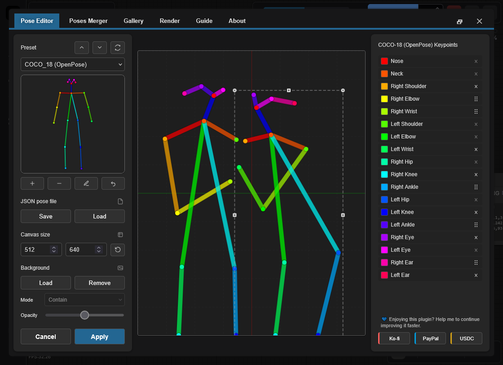
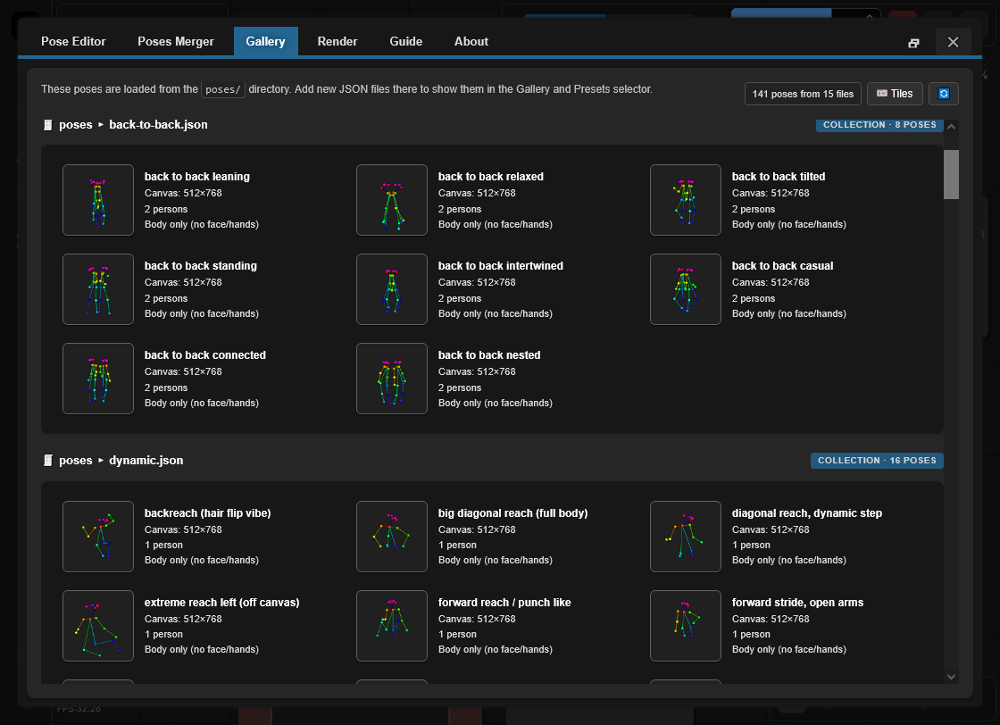

<h4 align="center">
  English | <a href="./README.de.md">Deutsch</a> | <a href="./README.es.md">Español</a> | <a href="./README.fr.md">Français</a> | <a href="./README.pt.md">Português</a> | <a href="./README.ru.md">Русский</a> | <a href="./README.ja.md">日本語</a> | <a href="./README.ko.md">한국어</a> | <a href="./README.zh.md">中文</a> | <a href="./README.zh-TW.md">繁體中文</a>
</h4>

<p align="center">
  
  
  
</p>
<br />

# OpenPose Studio for ComfyUI 🤸

OpenPose Studio is an advanced ComfyUI extension for creating, editing, previewing, and organizing OpenPose poses with a streamlined interface. It makes it easy to adjust keypoints visually, save and load pose files, browse pose presets and galleries, manage pose collections, merge multiple poses, and export clean JSON data for use in ControlNet and other pose-driven workflows.

---

## Table of Contents

- ✨ [Features](#features)
- 📦 [Installation](#installation)
- 🎯 [Usage](#usage)
- 🔧 [Nodes](#nodes)
- ⌨️ [Editor Controls & Shortcuts](#editor-controls--shortcuts)
- 📋 [Format Specifications](#format-specifications)
- 🖼️ [Gallery & Pose Management](#gallery--pose-management)
- 🔀 [Pose Merger](#pose-merger)
- 🖼️ [Background Reference](#background-reference)
- ⚠️ [Known Limitations](#known-limitations)
- 🔍 [Troubleshooting](#troubleshooting)
- 🤝 [Contributing](#contributing)
- 💙 [Funding & Support](#funding--support)
- 📄 [License](#license)

---

## Features

✨ **Core Capabilities**
- Real-time OpenPose keypoint editing with visual feedback
- Modern native Canvas rendering engine (faster, smoother, fewer moving parts)
- Interactive editing UX: clear active selection + pose hover preselection
- Constrained transforms so keypoints don’t drift out of canvas bounds
- JSON import/export for single poses and pose collections
- Standard OpenPose JSON export (portable to other tools)
- Legacy JSON compatibility (can load and correctly edit older non-standard JSON)

✨ **Advanced Features**
- **Render Toggles**: Optionally render Body / Hands / Face
- **Pose Gallery**: Browse and preview poses from `poses/`
- **Pose Collections**: Multi-pose JSON files shown as individual selectable poses
- **Pose Merger**: Combine multiple JSON files into organized collections
- **Quick Cleanup Actions**: Remove Face keypoints and/or Left/Right Hand keypoints when present
- **Optional Cleanup on Export**: Remove Face and/or Hands keypoints when exporting pose packs
- **Background Overlay System**: Selectable contain/cover modes with opacity control
- **Undo**: Full editing history during session

✨ **Data Handling**
- Automatic pose file discovery from `poses/` (including subdirectories)
- Validation and error recovery for malformed JSON files
- Support for partial poses (subset of body keypoints)
- Pixel-space coordinates matching pose files for seamless compatibility

✨ **UI & Integration**
- Fully responsive layout: adapts to any window size in real time and stays centered
- Auto-fit scaling when the canvas would not otherwise fit on screen
- Improved canvas visuals: background grid + center axes styled similarly to Blender
- Persistence across restarts: gallery view mode + background overlay settings restored on launch
- Native ComfyUI integrations: toasts + dialogs (with safe fallback)

---

✨ **Planned Features & Roadmap**

> [!IMPORTANT]
> Many planned features depend on funding for AI tokens. For the full roadmap and upcoming work, please check [TODO.md](../TODO.md)..

If you have an idea for a new feature, I would love to hear it — we may be able to implement it quickly. Please submit feedback, ideas, or suggestions via the repository Issues page: https://github.com/andreszs/comfyui-openpose-studio/issues


## Installation

### Requirements
- ComfyUI (recent build)
- Python 3.10+

### Steps

1. Clone this repository into `ComfyUI/custom_nodes/`.
2. Restart ComfyUI.
3. Confirm nodes appear under `image > OpenPose Studio`.

---

## Usage

### Basic Workflow

1. Add the **OpenPose Studio** node to your workflow
2. Click the node's preview canvas to open the editor UI
3. Select a pose from the presets or gallery to insert into canvas
4. Adjust keypoints by dragging them on the canvas
5. Click **Apply** to render the pose. This will create the serialized JSON in the node.
6. Connect the `image` output to subsequent image nodes
7. Connect the `kps` output to ControlNet/OpenPose compatible nodes

### Editor Preview



---

## Nodes

### OpenPose Studio

**Category:** `image`

- **Input:** `Pose JSON` (STRING) — standard OpenPose-style JSON.
- **Options:**
  - `render body` — include body in the rendered preview/output image
  - `render hands` — include hands in the rendered preview/output image (if present in the JSON)
  - `render face` — include face in the rendered preview/output image (if present in the JSON)
- **Outputs:**
  - `IMAGE` — Rendered pose visualization as RGB image (float32, 0-1 range)
  - `JSON` — OpenPose-style pose JSON with canvas dimensions and people array containing keypoint data
  - `KPS` — Keypoint data in POSE_KEYPOINT format, compatible with ControlNet
- **UI:** Click the node preview to open the interactive editor. Use the **open editor** button (pencil icon) to edit the pose directly.

#### Node Screenshot


---

## Editor Controls & Shortcuts

### Keyboard Shortcuts

| Control | Action |
|---------|--------|
| **Enter** | Apply pose and close editor |
| **Escape** | Cancel and discard changes |
| **Ctrl+Z** | Undo last action |
| **Ctrl+Y** | Redo last undone action |
| **Delete** | Remove selected keypoint |

### Canvas Interactions

- **Click**: Select keypoint
- **Drag**: Move keypoint to new position
- **Scroll**: Zoom in/out on canvas (TO-DO)

### Background Reference

Load reference images (e.g., anatomy guides, photo references) as non-destructive overlays during pose editing. Use **Contain** mode to fit images within the canvas or **Cover** mode to fill the canvas. Adjust opacity as needed.

- **Load Image**: Import reference image from disk
- **Contain/Cover**: Choose scaling mode
- **Opacity**: Adjust transparency (0-100%)

> [!NOTE]
> Background images persist during the ComfyUI session but are **not** saved in workflows.

---

## Format Specifications

This editor fully supports **OpenPose COCO-18 (body)** editing.

It also supports **OpenPose face and hands data** in a *pass-through* manner: if your JSON includes face and/or hand keypoints, they are preserved (not removed) and the Python node can render them correctly. However, **editing face and hand keypoints is not available yet** (planned for upcoming updates).

### OpenPose COCO-18 keypoints (body)

COCO-18 uses **18 body keypoints**. The pose is stored as a flat array named `pose_keypoints_2d` with the pattern:

`[x0, y0, c0, x1, y1, c1, ...]`

Where each keypoint has:
- `x`, `y`: pixel coordinates in the canvas
- `c`: confidence (commonly `0..1`; `0` can be used for “missing” points)

Keypoint order (index → name):

| Index | Name |
|------:|------|
| 0 | Nose |
| 1 | Neck |
| 2 | Right Shoulder |
| 3 | Right Elbow |
| 4 | Right Wrist |
| 5 | Left Shoulder |
| 6 | Left Elbow |
| 7 | Left Wrist |
| 8 | Right Hip |
| 9 | Right Knee |
| 10 | Right Ankle |
| 11 | Left Hip |
| 12 | Left Knee |
| 13 | Left Ankle |
| 14 | Right Eye |
| 15 | Left Eye |
| 16 | Right Ear |
| 17 | Left Ear |

> [!NOTE]
> **COCO** refers to the *Common Objects in Context* keypoint convention/dataset naming widely used in pose estimation. “COCO-18” here means the OpenPose body layout with 18 keypoints.

### Minimal JSON shape

A typical single-pose OpenPose-style JSON includes canvas dimensions and one `people` entry with `pose_keypoints_2d`:

```json
{
  "canvas_width": 512,
  "canvas_height": 512,
  "people": [
    {
      "pose_keypoints_2d": [0, 0, 0, 0, 0, 0 /* ... 18 * 3 values total ... */]
    }
  ]
}
```

> [!NOTE]
> The editor can handle partial poses (some keypoints missing). Missing points are typically represented as 0,0,0. You can also delete distal keypoints using the Pose Editor.

### Further reading

- History & context: "What is OpenPose — Exploring a milestone in pose estimation" — an approachable article explaining how OpenPose was introduced and its impact on pose estimation: https://www.ultralytics.com/blog/what-is-openpose-exploring-a-milestone-in-pose-estimation

### JSON format: Standard vs Legacy

- **OpenPose Studio:** reads/writes **standard OpenPose-style JSON** and also accepts older non-standard (legacy) JSON.

Practical notes:
- Pasting standard JSON into the OpenPose Studio node will render preview immediately.

---

## Gallery & Pose Management

### Overview

The **Gallery** tab provides visual browsing of all available poses with live preview thumbnails. It automatically discovers and organizes poses without manual configuration.



### View modes

The Gallery supports three display modes:
- **Large** — larger previews for quick visual selection
- **Medium** — balanced preview size and density
- **Tiles** — compact grid with extra metadata (e.g. **canvas size**, **keypoint counts**, and other pose details)

### Features

- **Auto-discovery**: Scans `poses/` directory on startup
- **Nested organization**: Subdirectory names become group labels
- **Live preview**: Thumbnail rendering for each pose
- **Search/filter**: Find poses by name or group
- **One-click load**: Select a pose to load into editor

### Supported File Types

- **Single-pose JSON**: Individual OpenPose JSON files
- **Pose Collections**: Multi-pose JSON files (each pose shown separately)
- **Nested directories**: Poses in subdirectories automatically grouped

### Deterministic Behavior

Gallery ordering and discovery is fully deterministic:
- No random shuffling
- Consistent alphabetical sorting
- Root poses listed first, then grouped poses
- Immediate reload of all JSON poses upon opening the Editor window.

---

## Pose Merger

### Purpose

The **Pose Merger** tab consolidates multiple individual pose JSON files into organized pose collection files. This is useful for:

- Converting large pose libraries into single files
- Cleaning pose data (removing face/hand keypoints)
- Reorganizing and renaming poses
- Distributing pose packs efficiently

### Workflow

1. **Add Files**: Load individual or collection JSON files
2. **Preview**: Each pose shown with thumbnail
3. **Configure**: Optionally exclude face/hand components
4. **Export**: Save as combined collection or individual files

### Key Capabilities

| Feature | Use Case |
|---------|----------|
| **Load Multiple Files** | Bulk import from file system |
| **Component Filtering** | Remove unnecessary face/hand data |
| **Collection Expansion** | Extract poses from existing collections |
| **Batch Renaming** | Assign meaningful names during export |
| **Selective Export** | Choose which poses to include |

### Output Options

- **Combined Collection**: Single JSON with all poses
- **Individual Files**: One file per pose (for compatibility)

Both output formats are automatically picked up by Gallery and Pose Selector.

---

## Known Limitations

> [!WARNING]
> Nodes 2.0 is currently not supported. Please disable Nodes 2.0 for now.

### Current Limitations & Workarounds

1. **Hand & Face Editing**
  - Issue: Editor currently limited to body keypoints (0-17)
  - Status: Planned for future release
  - Workaround: Use Pose Merger to manually edit hand/face JSON before importing

2. **Resolution Consistency**
  - Issue: Pose Merger doesn't auto-unify resolution across collection exports
  - Status: Needs careful implementation to avoid clipping
  - Workaround: Pre-scale poses to target resolution before importing

3. **Nodes 2.0 Compatibility**
  - Issue: The node does not behave correctly when ComfyUI "Nodes 2.0" is enabled.
  - Status: Planned fix, but it is a large and time-consuming refactor.
  - Note: This project is developed using paid AI agents. Once funding is available to purchase additional AI tokens, I intend to prioritize Nodes 2.0 support.
  - Workaround: Disable Nodes 2.0 for now.

### Error Recovery

The plugin includes defensive error handling:
- Invalid JSON files skip silently in Gallery
- Rendering errors return blank images instead of crashing
- Missing metadata falls back to safe defaults
- Malformed keypoints are filtered during rendering

---

## Troubleshooting

### Common Issues & Solutions

**Poses not appearing in Gallery**
```
✓ Confirm files exist in poses/ directory
✓ Verify JSON is valid (use online JSON validator)
✓ Check file extension is .json (case-sensitive on Linux)
✓ Restart ComfyUI to trigger discovery
✓ Check browser console (F12) for error messages
```

**JSON import fails**
```
✓ Validate JSON structure (must have "pose_keypoints_2d" or equivalent)
✓ Ensure coordinates are valid numbers, not strings
✓ Confirm minimum 18 keypoints for body poses
✓ Check for malformed escape sequences in JSON
```

**Blank output image**
```
✓ Verify pose is selected and contains valid keypoints
✓ Check canvas dimensions (width/height) are reasonable (100-2048px)
✓ Click Apply to render after making changes
✓ Check for NaN or infinite values in coordinates
```

**Background reference not persisting**
```
✓ Enable third-party cookies/storage in browser
✓ Check browser localStorage settings
✓ Try incognito mode to isolate issue
✓ Clear browser cache and try again
```

**Node not appearing in ComfyUI**
```
✓ Verify clone location: ComfyUI/custom_nodes/comfyui-openpose-studio
✓ Check __init__.py exists and imports correctly
✓ Restart ComfyUI fully (not just reload page)
✓ Check ComfyUI console for import errors
```
---

## Contributing

For guidelines on contributing, pull requests guidelines, architectural details, and development information, see [CONTRIBUTING.md](../CONTRIBUTING.md). If using an AI agent to assist with development, ensure it reads [AGENTS.md](../AGENTS.md) before making any code changes.

---

## Funding & Support

### Why Your Support Matters

This plugin is developed and maintained independently, with regular use of **paid AI agents** to speed up debugging, testing, and quality-of-life improvements. If you find it useful, financial support helps keep development moving steadily.

Your contribution helps:

* Fund AI tooling for faster fixes and new features
* Cover ongoing maintenance and compatibility work across ComfyUI updates
* Prevent development slowdowns when usage limits are reached

> [!TIP]
> Not donating? A GitHub star ⭐ still helps a lot by improving visibility and helping more users

### 💙 Support This Project

<table style="width: 100%; table-layout: fixed;">
  <tr>
    <td align="center" style="width: 33.33%; padding: 20px;">
      <div>
        <h4 style="margin: 8px 0;">Ko-fi</h4>
        <a href="https://ko-fi.com/D1D716OLPM" target="_blank" rel="noopener noreferrer">
          
        </a>
        <p style="margin: 8px 0; font-size: 12px;"><a href="https://ko-fi.com/D1D716OLPM" target="_blank" rel="noopener noreferrer">Buy a Coffee</a></p>
      </div>
    </td>
    <td align="center" style="width: 33.33%; padding: 20px;">
      <div>
        <h4 style="margin: 8px 0;">PayPal</h4>
        <a href="https://www.paypal.com/ncp/payment/GEEM324PDD9NC" target="_blank" rel="noopener noreferrer">
          
        </a>
        <p style="margin: 8px 0; font-size: 12px;"><a href="https://www.paypal.com/ncp/payment/GEEM324PDD9NC" target="_blank" rel="noopener noreferrer">Open PayPal</a></p>
      </div>
    </td>
    <td align="center" style="width: 33.33%; padding: 20px;">
      <div>
        <h4 style="margin: 8px 0;">USDC (Arbitrum only ⚠️)</h4>
        <a href="https://arbiscan.io/address/0xe36a336fC6cc9Daae657b4A380dA492AB9601e73" target="_blank" rel="noopener noreferrer">
          
        </a>
        <p style="margin: 8px 0; font-size: 12px;"><a href="#usdc-address">Show address</a></p>
      </div>
    </td>
  </tr>
</table>

<details>
  <summary>Prefer scanning? Show QR codes</summary>
  <br />
  <table style="width: 100%; table-layout: fixed;">
    <tr>
      <td align="center" style="width: 33.33%; padding: 12px;">
        <strong>Ko-fi</strong><br />
        <a href="https://ko-fi.com/D1D716OLPM" target="_blank" rel="noopener noreferrer">
          
        </a>
      </td>
      <td align="center" style="width: 33.33%; padding: 12px;">
        <strong>PayPal</strong><br />
        <a href="https://www.paypal.com/ncp/payment/GEEM324PDD9NC" target="_blank" rel="noopener noreferrer">
          
        </a>
      </td>
      <td align="center" style="width: 33.33%; padding: 12px;">
        <strong>USDC (Arbitrum) ⚠️</strong><br />
        <a href="https://arbiscan.io/address/0xe36a336fC6cc9Daae657b4A380dA492AB9601e73" target="_blank" rel="noopener noreferrer">
          
        </a>
      </td>
    </tr>
  </table>
</details>

<a id="usdc-address"></a>
<details>
  <summary>Show USDC address</summary>

```text
0xe36a336fC6cc9Daae657b4A380dA492AB9601e73
```

> [!WARNING]
> Send USDC on Arbitrum One only. Transfers sent on any other network will not arrive and may be permanently lost.
</details>

---

## License

MIT License - see [LICENSE](../LICENSE) file for full text.

**Summary:**
- ✓ Free for commercial use
- ✓ Free for private use
- ✓ Modify and distribute
- ✓ Include license and copyright notice

---

## Additional Resources

### Related Projects

- [ComfyUI](https://github.com/comfyanonymous/ComfyUI) - Core framework
- [comfyui_controlnet_aux](https://github.com/Kosinkadink/ComfyUI-Advanced-ControlNet) - ControlNet support
- [OpenPose](https://github.com/CMU-Perceptual-Computing-Lab/openpose) - Original pose detection

### Documentation

- [ComfyUI Custom Nodes Guide](https://github.com/comfyanonymous/ComfyUI/blob/main/docs/)
- [OpenPose Models & Keypoints](https://github.com/CMU-Perceptual-Computing-Lab/openpose/blob/master/doc/02_Output.md)
- [Canvas 2D API](https://developer.mozilla.org/en-US/docs/Web/API/Canvas_API) - Rendering engine

### Troubleshooting Guides

- [ComfyUI Installation Issues](https://github.com/comfyanonymous/ComfyUI/wiki/Installation)
- [Node Registration & Loading](https://github.com/comfyanonymous/ComfyUI/blob/main/docs/CONTRIBUTING.md)
- [Browser Developer Tools](https://developer.chrome.com/docs/devtools/)

---

**Maintained by:** andreszs  
**Status:** Active Development
