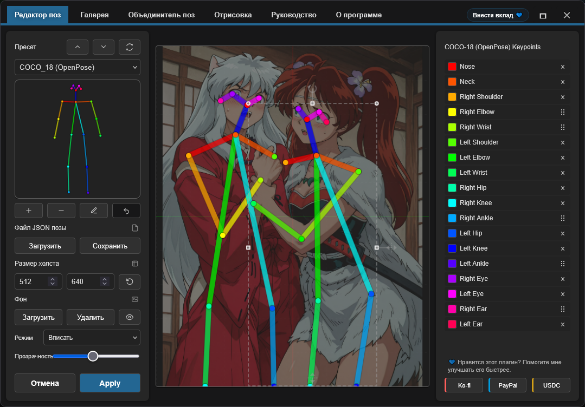

<h4 align="center">
  <a href="./README.md">English</a> | <a href="./README.de.md">Deutsch</a> | <a href="./README.es.md">Español</a> | <a href="./README.fr.md">Français</a> | <a href="./README.pt.md">Português</a> | Русский | <a href="./README.ja.md">日本語</a> | <a href="./README.ko.md">한국어</a> | <a href="./README.zh.md">中文</a> | <a href="./README.zh-TW.md">繁體中文</a>
</h4>

<p align="center">
  
  
  
</p>
<br />

# OpenPose Studio for ComfyUI 🤸

OpenPose Studio — это продвинутое расширение для ComfyUI, предназначенное для создания, редактирования, предпросмотра и организации поз OpenPose с помощью удобного и понятного интерфейса. Оно позволяет легко настраивать keypoints визуально, сохранять и загружать файлы поз, просматривать пресеты и галереи поз, управлять коллекциями, объединять несколько поз и экспортировать чистые JSON-данные для использования в ControlNet и других workflow, основанных на позах.

---

## Содержание

- ✨ [Возможности](#возможности)
- 📦 [Установка](#установка)
- 🎯 [Использование](#использование)
- 🔧 [Nodes](#nodes)
- ⌨️ [Управление и горячие клавиши редактора](#управление-и-горячие-клавиши-редактора)
- 📋 [Спецификации формата](#спецификации-формата)
- 🖼️ [Галерея и управление позами](#галерея-и-управление-позами)
- 🔀 [Pose Merger](#pose-merger)
- 🖼️ [Фоновое изображение](#background-reference)
- 🗺️ [Areas Input](#areas-input)
- ⚠️ [Известные ограничения](#известные-ограничения)
- 🔍 [Устранение неполадок](#устранение-неполадок)
- 🤝 [Участие в разработке](#участие-в-разработке)
- 💙 [Финансирование и поддержка](#финансирование-и-поддержка)
- 📄 [Лицензия](#лицензия)

---

## Возможности

✨ **Основные возможности**
- Редактирование keypoints OpenPose в реальном времени с визуальной обратной связью
- Современный нативный движок рендеринга Canvas (быстрее, плавнее, меньше движущихся частей)
- Интерактивный UX редактирования: чёткое активное выделение + предварительный выбор позы при наведении
- Ограниченные трансформации, не допускающие выход keypoints за границы canvas
- Импорт/экспорт JSON для отдельных поз и коллекций поз
- Стандартный экспорт JSON OpenPose (совместим с другими инструментами)
- Совместимость с legacy JSON (может загружать и правильно редактировать устаревший нестандартный JSON)

✨ **Расширенные возможности**
- **Render Toggles**: Опциональный рендеринг Body / Hands / Face
- **Pose Gallery**: Просмотр и предварительный просмотр поз из `poses/`
- **Pose Collections**: Многопозиционные JSON-файлы, отображаемые как отдельные выбираемые позы
- **Pose Merger**: Объединение нескольких JSON-файлов в организованные коллекции
- **Quick Cleanup Actions**: Удаление keypoints Face и/или keypoints левой/правой руки при их наличии
- **Optional Cleanup on Export**: Удаление keypoints Face и/или Hands при экспорте пакетов поз
- **Background Overlay System**: Выбираемые режимы Contain/Cover с управлением непрозрачностью
- **Undo**: Полная история редактирования в течение сессии

✨ **Работа с данными**
- Автоматическое обнаружение файлов поз из `poses/` (включая подкаталоги)
- Валидация и восстановление после ошибок для некорректных JSON-файлов
- Поддержка частичных поз (подмножество keypoints тела)
- Координаты в пиксельном пространстве, соответствующие файлам поз для полной совместимости

✨ **UI и интеграция**
- Полностью адаптивный макет: подстраивается под любой размер окна в реальном времени и остаётся по центру
- Автоматическое масштабирование, если canvas иначе не умещается на экране
- Улучшенная визуализация canvas: фоновая сетка + центральные оси в стиле Blender
- Сохранение состояния после перезапуска: режим просмотра галереи + настройки наложения фона восстанавливаются при запуске
- Нативные интеграции ComfyUI: уведомления + диалоги (с безопасным fallback)

---

✨ **Планируемые возможности и дорожная карта**

> [!IMPORTANT]
> Многие планируемые возможности зависят от финансирования для токенов ИИ. Полную дорожную карту и предстоящие работы см. в [TODO.md](../TODO.md)..

Если у вас есть идея новой функции, буду рад её услышать — возможно, мы сможем реализовать её быстро. Отправляйте отзывы, идеи или предложения через страницу Issues репозитория: https://github.com/andreszs/comfyui-openpose-studio/issues


## Установка

### Требования
- ComfyUI (актуальная сборка)
- Python 3.10+

### Шаги

1. Клонируйте этот репозиторий в `ComfyUI/custom_nodes/`.
2. Перезапустите ComfyUI.
3. Убедитесь, что ноды отображаются в разделе `image > OpenPose Studio`.

---

## Использование

### Базовый рабочий процесс

1. Добавить node **OpenPose Studio** в рабочий процесс
2. Кликнуть по превью-canvas ноды, чтобы открыть UI редактора
3. Выбрать позу из пресетов или галереи для вставки на canvas
4. Настроить keypoints, перетаскивая их на canvas
5. Нажать **Apply** для рендеринга позы. Это создаст сериализованный JSON в ноде.
6. Подключить выход `image` к последующим image-нодам
7. Подключить выход `kps` к нодам, совместимым с ControlNet/OpenPose

### Предварительный просмотр редактора



---

## Nodes

### OpenPose Studio

**Категория:** `image`

- **Вход:** `Pose JSON` (STRING) — стандартный JSON в стиле OpenPose.
- **Необязательные входы:**
  - `areas` (`CONDITIONING_AREAS`) — данные overlay областей; подключить выход `areas_out` ноды [Conditioning Pipeline (Combine)](https://github.com/andreszs/comfyui-lora-pipeline), чтобы визуализировать области кондиционирования на canvas
- **Опции:**
  - `render body` — включить body в рендерированное изображение предпросмотра/вывода
  - `render hands` — включить hands в рендерированное изображение предпросмотра/вывода (если присутствуют в JSON)
  - `render face` — включить face в рендерированное изображение предпросмотра/вывода (если присутствует в JSON)
- **Выходы:**
  - `IMAGE` — Рендерированная визуализация позы в виде RGB-изображения (float32, диапазон 0-1)
  - `JSON` — JSON в стиле OpenPose с размерами canvas и массивом people, содержащим данные keypoints
  - `KPS` — Данные keypoints в формате POSE_KEYPOINT, совместимом с ControlNet
- **UI:** Кликнуть на превью ноды, чтобы открыть интерактивный редактор. Использовать кнопку **open editor** (значок карандаша) для прямого редактирования позы.

#### Скриншот ноды


---

## Управление и горячие клавиши редактора

### Горячие клавиши

| Управление | Действие |
|---------|--------|
| **Enter** | Применить позу и закрыть редактор |
| **Escape** | Отмена и сброс изменений |
| **Ctrl+Z** | Отменить последнее действие |
| **Ctrl+Y** | Повторить последнее отменённое действие |
| **Delete** | Удалить выбранный keypoint |

### Взаимодействие с canvas

- **Клик**: Выбрать keypoint
- **Перетаскивание**: Переместить keypoint в новое положение
- **Прокрутка**: Масштабирование canvas (TO-DO)

### Background Reference

Загрузка изображений-ссылок (например, анатомические руководства, фотографии) в качестве неразрушающих наложений при редактировании позы. Режим **Contain** для вписывания изображений в canvas, режим **Cover** для заполнения canvas. Прозрачность регулируется по необходимости.

- **Load Image**: Импортировать изображение-ссылку с диска
- **Contain/Cover**: Выбрать режим масштабирования
- **Opacity**: Регулировать прозрачность (0-100%)

> [!NOTE]
> Фоновые изображения сохраняются в течение сессии ComfyUI, но **не** сохраняются в рабочих процессах.

### Areas Input

Вход **areas** — это **необязательное** подключение, которое отображает границы областей кондиционирования на canvas во время редактирования позы.

Подключите выход `areas_out` ноды [**Conditioning Pipeline (Combine)**](https://github.com/andreszs/comfyui-lora-pipeline) из репозитория [ComfyUI-LoRA-Pipeline](https://github.com/andreszs/comfyui-lora-pipeline), чтобы визуализировать целевые регионы каждой области при позиционировании поз.

Каждая область отображается в виде подписанного значка на canvas. Нажмите на значок, чтобы **включить или отключить** соответствующую область отдельно, что позволяет сосредоточиться на регионах, важных для текущей позы.


Эта комбинация особенно полезна при создании workflows с несколькими персонажами: [ComfyUI-LoRA-Pipeline](https://github.com/andreszs/comfyui-lora-pipeline) управляет кондиционированием по областям и назначением LoRA, тогда как OpenPose Studio обеспечивает точное позиционирование поз в каждом регионе. В результате получается простая и неразрушающая конфигурация, в которой LoRA как по областям, так и по позам могут применяться одновременно без взаимных помех. Если вы ещё не знакомы с кондиционированием на основе областей, расширение [ComfyUI-LoRA-Pipeline](https://github.com/andreszs/comfyui-lora-pipeline) создано именно для такого типа workflow и отлично сочетается с этой нодой.

Реальный пример совместного использования всех трёх репозиториев — кондиционирование областей, управление OpenPose и наложение стилей — можно найти в этом [пошаговом руководстве по workflow](https://www.andreszsogon.com/building-a-multi-character-comfyui-workflow-with-area-conditioning-openpose-control-and-style-layering/).

---

## Спецификации формата

Этот редактор полностью поддерживает редактирование **OpenPose COCO-18 (body)**.

Также поддерживает **данные OpenPose face и hands** в режиме *pass-through*: если ваш JSON включает keypoints face и/или hand, они сохраняются (не удаляются), и Python node может корректно их отрендерить. Однако **редактирование keypoints face и hand пока недоступно** (запланировано в следующих обновлениях).

### Keypoints OpenPose COCO-18 (body)

COCO-18 использует **18 keypoints тела**. Поза хранится как плоский массив с именем `pose_keypoints_2d` по шаблону:

`[x0, y0, c0, x1, y1, c1, ...]`

Где каждый keypoint имеет:
- `x`, `y`: пиксельные координаты на canvas
- `c`: достоверность (обычно `0..1`; `0` используется для «отсутствующих» точек)

Порядок keypoints (индекс → название):

| Индекс | Название |
|------:|------|
| 0 | Нос |
| 1 | Шея |
| 2 | Правое плечо |
| 3 | Правый локоть |
| 4 | Правое запястье |
| 5 | Левое плечо |
| 6 | Левый локоть |
| 7 | Левое запястье |
| 8 | Правое бедро |
| 9 | Правое колено |
| 10 | Правая лодыжка |
| 11 | Левое бедро |
| 12 | Левое колено |
| 13 | Левая лодыжка |
| 14 | Правый глаз |
| 15 | Левый глаз |
| 16 | Правое ухо |
| 17 | Левое ухо |

> [!NOTE]
> **COCO** относится к соглашению/именованию набора данных *Common Objects in Context*, широко используемому в оценке позы. «COCO-18» здесь означает разметку body OpenPose с 18 keypoints.

### Минимальная структура JSON

Типичный JSON в стиле OpenPose для одиночной позы включает размеры canvas и одну запись `people` с `pose_keypoints_2d`:

```json
{
  "canvas_width": 512,
  "canvas_height": 512,
  "people": [
    {
      "pose_keypoints_2d": [0, 0, 0, 0, 0, 0 /* ... 18 * 3 values total ... */]
    }
  ]
}
```

> [!NOTE]
> Редактор может обрабатывать частичные позы (часть keypoints отсутствует). Отсутствующие точки обычно представлены как 0,0,0. Также можно удалять дистальные keypoints с помощью Pose Editor.

### Дополнительное чтение

- История и контекст: «What is OpenPose — Exploring a milestone in pose estimation» — доступная статья с объяснением появления OpenPose и его влияния на оценку позы: https://www.ultralytics.com/blog/what-is-openpose-exploring-a-milestone-in-pose-estimation

### Формат JSON: стандартный и legacy

- **OpenPose Studio:** читает/записывает **стандартный JSON в стиле OpenPose** и также принимает старый legacy JSON.

Практические заметки:
- Вставка стандартного JSON в node OpenPose Studio немедленно отображает предпросмотр.

---

## Галерея и управление позами

### Обзор

Вкладка **Gallery** обеспечивает визуальный просмотр всех доступных поз с миниатюрами предварительного просмотра в реальном времени. Автоматически обнаруживает и организует позы без ручной настройки.


### Режимы просмотра

Gallery поддерживает три режима отображения:
- **Large** — крупные миниатюры для быстрого визуального выбора
- **Medium** — сбалансированный размер и плотность миниатюр
- **Tiles** — компактная сетка с дополнительными метаданными (например, **размер canvas**, **количество keypoints** и другие подробности позы)

### Функции

- **Auto-discovery**: Сканирует каталог `poses/` при запуске
- **Nested organization**: Имена подкаталогов становятся метками групп
- **Live preview**: Рендеринг миниатюр в реальном времени для каждой позы
- **Search/filter**: Поиск поз по имени или группе
- **One-click load**: Выбор позы для загрузки в редактор

### Поддерживаемые типы файлов

- **Single-pose JSON**: Отдельные JSON-файлы OpenPose
- **Pose Collections**: Многопозиционные JSON-файлы (каждая поза отображается отдельно)
- **Nested directories**: Позы в подкаталогах автоматически группируются

### Детерминированное поведение

Порядок и обнаружение в галерее полностью детерминированы:
- Без случайного перемешивания
- Последовательная сортировка по алфавиту
- Корневые позы перечислены первыми, затем сгруппированные позы
- Немедленная перезагрузка всех JSON-поз при открытии окна редактора.

---

## Pose Merger

### Назначение

Вкладка **Pose Merger** объединяет несколько отдельных JSON-файлов поз в организованные файлы коллекций поз. Это полезно для:

- Преобразования больших библиотек поз в единые файлы
- Очистки данных поз (удаление keypoints face/hand)
- Реорганизации и переименования поз
- Эффективного распространения пакетов поз

### Рабочий процесс

1. **Add Files**: Загрузить отдельные или коллекционные JSON-файлы
2. **Preview**: Каждая поза отображается с миниатюрой
3. **Configure**: Опционально исключить компоненты face/hand
4. **Export**: Сохранить как объединённую коллекцию или отдельные файлы

### Ключевые возможности

| Функция | Применение |
|---------|----------|
| **Load Multiple Files** | Массовый импорт из файловой системы |
| **Component Filtering** | Удаление ненужных данных face/hand |
| **Collection Expansion** | Извлечение поз из существующих коллекций |
| **Batch Renaming** | Присвоение значимых имён при экспорте |
| **Selective Export** | Выбор включаемых поз |

### Варианты вывода

- **Combined Collection**: Единый JSON со всеми позами
- **Individual Files**: Один файл на позу (для совместимости)

Оба формата вывода автоматически подхватываются Gallery и Pose Selector.

---

## Известные ограничения

> [!WARNING]
> Nodes 2.0 в настоящее время не поддерживается. Пожалуйста, отключите Nodes 2.0 на данный момент.

### Текущие ограничения и обходные пути

1. **Редактирование Hand и Face**
  - Проблема: Редактор в настоящее время ограничен keypoints body (0-17)
  - Статус: Запланировано для следующего выпуска
  - Обходной путь: Использовать Pose Merger для ручного редактирования JSON hand/face перед импортом

2. **Согласованность разрешения**
  - Проблема: Pose Merger не унифицирует автоматически разрешение при экспорте коллекций
  - Статус: Требует тщательной реализации во избежание обрезки
  - Обходной путь: Предварительно масштабировать позы до целевого разрешения перед импортом

3. **Совместимость с Nodes 2.0**
  - Проблема: Node работает некорректно при включённом ComfyUI «Nodes 2.0».
  - Статус: Исправление запланировано, но это большой и трудоёмкий рефакторинг.
  - Примечание: Этот проект разрабатывается с использованием платных ИИ-агентов. Как только появится финансирование для покупки дополнительных токенов ИИ, я намерен приоритизировать поддержку Nodes 2.0.
  - Обходной путь: Отключить Nodes 2.0 на данный момент.

### Восстановление после ошибок

Плагин включает защитную обработку ошибок:
- Некорректные JSON-файлы тихо пропускаются в Gallery
- Ошибки рендеринга возвращают пустые изображения вместо сбоя
- Отсутствующие метаданные используют безопасные значения по умолчанию
- Некорректные keypoints фильтруются при рендеринге

---

## Устранение неполадок

### Частые проблемы и решения

**Позы не появляются в Gallery**
```
✓ Убедиться, что файлы существуют в каталоге poses/
✓ Проверить корректность JSON (использовать онлайн-валидатор JSON)
✓ Проверить расширение файла .json (чувствительно к регистру на Linux)
✓ Перезапустить ComfyUI для запуска обнаружения
✓ Проверить консоль браузера (F12) на наличие сообщений об ошибках
```

**Импорт JSON завершается ошибкой**
```
✓ Проверить структуру JSON (должен иметь "pose_keypoints_2d" или аналог)
✓ Убедиться, что координаты — допустимые числа, а не строки
✓ Подтвердить минимум 18 keypoints для body-поз
✓ Проверить некорректные escape-последовательности в JSON
```

**Пустое выходное изображение**
```
✓ Проверить, что поза выбрана и содержит допустимые keypoints
✓ Проверить размеры canvas (ширина/высота) в разумных пределах (100-2048px)
✓ Нажать Apply для рендеринга после внесения изменений
✓ Проверить наличие NaN или бесконечных значений в координатах
```

**Background reference не сохраняется**
```
✓ Включить сторонние куки/хранилище в браузере
✓ Проверить настройки localStorage браузера
✓ Попробовать режим инкогнито для изоляции проблемы
✓ Очистить кэш браузера и попробовать снова
```

**Node не появляется в ComfyUI**
```
✓ Проверить расположение клона: ComfyUI/custom_nodes/comfyui-openpose-studio
✓ Убедиться, что __init__.py существует и корректно импортируется
✓ Полностью перезапустить ComfyUI (не просто перезагрузить страницу)
✓ Проверить консоль ComfyUI на наличие ошибок импорта
```
---

## Участие в разработке

Рекомендации по вкладу, требования к pull request, архитектурные подробности и информацию о разработке см. в [CONTRIBUTING.md](../CONTRIBUTING.md). При использовании ИИ-агента для помощи в разработке убедитесь, что он прочёл [AGENTS.md](../AGENTS.md) перед внесением изменений в код.

---

## Финансирование и поддержка

### Почему ваша поддержка важна

Этот плагин разрабатывается и поддерживается независимо, с регулярным использованием **платных ИИ-агентов** для ускорения отладки, тестирования и улучшения качества работы. Если вы находите его полезным, финансовая поддержка помогает поддерживать стабильный темп разработки.

Ваш вклад помогает:

* Финансировать ИИ-инструменты для более быстрых исправлений и новых функций
* Покрывать текущее обслуживание и работу по совместимости с обновлениями ComfyUI
* Предотвращать замедления разработки при достижении лимитов использования

> [!TIP]
> Нет возможности пожертвовать? Звезда GitHub ⭐ всё равно очень помогает, повышая видимость и привлекая больше пользователей.

### 💙 Поддержать этот проект

<table style="width: 100%; table-layout: fixed;">
  <tr>
    <td align="center" style="width: 33.33%; padding: 20px;">
      <div>
        <h4 style="margin: 8px 0;">Ko-fi</h4>
        <a href="https://ko-fi.com/D1D716OLPM" target="_blank" rel="noopener noreferrer">
          
        </a>
        <p style="margin: 8px 0; font-size: 12px;"><a href="https://ko-fi.com/D1D716OLPM" target="_blank" rel="noopener noreferrer">Угостить кофе</a></p>
      </div>
    </td>
    <td align="center" style="width: 33.33%; padding: 20px;">
      <div>
        <h4 style="margin: 8px 0;">PayPal</h4>
        <a href="https://www.paypal.com/ncp/payment/GEEM324PDD9NC" target="_blank" rel="noopener noreferrer">
          
        </a>
        <p style="margin: 8px 0; font-size: 12px;"><a href="https://www.paypal.com/ncp/payment/GEEM324PDD9NC" target="_blank" rel="noopener noreferrer">Открыть PayPal</a></p>
      </div>
    </td>
    <td align="center" style="width: 33.33%; padding: 20px;">
      <div>
        <h4 style="margin: 8px 0;">USDC (только Arbitrum ⚠️)</h4>
        <a href="https://arbiscan.io/address/0xe36a336fC6cc9Daae657b4A380dA492AB9601e73" target="_blank" rel="noopener noreferrer">
          
        </a>
        <p style="margin: 8px 0; font-size: 12px;"><a href="#usdc-address">Показать адрес</a></p>
      </div>
    </td>
  </tr>
</table>

<details>
  <summary>Предпочитаете сканировать? Показать QR-коды</summary>
  <br />
  <table style="width: 100%; table-layout: fixed;">
    <tr>
      <td align="center" style="width: 33.33%; padding: 12px;">
        <strong>Ko-fi</strong><br />
        <a href="https://ko-fi.com/D1D716OLPM" target="_blank" rel="noopener noreferrer">
          
        </a>
      </td>
      <td align="center" style="width: 33.33%; padding: 12px;">
        <strong>PayPal</strong><br />
        <a href="https://www.paypal.com/ncp/payment/GEEM324PDD9NC" target="_blank" rel="noopener noreferrer">
          
        </a>
      </td>
      <td align="center" style="width: 33.33%; padding: 12px;">
        <strong>USDC (Arbitrum) ⚠️</strong><br />
        <a href="https://arbiscan.io/address/0xe36a336fC6cc9Daae657b4A380dA492AB9601e73" target="_blank" rel="noopener noreferrer">
          
        </a>
      </td>
    </tr>
  </table>
</details>

<a id="usdc-address"></a>
<details>
  <summary>Показать адрес USDC</summary>

```text
0xe36a336fC6cc9Daae657b4A380dA492AB9601e73
```

> [!WARNING]
> Отправляйте USDC только в сети Arbitrum One. Переводы в любой другой сети не дойдут и могут быть безвозвратно утеряны.
</details>

---

## Лицензия

Лицензия MIT — полный текст в файле [LICENSE](../LICENSE).

**Краткое описание:**
- ✓ Бесплатно для коммерческого использования
- ✓ Бесплатно для частного использования
- ✓ Изменение и распространение
- ✓ Включить лицензию и уведомление об авторских правах

---

## Дополнительные ресурсы

### Связанные проекты

- [ComfyUI](https://github.com/comfyanonymous/ComfyUI) - Основной фреймворк
- [comfyui_controlnet_aux](https://github.com/Kosinkadink/ComfyUI-Advanced-ControlNet) - Поддержка ControlNet
- [OpenPose](https://github.com/CMU-Perceptual-Computing-Lab/openpose) - Оригинальное обнаружение поз

### Документация

- [ComfyUI Custom Nodes Guide](https://github.com/comfyanonymous/ComfyUI/blob/main/docs/)
- [OpenPose Models & Keypoints](https://github.com/CMU-Perceptual-Computing-Lab/openpose/blob/master/doc/02_Output.md)
- [Canvas 2D API](https://developer.mozilla.org/en-US/docs/Web/API/Canvas_API) - Движок рендеринга

### Руководства по устранению неполадок

- [ComfyUI Installation Issues](https://github.com/comfyanonymous/ComfyUI/wiki/Installation)
- [Node Registration & Loading](https://github.com/comfyanonymous/ComfyUI/blob/main/docs/CONTRIBUTING.md)
- [Browser Developer Tools](https://developer.chrome.com/docs/devtools/)

---

**Поддерживается:** andreszs  
**Статус:** Активная разработка
