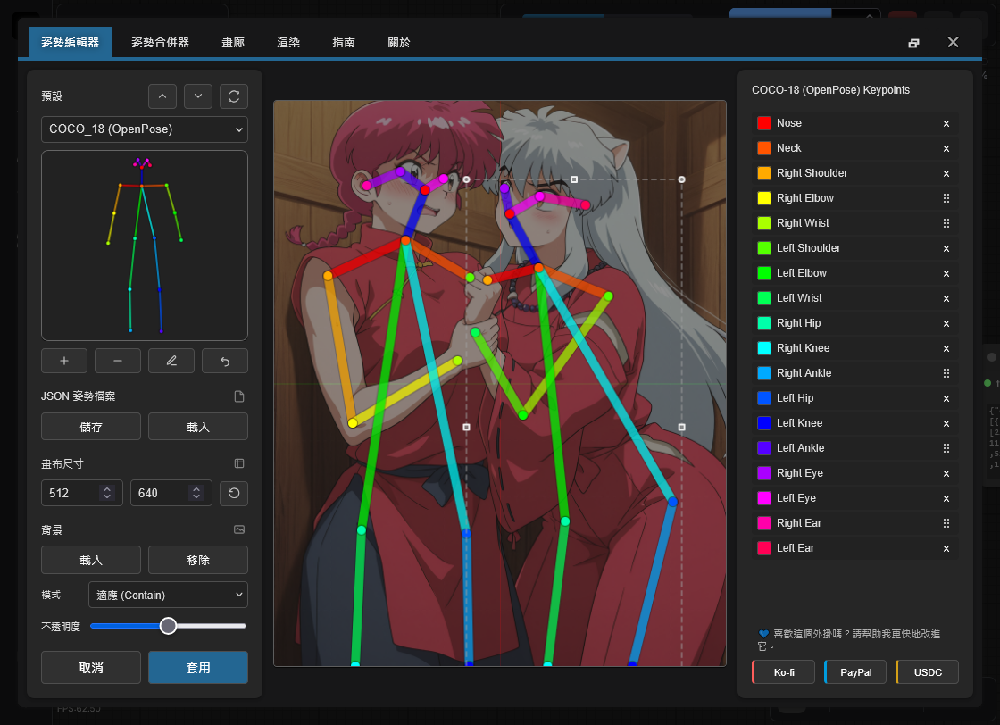
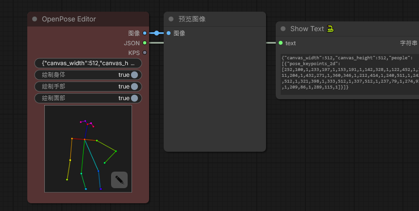
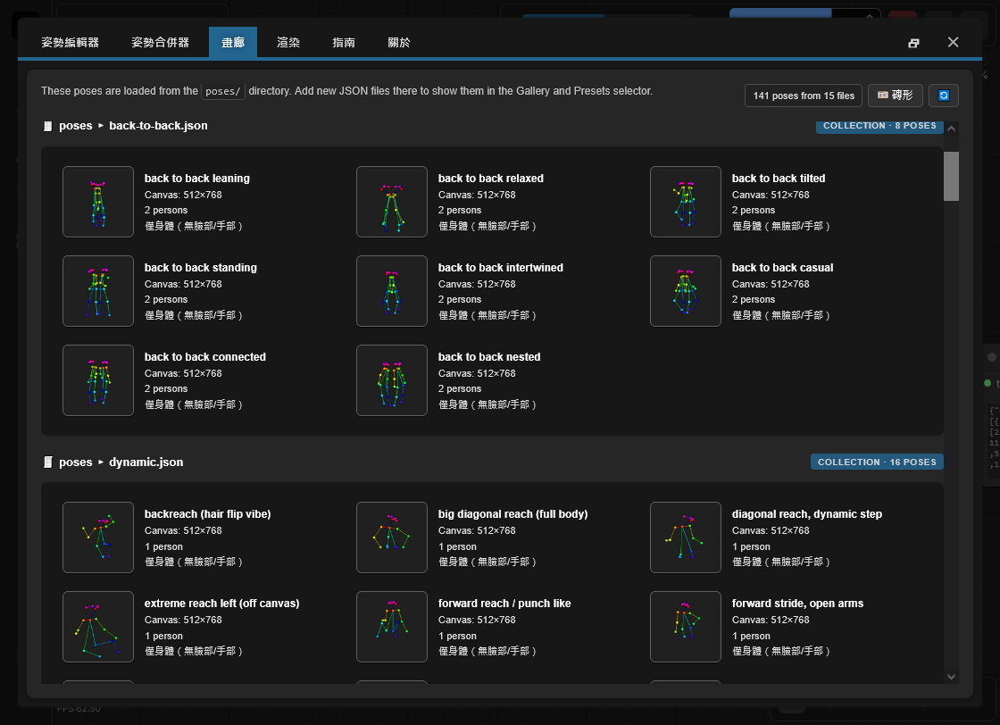

<h4 align="center">
  <a href="./README.md">English</a> | <a href="./README.de.md">Deutsch</a> | <a href="./README.es.md">Español</a> | <a href="./README.fr.md">Français</a> | <a href="./README.pt.md">Português</a> | <a href="./README.ru.md">Русский</a> | <a href="./README.ja.md">日本語</a> | <a href="./README.ko.md">한국어</a> | <a href="./README.zh.md">中文</a> | 繁體中文
</h4>

<p align="center">
  
  
  
</p>
<br />

# ComfyUI 的 OpenPose Studio 🤸

OpenPose Studio 是一款進階的 ComfyUI 擴充套件，提供簡潔流暢的介面，用於建立、編輯、預覽與整理 OpenPose 姿勢。它可讓你輕鬆地以視覺化方式調整 keypoints、儲存與載入姿勢檔案、瀏覽姿勢預設與圖庫、管理姿勢集合、合併多個姿勢，並匯出乾淨的 JSON 資料，以便用於 ControlNet 與其他以姿勢為基礎的 workflows。

---

## 目錄

- ✨ [功能特色](#功能特色)
- 📦 [安裝](#安裝)
- 🎯 [使用方式](#使用方式)
- 🔧 [節點](#節點)
- ⌨️ [編輯器控制與快捷鍵](#編輯器控制與快捷鍵)
- 📋 [格式規格](#格式規格)
- 🖼️ [圖庫與姿勢管理](#圖庫與姿勢管理)
- 🔀 [姿勢合併器](#姿勢合併器)
- 🖼️ [背景參考](#背景參考)
- ⚠️ [已知限制](#已知限制)
- 🔍 [疑難排解](#疑難排解)
- 🤝 [貢獻](#貢獻)
- 💙 [資助與支持](#資助與支持)
- 📄 [授權條款](#授權條款)

---

## 功能特色

✨ **核心能力**
- 具備視覺回饋的即時 OpenPose 關鍵點編輯
- 現代原生 Canvas 渲染引擎（更快、更順暢、組件更精簡）
- 互動式編輯體驗：清楚的目前選取 + 姿勢懸停預選
- 受限變換，避免關鍵點漂移到 Canvas 邊界之外
- 支援單一姿勢與姿勢集合的 JSON 匯入/匯出
- 標準 OpenPose JSON 匯出（可攜至其他工具）
- Legacy JSON 相容（可載入並正確編輯舊版非標準 JSON）

✨ **進階功能**
- **繪製切換**：可選擇繪製 Body / Hands / Face
- **姿勢圖庫**：瀏覽並預覽 `poses/` 中的姿勢
- **姿勢集合**：多姿勢 JSON 檔案會顯示為可個別選取的姿勢
- **姿勢合併器**：將多個 JSON 檔案合併為有組織的集合
- **快速清理操作**：若存在則移除 Face 關鍵點與/或 Left/Right Hand 關鍵點
- **匯出時可選清理**：匯出姿勢包時移除 Face 與/或 Hands 關鍵點
- **背景疊加系統**：可選 contain/cover 模式並支援不透明度控制
- **復原**：工作階段期間完整編輯歷史

✨ **資料處理**
- 自動探索 `poses/` 中的姿勢檔案（包含子目錄）
- 針對格式錯誤的 JSON 檔案提供驗證與錯誤復原
- 支援部分姿勢（身體關鍵點的子集合）
- 與姿勢檔案一致的像素座標空間，確保無縫相容

✨ **UI 與整合**
- 完全響應式版面：即時適配任意視窗大小並保持置中
- 當 Canvas 無法顯示於螢幕時，自動縮放以適配
- 改良 Canvas 視覺：背景網格 + 中心軸，風格類似 Blender
- 重啟後持久化：啟動時還原圖庫檢視模式 + 背景疊加設定
- 原生 ComfyUI 整合：toasts + dialogs（含安全回退）

---

✨ **規劃功能與路線圖**

> [!IMPORTANT]
> 許多規劃中的功能仰賴 AI Token 資金支持。完整路線圖與後續工作請參閱 [TODO.md](../TODO.md)。

如果你有新功能的想法，我很樂意聽取，我們可能可以很快實作。請透過儲存庫 Issues 頁面提交回饋、想法或建議：https://github.com/andreszs/comfyui-openpose-studio/issues


## 安裝

### 需求
- ComfyUI（最新版本）
- Python 3.10+

### 步驟

1. 將此儲存庫複製到 `ComfyUI/custom_nodes/`。
2. 重新啟動 ComfyUI。
3. 確認節點出現在 `image > OpenPose Studio` 下。

---

## 使用方式

### 基本工作流程

1. 將 **OpenPose Studio** 節點加入你的工作流程
2. 點擊節點預覽 Canvas 以開啟編輯器 UI
3. 從預設或圖庫選擇姿勢並插入到 Canvas
4. 在 Canvas 上拖曳關鍵點進行調整
5. 點擊 **Apply** 來渲染姿勢。這會在節點中建立序列化的 JSON。
6. 將 `image` 輸出連接到後續影像節點
7. 將 `kps` 輸出連接到相容 ControlNet/OpenPose 的節點

### 編輯器預覽



---

## 節點

### OpenPose Studio

**分類：** `image`

- **輸入：** `Pose JSON` (STRING) - 標準 OpenPose 風格 JSON。
- **選項：**
  - `render body` - 在渲染預覽/輸出影像中包含 body
  - `render hands` - 在渲染預覽/輸出影像中包含 hands（若 JSON 中存在）
  - `render face` - 在渲染預覽/輸出影像中包含 face（若 JSON 中存在）
- **輸出：**
  - `IMAGE` - 以 RGB 影像呈現的渲染姿勢可視化（float32，0-1 範圍）
  - `JSON` - OpenPose 風格姿勢 JSON，包含 Canvas 尺寸與含關鍵點資料的 people 陣列
  - `KPS` - POSE_KEYPOINT 格式的關鍵點資料，相容 ControlNet
- **UI：** 點擊節點預覽以開啟互動式編輯器。使用 **open editor** 按鈕（鉛筆圖示）可直接編輯姿勢。

#### 節點截圖



---

## 編輯器控制與快捷鍵

### 鍵盤快捷鍵

| Control | Action |
|---------|--------|
| **Enter** | 套用姿勢並關閉編輯器 |
| **Escape** | 取消並捨棄變更 |
| **Ctrl+Z** | 復原上一步操作 |
| **Ctrl+Y** | 重做上次復原的操作 |
| **Delete** | 移除已選取關鍵點 |

### Canvas 互動

- **Click**: 選取關鍵點
- **Drag**: 將關鍵點移動到新位置
- **Scroll**: 在 Canvas 上縮放（TO-DO）

### 背景參考

在姿勢編輯期間，載入參考圖片（例如解剖指南、照片參考）作為非破壞性疊加。使用 **Contain** 模式可讓圖片適配在 Canvas 內，或使用 **Cover** 模式填滿 Canvas。可依需求調整不透明度。

- **Load Image**: 從磁碟匯入參考圖片
- **Contain/Cover**: 選擇縮放模式
- **Opacity**: 調整透明度（0-100%）

> [!NOTE]
> 背景圖片會在 ComfyUI 工作階段中保留，但**不會**儲存到工作流程中。

---

## 格式規格

此編輯器完整支援 **OpenPose COCO-18 (body)** 編輯。

它也以 *pass-through* 方式支援 **OpenPose face 與 hands 資料**：如果你的 JSON 包含 face 與/或 hand 關鍵點，這些資料會被保留（不會移除），且 Python 節點可以正確渲染它們。不過，**目前尚未支援 face 與 hand 關鍵點編輯**（規劃於後續更新）。

### OpenPose COCO-18 keypoints（body）

COCO-18 使用 **18 個身體關鍵點**。姿勢以名為 `pose_keypoints_2d` 的扁平陣列儲存，格式如下：

`[x0, y0, c0, x1, y1, c1, ...]`

其中每個關鍵點包含：
- `x`, `y`: Canvas 中的像素座標
- `c`: 信心值（常見為 `0..1`；`0` 可用於表示「缺失」點）

關鍵點順序（索引 → 名稱）：

| 索引 | 名稱 |
|------:|------|
| 0 | 鼻子 |
| 1 | 頸部 |
| 2 | 右肩 |
| 3 | 右肘 |
| 4 | 右手腕 |
| 5 | 左肩 |
| 6 | 左肘 |
| 7 | 左手腕 |
| 8 | 右髖 |
| 9 | 右膝 |
| 10 | 右腳踝 |
| 11 | 左髖 |
| 12 | 左膝 |
| 13 | 左腳踝 |
| 14 | 右眼 |
| 15 | 左眼 |
| 16 | 右耳 |
| 17 | 左耳 |

> [!NOTE]
> **COCO** 指的是在姿勢估計中廣泛使用的 *Common Objects in Context* 關鍵點慣例/資料集命名。此處的「COCO-18」代表具有 18 個關鍵點的 OpenPose body 佈局。

### 最小 JSON 結構

典型的單姿勢 OpenPose 風格 JSON 包含 Canvas 尺寸，以及一個帶有 `pose_keypoints_2d` 的 `people` 項目：

```json
{
  "canvas_width": 512,
  "canvas_height": 512,
  "people": [
    {
      "pose_keypoints_2d": [0, 0, 0, 0, 0, 0 /* ... 18 * 3 values total ... */]
    }
  ]
}
```

> [!NOTE]
> 編輯器可處理部分姿勢（部分關鍵點缺失）。缺失點通常表示為 0,0,0。你也可以使用 Pose Editor 刪除遠端關鍵點。

### 延伸閱讀

- 歷史與脈絡：「What is OpenPose - Exploring a milestone in pose estimation」- 一篇易於理解的文章，說明 OpenPose 的推出及其對姿勢估計的影響：https://www.ultralytics.com/blog/what-is-openpose-exploring-a-milestone-in-pose-estimation

### JSON 格式：Standard vs Legacy

- **OpenPose Studio:** 讀寫**標準 OpenPose 風格 JSON**，同時支援較舊的非標準 Legacy JSON。

實務說明：
- 將標準 JSON 貼到 OpenPose Studio 節點會立即渲染預覽。

---

## 圖庫與姿勢管理

### 概覽

**Gallery** 分頁提供所有可用姿勢的視覺化瀏覽，並附即時預覽縮圖。它會自動探索與整理姿勢，無需手動設定。



### 檢視模式

Gallery 支援三種顯示模式：
- **Large** - 較大的預覽，便於快速視覺選擇
- **Medium** - 預覽大小與密度的平衡
- **Tiles** - 緊湊網格，含額外中繼資料（例如 **canvas size**、**keypoint counts** 與其他姿勢細節）

### 功能

- **自動探索**: 啟動時掃描 `poses/` 目錄
- **巢狀組織**: 子目錄名稱會成為分組標籤
- **即時預覽**: 為每個姿勢渲染縮圖
- **搜尋/篩選**: 依名稱或分組尋找姿勢
- **一鍵載入**: 選取姿勢即可載入編輯器

### 支援的檔案類型

- **單一姿勢 JSON**: 個別 OpenPose JSON 檔案
- **姿勢集合**: 多姿勢 JSON 檔案（每個姿勢分別顯示）
- **巢狀目錄**: 子目錄中的姿勢會自動分組

### 決定性行為

圖庫排序與探索完全具決定性：
- 不進行隨機打亂
- 一致的字母排序
- 先列出根目錄姿勢，再列出分組姿勢
- 開啟 Editor 視窗時立即重新載入所有 JSON 姿勢。

---

## 姿勢合併器

### 目的

**Pose Merger** 分頁可將多個個別姿勢 JSON 檔案整合為有組織的姿勢集合檔案。適用於：

- 將大型姿勢資料庫轉為單一檔案
- 清理姿勢資料（移除 face/hand 關鍵點）
- 重新組織與重新命名姿勢
- 高效率分發姿勢包

### 工作流程

1. **Add Files**: 載入個別或集合 JSON 檔案
2. **Preview**: 每個姿勢以縮圖顯示
3. **Configure**: 可選擇排除 face/hand 元件
4. **Export**: 儲存為合併集合或個別檔案

### 主要能力

| Feature | Use Case |
|---------|----------|
| **Load Multiple Files** | 從檔案系統批次匯入 |
| **Component Filtering** | 移除不必要的 face/hand 資料 |
| **Collection Expansion** | 從既有集合提取姿勢 |
| **Batch Renaming** | 匯出時指派有意義的名稱 |
| **Selective Export** | 選擇要包含的姿勢 |

### 輸出選項

- **Combined Collection**: 含所有姿勢的單一 JSON
- **Individual Files**: 每個姿勢一個檔案（供相容性使用）

兩種輸出格式都會被 Gallery 與 Pose Selector 自動識別。

---

## 已知限制

> [!WARNING]
> Nodes 2.0 目前尚未支援。請先停用 Nodes 2.0。

### 目前限制與替代方案

1. **Hand 與 Face 編輯**
  - 問題：編輯器目前僅限 body 關鍵點（0-17）
  - 狀態：規劃於未來版本
  - 替代方案：匯入前使用 Pose Merger 手動編輯 hand/face JSON

2. **解析度一致性**
  - 問題：Pose Merger 不會在集合匯出時自動統一解析度
  - 狀態：需要謹慎實作以避免裁切
  - 替代方案：匯入前先將姿勢縮放至目標解析度

3. **Nodes 2.0 相容性**
  - 問題：啟用 ComfyUI 的 "Nodes 2.0" 時，此節點行為不正確。
  - 狀態：規劃修復，但這是大型且耗時的重構。
  - 備註：此專案使用付費 AI agents 開發。一旦有資金可購買額外 AI Token，我打算優先處理 Nodes 2.0 支援。
  - 替代方案：目前先停用 Nodes 2.0。

### 錯誤復原

此外掛包含防禦性錯誤處理：
- 在 Gallery 中靜默跳過無效 JSON 檔案
- 渲染錯誤時回傳空白影像而非崩潰
- 缺少中繼資料時回退到安全預設值
- 在渲染過程中過濾格式錯誤的關鍵點

---

## 疑難排解

### 常見問題與解決方案

**Poses not appearing in Gallery**
```
✓ Confirm files exist in poses/ directory
✓ Verify JSON is valid (use online JSON validator)
✓ Check file extension is .json (case-sensitive on Linux)
✓ Restart ComfyUI to trigger discovery
✓ Check browser console (F12) for error messages
```

**JSON import fails**
```
✓ Validate JSON structure (must have "pose_keypoints_2d" or equivalent)
✓ Ensure coordinates are valid numbers, not strings
✓ Confirm minimum 18 keypoints for body poses
✓ Check for malformed escape sequences in JSON
```

**Blank output image**
```
✓ Verify pose is selected and contains valid keypoints
✓ Check canvas dimensions (width/height) are reasonable (100-2048px)
✓ Click Apply to render after making changes
✓ Check for NaN or infinite values in coordinates
```

**Background reference not persisting**
```
✓ Enable third-party cookies/storage in browser
✓ Check browser localStorage settings
✓ Try incognito mode to isolate issue
✓ Clear browser cache and try again
```

**Node not appearing in ComfyUI**
```
✓ Verify clone location: ComfyUI/custom_nodes/comfyui-openpose-studio
✓ Check __init__.py exists and imports correctly
✓ Restart ComfyUI fully (not just reload page)
✓ Check ComfyUI console for import errors
```
---

## 貢獻

有關貢獻指南、pull requests 指南、架構細節與開發資訊，請參閱 [CONTRIBUTING.md](../CONTRIBUTING.md)。若使用 AI agent 協助開發，請確保它在進行任何程式碼變更前先閱讀 [AGENTS.md](../AGENTS.md)。

---

## 資助與支持

### 為什麼您的支持很重要

這個外掛由作者獨立開發與維護，並定期使用 **付費 AI agents** 來加速除錯、測試與品質提升。如果您覺得它有幫助，資金支持能讓開發穩定、持續地推進。

您的貢獻可幫助：

* 為更快修復問題與推出新功能提供 AI 工具資金
* 支援 ComfyUI 更新期間的持續維護與相容性工作
* 在達到使用上限時避免開發速度放緩

> [!TIP]
> 目前不方便捐贈嗎？給一個 GitHub 星標 ⭐ 一樣很有幫助，能提升可見度並讓更多使用者發現這個專案。

### 💙 支持此專案

請選擇您偏好的支持方式：

<table style="width: 100%; table-layout: fixed;">
  <tr>
    <td align="center" style="width: 33.33%; padding: 20px;">
      <div>
        <h4 style="margin: 8px 0;">Ko-fi</h4>
        <a href="https://ko-fi.com/D1D716OLPM" target="_blank" rel="noopener noreferrer">
          
        </a>
        <p style="margin: 8px 0; font-size: 12px;"><a href="https://ko-fi.com/D1D716OLPM" target="_blank" rel="noopener noreferrer">請我喝杯咖啡</a></p>
      </div>
    </td>
    <td align="center" style="width: 33.33%; padding: 20px;">
      <div>
        <h4 style="margin: 8px 0;">PayPal</h4>
        <a href="https://www.paypal.com/ncp/payment/GEEM324PDD9NC" target="_blank" rel="noopener noreferrer">
          
        </a>
        <p style="margin: 8px 0; font-size: 12px;"><a href="https://www.paypal.com/ncp/payment/GEEM324PDD9NC" target="_blank" rel="noopener noreferrer">開啟 PayPal</a></p>
      </div>
    </td>
    <td align="center" style="width: 33.33%; padding: 20px;">
      <div>
        <h4 style="margin: 8px 0;">USDC（僅限 Arbitrum ⚠️）</h4>
        <a href="https://arbiscan.io/address/0xe36a336fC6cc9Daae657b4A380dA492AB9601e73" target="_blank" rel="noopener noreferrer">
          
        </a>
        <p style="margin: 8px 0; font-size: 12px;"><a href="#usdc-address">顯示地址</a></p>
      </div>
    </td>
  </tr>
</table>

<details>
  <summary>偏好掃碼？顯示 QR 碼</summary>
  <br />
  <table style="width: 100%; table-layout: fixed;">
    <tr>
      <td align="center" style="width: 33.33%; padding: 12px;">
        <strong>Ko-fi</strong><br />
        <a href="https://ko-fi.com/D1D716OLPM" target="_blank" rel="noopener noreferrer">
          
        </a>
      </td>
      <td align="center" style="width: 33.33%; padding: 12px;">
        <strong>PayPal</strong><br />
        <a href="https://www.paypal.com/ncp/payment/GEEM324PDD9NC" target="_blank" rel="noopener noreferrer">
          
        </a>
      </td>
      <td align="center" style="width: 33.33%; padding: 12px;">
        <strong>USDC（Arbitrum）⚠️</strong><br />
        <a href="https://arbiscan.io/address/0xe36a336fC6cc9Daae657b4A380dA492AB9601e73" target="_blank" rel="noopener noreferrer">
          
        </a>
      </td>
    </tr>
  </table>
</details>

<a id="usdc-address"></a>
<details>
  <summary>顯示 USDC 地址</summary>

```text
0xe36a336fC6cc9Daae657b4A380dA492AB9601e73
```

> [!WARNING]
> 請僅透過 Arbitrum One 網路轉入 USDC。若使用其他網路轉帳，將不會到帳且可能永久遺失。
</details>

---

## 授權條款

MIT License - 完整內容請參閱 [LICENSE](../LICENSE) 檔案。

**摘要：**
- ✓ 免費商業使用
- ✓ 免費私人使用
- ✓ 可修改並散佈
- ✓ 需包含授權與版權聲明

---

## 其他資源

### 相關專案

- [ComfyUI](https://github.com/comfyanonymous/ComfyUI) - 核心框架
- [comfyui_controlnet_aux](https://github.com/Kosinkadink/ComfyUI-Advanced-ControlNet) - ControlNet 支援
- [OpenPose](https://github.com/CMU-Perceptual-Computing-Lab/openpose) - 原始姿勢偵測

### 文件

- [ComfyUI Custom Nodes Guide](https://github.com/comfyanonymous/ComfyUI/blob/main/docs/)
- [OpenPose Models & Keypoints](https://github.com/CMU-Perceptual-Computing-Lab/openpose/blob/master/doc/02_Output.md)
- [Canvas 2D API](https://developer.mozilla.org/en-US/docs/Web/API/Canvas_API) - 渲染引擎

### 疑難排解指南

- [ComfyUI Installation Issues](https://github.com/comfyanonymous/ComfyUI/wiki/Installation)
- [Node Registration & Loading](https://github.com/comfyanonymous/ComfyUI/blob/main/docs/CONTRIBUTING.md)
- [Browser Developer Tools](https://developer.chrome.com/docs/devtools/)

---

**Maintained by:** andreszs  
**Status:** Active Development
