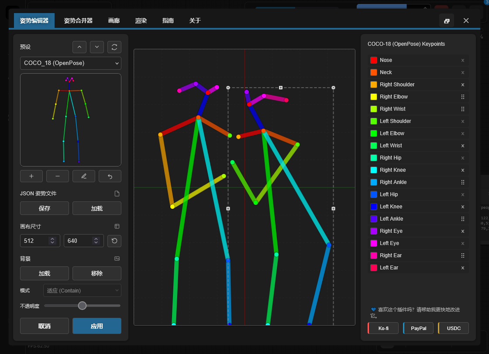
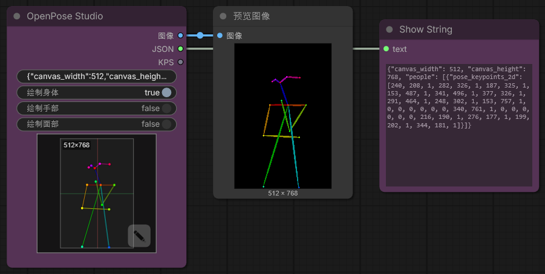
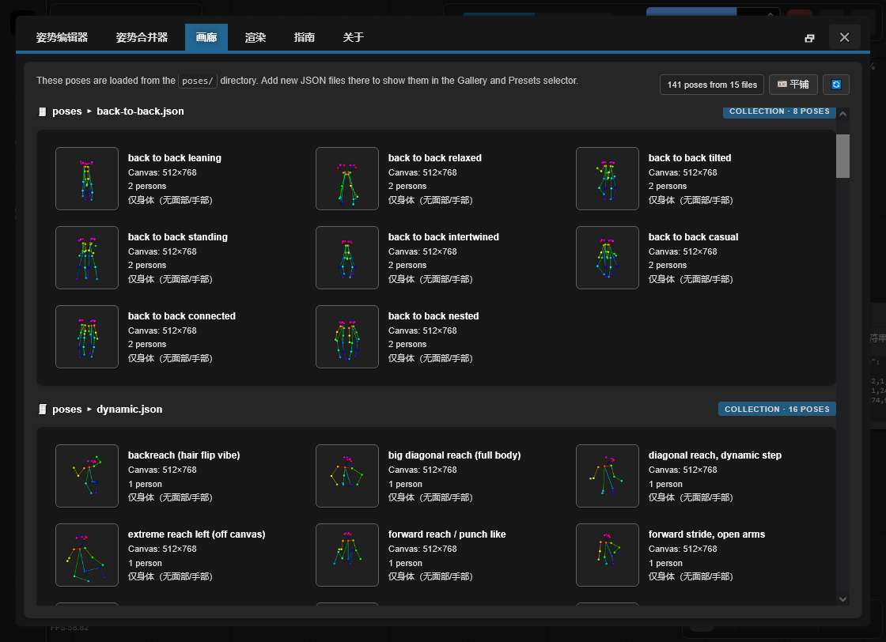

<h4 align="center">
  <a href="./README.md">English</a> | <a href="./README.de.md">Deutsch</a> | <a href="./README.es.md">Español</a> | <a href="./README.fr.md">Français</a> | <a href="./README.pt.md">Português</a> | <a href="./README.ru.md">Русский</a> | <a href="./README.ja.md">日本語</a> | <a href="./README.ko.md">한국어</a> | 中文 | <a href="./README.zh-TW.md">繁體中文</a>
</h4>

<p align="center">
  
  
  
</p>
<br />

# 适用于 ComfyUI 的 OpenPose Studio 🤸

OpenPose Studio 是一款高级 ComfyUI 扩展，提供简洁流畅的界面，用于创建、编辑、预览和整理 OpenPose 姿势。它可以让你轻松地可视化调整 keypoints、保存和加载姿势文件、浏览姿势预设与图库、管理姿势集合、合并多个姿势，并导出干净的 JSON 数据，以便用于 ControlNet 和其他基于姿势的 workflows。

---

## 目录

- ✨ [功能特性](#功能特性)
- 📦 [安装](#安装)
- 🎯 [使用方法](#使用方法)
- 🔧 [节点](#节点)
- ⌨️ [编辑器控制与快捷键](#编辑器控制与快捷键)
- 📋 [格式规范](#格式规范)
- 🖼️ [图库与姿态管理](#图库与姿态管理)
- 🔀 [姿态合并器](#姿态合并器)
- 🖼️ [背景参考](#背景参考)
- 🗺️ [区域输入](#区域输入)
- ⚠️ [已知限制](#已知限制)
- 🔍 [故障排除](#故障排除)
- 🤝 [贡献](#贡献)
- 💙 [资金与支持](#资金与支持)
- 📄 [许可证](#许可证)

---

## 功能特性

✨ **核心能力**
- 带可视化反馈的实时 OpenPose Keypoints 编辑
- 现代原生 Canvas 渲染引擎（更快、更顺滑、依赖更少）
- 交互式编辑体验：清晰的当前选择 + 姿态悬停预选
- 约束变换，防止 Keypoints 漂移到 Canvas 边界之外
- 支持单姿态与姿态集合的 JSON 导入/导出
- 标准 OpenPose JSON 导出（可移植到其他工具）
- 兼容旧版 JSON（可加载并正确编辑较早的非标准 JSON）

✨ **高级功能**
- **绘制开关**：可选绘制 Body / Hands / Face
- **姿态图库**：浏览并预览 `poses/` 中的姿态
- **姿态集合**：多姿态 JSON 文件按可单独选择的姿态显示
- **姿态合并器**：将多个 JSON 文件合并为有组织的集合
- **快速清理操作**：在存在时移除 Face Keypoints 和/或 Left/Right Hand Keypoints
- **导出时可选清理**：导出姿态包时移除 Face 和/或 Hands Keypoints
- **背景叠加系统**：可选 contain/cover 模式并支持不透明度控制
- **撤销**：会话期间完整编辑历史

✨ **数据处理**
- 自动发现 `poses/` 中的姿态文件（包含子目录）
- 对格式错误的 JSON 文件进行校验与错误恢复
- 支持部分姿态（仅包含部分身体 Keypoints）
- 与姿态文件一致的像素坐标空间，确保无缝兼容

✨ **UI 与集成**
- 完全响应式布局：实时适配任意窗口尺寸并保持居中
- 当 Canvas 无法完整显示在屏幕上时自动缩放适配
- 改进的 Canvas 视觉效果：背景网格 + 中心轴，风格类似 Blender
- 重启后持久化：启动时恢复图库视图模式与背景叠加设置
- 原生 ComfyUI 集成：toasts + dialogs（含安全回退）

---

✨ **计划功能与路线图**

> [!IMPORTANT]
> 许多计划功能依赖 AI Token 资金支持。完整路线图与后续计划请查看 [TODO.md](../TODO.md)。

如果你有新功能想法，我很愿意听取，我们可能可以很快实现。请通过仓库 Issues 页面提交反馈、想法或建议：https://github.com/andreszs/comfyui-openpose-studio/issues


## 安装

### 要求
- ComfyUI（最新构建）
- Python 3.10+

### 步骤

1. 将此仓库克隆到 `ComfyUI/custom_nodes/`。
2. 重启 ComfyUI。
3. 确认节点出现在 `image > OpenPose Studio` 下。

---

## 使用方法

### 基本工作流

1. 将 **OpenPose Studio** 节点添加到你的工作流
2. 点击节点预览 Canvas 打开编辑器 UI
3. 从预设或图库中选择一个姿态并插入到 Canvas
4. 在 Canvas 上拖动 Keypoints 进行调整
5. 点击 **Apply** 以渲染姿态。这会在节点中创建序列化后的 JSON。
6. 将 `image` 输出连接到后续图像节点
7. 将 `kps` 输出连接到兼容 ControlNet/OpenPose 的节点

### 编辑器预览



---

## 节点

### OpenPose Studio

**分类：** `image`

- **输入：** `Pose JSON` (STRING) - 标准 OpenPose 风格 JSON。
- **可选输入：**
  - `areas` (`CONDITIONING_AREAS`) — 区域叠加数据；连接 [Conditioning Pipeline (Combine)](https://github.com/andreszs/comfyui-lora-pipeline) 节点的 `areas_out` 输出，可在 Canvas 上可视化条件化区域
- **选项：**
  - `render body` - 在渲染预览/输出图像中包含 body
  - `render hands` - 在渲染预览/输出图像中包含 hands（如果 JSON 中存在）
  - `render face` - 在渲染预览/输出图像中包含 face（如果 JSON 中存在）
- **输出：**
  - `IMAGE` - 以 RGB 图像表示的渲染姿态可视化（float32，0-1 范围）
  - `JSON` - OpenPose 风格姿态 JSON，包含 Canvas 尺寸与含 Keypoints 数据的 people 数组
  - `KPS` - POSE_KEYPOINT 格式的 Keypoint 数据，兼容 ControlNet
- **UI：** 点击节点预览可打开交互式编辑器。使用 **open editor** 按钮（铅笔图标）可直接编辑姿态。

#### 节点截图



---

## 编辑器控制与快捷键

### 键盘快捷键

| Control | Action |
|---------|--------|
| **Enter** | 应用姿态并关闭编辑器 |
| **Escape** | 取消并丢弃更改 |
| **Ctrl+Z** | 撤销上一步操作 |
| **Ctrl+Y** | 重做上一次被撤销的操作 |
| **Delete** | 删除选中的 Keypoint |

### Canvas 交互

- **Click**: 选择 Keypoint
- **Drag**: 将 Keypoint 移动到新位置
- **Scroll**: 在 Canvas 上缩放（TO-DO）

### 背景参考

在编辑姿态时可加载参考图像（如解剖指南、照片参考）作为非破坏性叠加层。使用 **Contain** 模式可将图像适配在 Canvas 内，使用 **Cover** 模式可填满 Canvas。可按需调整不透明度。

- **Load Image**: 从磁盘导入参考图像
- **Contain/Cover**: 选择缩放模式
- **Opacity**: 调整透明度（0-100%）

> [!NOTE]
> 背景图像会在 ComfyUI 会话期间保留，但**不会**保存到工作流中。

### 区域输入

**areas** 输入是一个**可选**连接，在姿态编辑期间将条件化区域边界叠加显示在 Canvas 上。

将 [ComfyUI-LoRA-Pipeline](https://github.com/andreszs/comfyui-lora-pipeline) 仓库中 [**Conditioning Pipeline (Combine)**](https://github.com/andreszs/comfyui-lora-pipeline) 节点的 `areas_out` 输出连接到此处，即可在摇放姿态时将各区域所覆盖的范围可视化。

每个区域在 Canvas 上以带标签的徽章形式显示。点击任意徽章可单独**启用或禁用**该区域，让你专注于与当前姿态相关的区域。


这种组合在构建多角色工作流时尤为实用：[ComfyUI-LoRA-Pipeline](https://github.com/andreszs/comfyui-lora-pipeline) 负责处理分区条件化与 LoRA 分配，而 OpenPose Studio 确保各区域内姿态定位的精准性。最终可实现简单、无损的配置，让分区 LoRA 与分姿态 LoRA 同时生效且互不干扰。如果你还不熟惉基于区域的条件化，[ComfyUI-LoRA-Pipeline](https://github.com/andreszs/comfyui-lora-pipeline) 扩展正是为此类工作流而设计的，与本节点配合使用效果极佳。

想了解三个仓库协同工作的真实案例——区域条件化、OpenPose 控制与风格叠加——请参阅这篇[分步工作流指南](https://www.andreszsogon.com/building-a-multi-character-comfyui-workflow-with-area-conditioning-openpose-control-and-style-layering/)。

---

## 格式规范

本编辑器完整支持 **OpenPose COCO-18 (body)** 编辑。

它也以 *pass-through* 方式支持 **OpenPose face 与 hands 数据**：如果你的 JSON 包含 face 和/或 hand Keypoints，它们会被保留（不会移除），Python 节点也可正确渲染它们。不过，**暂不支持编辑 face 与 hand Keypoints**（计划在后续更新中提供）。

### OpenPose COCO-18 keypoints（body）

COCO-18 使用 **18 个身体 Keypoints**。姿态以名为 `pose_keypoints_2d` 的扁平数组存储，格式为：

`[x0, y0, c0, x1, y1, c1, ...]`

其中每个 Keypoint 包含：
- `x`, `y`: Canvas 中的像素坐标
- `c`: 置信度（通常为 `0..1`；`0` 可表示“缺失”点）

Keypoint 顺序（索引 → 名称）：

| 索引 | 名称 |
|------:|------|
| 0 | 鼻子 |
| 1 | 颈部 |
| 2 | 右肩 |
| 3 | 右肘 |
| 4 | 右手腕 |
| 5 | 左肩 |
| 6 | 左肘 |
| 7 | 左手腕 |
| 8 | 右髋 |
| 9 | 右膝 |
| 10 | 右脚踝 |
| 11 | 左髋 |
| 12 | 左膝 |
| 13 | 左脚踝 |
| 14 | 右眼 |
| 15 | 左眼 |
| 16 | 右耳 |
| 17 | 左耳 |

> [!NOTE]
> **COCO** 指的是在姿态估计中广泛使用的 *Common Objects in Context* Keypoint 规范/数据集命名。这里的“COCO-18”表示具有 18 个 Keypoints 的 OpenPose body 布局。

### 最小 JSON 结构

典型的单姿态 OpenPose 风格 JSON 包含 Canvas 尺寸和一个带 `pose_keypoints_2d` 的 `people` 条目：

```json
{
  "canvas_width": 512,
  "canvas_height": 512,
  "people": [
    {
      "pose_keypoints_2d": [0, 0, 0, 0, 0, 0 /* ... 18 * 3 values total ... */]
    }
  ]
}
```

> [!NOTE]
> 编辑器可以处理部分姿态（某些 Keypoints 缺失）。缺失点通常表示为 0,0,0。你也可以使用 Pose Editor 删除远端 Keypoints。

### 延伸阅读

- 历史与背景：“What is OpenPose - Exploring a milestone in pose estimation” - 一篇通俗文章，介绍了 OpenPose 如何被提出及其对姿态估计的影响：https://www.ultralytics.com/blog/what-is-openpose-exploring-a-milestone-in-pose-estimation

### JSON 格式：Standard vs Legacy

- **OpenPose Studio:** 读写**标准 OpenPose 风格 JSON**，同时支持较旧的非标准 Legacy JSON。

实践说明：
- 将标准 JSON 粘贴到 OpenPose Studio 节点中会立即渲染预览。

---

## 图库与姿态管理

### 概览

**Gallery** 标签页提供所有可用姿态的可视化浏览，并带有实时预览缩略图。它会自动发现并整理姿态，无需手动配置。



### 视图模式

Gallery 支持三种显示模式：
- **Large** - 更大的预览，便于快速视觉选择
- **Medium** - 预览大小与密度的平衡
- **Tiles** - 紧凑网格，显示额外元数据（例如 **canvas size**、**keypoint counts** 及其他姿态详情）

### 功能

- **自动发现**: 启动时扫描 `poses/` 目录
- **嵌套组织**: 子目录名会作为分组标签
- **实时预览**: 为每个姿态渲染缩略图
- **搜索/筛选**: 按名称或分组查找姿态
- **一键加载**: 选择姿态并加载到编辑器

### 支持的文件类型

- **单姿态 JSON**: 独立 OpenPose JSON 文件
- **姿态集合**: 多姿态 JSON 文件（每个姿态单独显示）
- **嵌套目录**: 子目录中的姿态会自动分组

### 确定性行为

图库排序和发现行为完全确定：
- 无随机打乱
- 一致的按字母排序
- 先列出根目录姿态，再列出分组姿态
- 打开 Editor 窗口时立即重新加载全部 JSON 姿态。

---

## 姿态合并器

### 目的

**Pose Merger** 标签页可将多个单独的姿态 JSON 文件整合为有组织的姿态集合文件。适用于：

- 将大型姿态库转换为单文件
- 清理姿态数据（移除 face/hand Keypoints）
- 重新组织并重命名姿态
- 高效分发姿态包

### 工作流

1. **Add Files**: 加载单独或集合 JSON 文件
2. **Preview**: 每个姿态以缩略图显示
3. **Configure**: 可选排除 face/hand 组件
4. **Export**: 保存为合并集合或独立文件

### 核心能力

| Feature | Use Case |
|---------|----------|
| **Load Multiple Files** | 从文件系统批量导入 |
| **Component Filtering** | 移除不必要的 face/hand 数据 |
| **Collection Expansion** | 从现有集合中提取姿态 |
| **Batch Renaming** | 导出时分配有意义的名称 |
| **Selective Export** | 选择要包含的姿态 |

### 输出选项

- **Combined Collection**: 包含全部姿态的单个 JSON
- **Individual Files**: 每个姿态一个文件（用于兼容性）

两种输出格式都会被 Gallery 和 Pose Selector 自动识别。

---

## 已知限制

> [!WARNING]
> Nodes 2.0 当前不受支持。请暂时禁用 Nodes 2.0。

### 当前限制与变通方案

1. **Hand 与 Face 编辑**
  - 问题：编辑器当前仅支持 body Keypoints（0-17）
  - 状态：计划在未来版本提供
  - 变通方案：导入前使用 Pose Merger 手动编辑 hand/face JSON

2. **分辨率一致性**
  - 问题：Pose Merger 在集合导出时不会自动统一分辨率
  - 状态：需要谨慎实现以避免裁剪
  - 变通方案：导入前先将姿态缩放到目标分辨率

3. **Nodes 2.0 兼容性**
  - 问题：启用 ComfyUI 的 "Nodes 2.0" 时，该节点行为不正确。
  - 状态：计划修复，但这是一次规模大且耗时的重构。
  - 说明：本项目使用付费 AI agents 开发。一旦有资金购买更多 AI Token，我计划优先推进 Nodes 2.0 支持。
  - 变通方案：暂时禁用 Nodes 2.0。

### 错误恢复

插件包含防御式错误处理：
- 在 Gallery 中静默跳过无效 JSON 文件
- 渲染错误时返回空白图像而不是崩溃
- 缺失元数据时回退到安全默认值
- 在渲染期间过滤格式错误的 Keypoints

---

## 故障排除

### 常见问题与解决方案

**Poses not appearing in Gallery**
```
✓ Confirm files exist in poses/ directory
✓ Verify JSON is valid (use online JSON validator)
✓ Check file extension is .json (case-sensitive on Linux)
✓ Restart ComfyUI to trigger discovery
✓ Check browser console (F12) for error messages
```

**JSON import fails**
```
✓ Validate JSON structure (must have "pose_keypoints_2d" or equivalent)
✓ Ensure coordinates are valid numbers, not strings
✓ Confirm minimum 18 keypoints for body poses
✓ Check for malformed escape sequences in JSON
```

**Blank output image**
```
✓ Verify pose is selected and contains valid keypoints
✓ Check canvas dimensions (width/height) are reasonable (100-2048px)
✓ Click Apply to render after making changes
✓ Check for NaN or infinite values in coordinates
```

**Background reference not persisting**
```
✓ Enable third-party cookies/storage in browser
✓ Check browser localStorage settings
✓ Try incognito mode to isolate issue
✓ Clear browser cache and try again
```

**Node not appearing in ComfyUI**
```
✓ Verify clone location: ComfyUI/custom_nodes/comfyui-openpose-studio
✓ Check __init__.py exists and imports correctly
✓ Restart ComfyUI fully (not just reload page)
✓ Check ComfyUI console for import errors
```
---

## 贡献

关于贡献指南、pull requests 规范、架构细节和开发信息，请参阅 [CONTRIBUTING.md](../CONTRIBUTING.md)。如果你使用 AI agent 辅助开发，请确保它在进行任何代码更改前先阅读 [AGENTS.md](../AGENTS.md)。

---

## 资金与支持

### 为什么您的支持很重要

该插件由作者独立开发和维护，并定期使用 **付费 AI 代理** 来加速调试、测试和体验改进。如果您觉得它有帮助，资金支持可以让开发持续、稳定地推进。

您的贡献有助于：

* 为更快修复问题和推出新功能提供 AI 工具资金
* 覆盖 ComfyUI 更新过程中的持续维护与兼容性工作
* 在达到使用上限时避免开发节奏放缓

> [!TIP]
> 暂时无法捐赠？点一个 GitHub 星标 ⭐ 也很有帮助，可以提升可见性并让更多用户发现项目。

### 💙 支持此项目

请选择您偏好的支持方式：

<table style="width: 100%; table-layout: fixed;">
  <tr>
    <td align="center" style="width: 33.33%; padding: 20px;">
      <div>
        <h4 style="margin: 8px 0;">Ko-fi</h4>
        <a href="https://ko-fi.com/D1D716OLPM" target="_blank" rel="noopener noreferrer">
          
        </a>
        <p style="margin: 8px 0; font-size: 12px;"><a href="https://ko-fi.com/D1D716OLPM" target="_blank" rel="noopener noreferrer">请我喝杯咖啡</a></p>
      </div>
    </td>
    <td align="center" style="width: 33.33%; padding: 20px;">
      <div>
        <h4 style="margin: 8px 0;">PayPal</h4>
        <a href="https://www.paypal.com/ncp/payment/GEEM324PDD9NC" target="_blank" rel="noopener noreferrer">
          
        </a>
        <p style="margin: 8px 0; font-size: 12px;"><a href="https://www.paypal.com/ncp/payment/GEEM324PDD9NC" target="_blank" rel="noopener noreferrer">打开 PayPal</a></p>
      </div>
    </td>
    <td align="center" style="width: 33.33%; padding: 20px;">
      <div>
        <h4 style="margin: 8px 0;">USDC（仅限 Arbitrum ⚠️）</h4>
        <a href="https://arbiscan.io/address/0xe36a336fC6cc9Daae657b4A380dA492AB9601e73" target="_blank" rel="noopener noreferrer">
          
        </a>
        <p style="margin: 8px 0; font-size: 12px;"><a href="#usdc-address">显示地址</a></p>
      </div>
    </td>
  </tr>
</table>

<details>
  <summary>更喜欢扫码？显示二维码</summary>
  <br />
  <table style="width: 100%; table-layout: fixed;">
    <tr>
      <td align="center" style="width: 33.33%; padding: 12px;">
        <strong>Ko-fi</strong><br />
        <a href="https://ko-fi.com/D1D716OLPM" target="_blank" rel="noopener noreferrer">
          
        </a>
      </td>
      <td align="center" style="width: 33.33%; padding: 12px;">
        <strong>PayPal</strong><br />
        <a href="https://www.paypal.com/ncp/payment/GEEM324PDD9NC" target="_blank" rel="noopener noreferrer">
          
        </a>
      </td>
      <td align="center" style="width: 33.33%; padding: 12px;">
        <strong>USDC（Arbitrum）⚠️</strong><br />
        <a href="https://arbiscan.io/address/0xe36a336fC6cc9Daae657b4A380dA492AB9601e73" target="_blank" rel="noopener noreferrer">
          
        </a>
      </td>
    </tr>
  </table>
</details>

<a id="usdc-address"></a>
<details>
  <summary>显示 USDC 地址</summary>

```text
0xe36a336fC6cc9Daae657b4A380dA492AB9601e73
```

> [!WARNING]
> 请仅通过 Arbitrum One 网络发送 USDC。若通过其他网络转账，将不会到账并且可能永久丢失。
</details>

---

## 许可证

MIT License - 完整文本请参阅 [LICENSE](../LICENSE) 文件。

**摘要：**
- ✓ 可免费商用
- ✓ 可免费私用
- ✓ 可修改和分发
- ✓ 需包含许可证和版权声明

---

## 其他资源

### 相关项目

- [ComfyUI](https://github.com/comfyanonymous/ComfyUI) - 核心框架
- [comfyui_controlnet_aux](https://github.com/Kosinkadink/ComfyUI-Advanced-ControlNet) - ControlNet 支持
- [OpenPose](https://github.com/CMU-Perceptual-Computing-Lab/openpose) - 原始姿态检测

### 文档

- [ComfyUI Custom Nodes Guide](https://github.com/comfyanonymous/ComfyUI/blob/main/docs/)
- [OpenPose Models & Keypoints](https://github.com/CMU-Perceptual-Computing-Lab/openpose/blob/master/doc/02_Output.md)
- [Canvas 2D API](https://developer.mozilla.org/en-US/docs/Web/API/Canvas_API) - 渲染引擎

### 故障排除指南

- [ComfyUI Installation Issues](https://github.com/comfyanonymous/ComfyUI/wiki/Installation)
- [Node Registration & Loading](https://github.com/comfyanonymous/ComfyUI/blob/main/docs/CONTRIBUTING.md)
- [Browser Developer Tools](https://developer.chrome.com/docs/devtools/)

---

**Maintained by:** andreszs  
**Status:** Active Development
